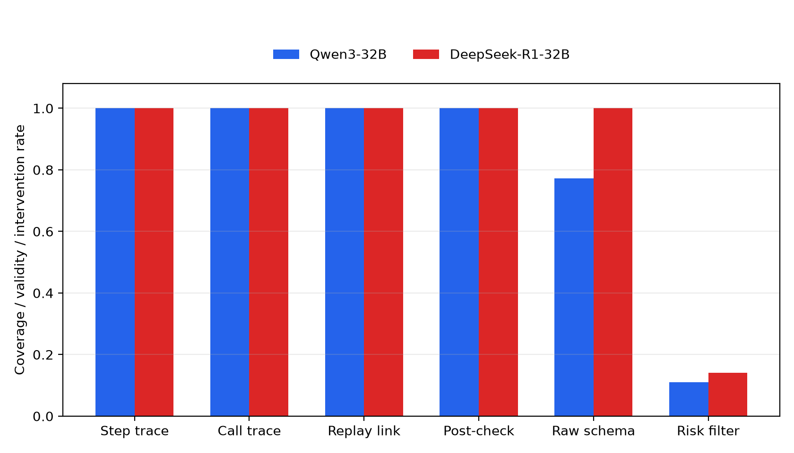

# LuxLLM-Agent

**LuxLLM-Agent** is an interactive platform for developing and evaluating LLM-based decision making in **Lux AI Season 3**.

The project combines a Lux AI Season 3 agent, compact game-state summarisation, LLM-based strategic proposals, deterministic action verification, fallback handling, decision provenance logging, controlled evaluation, and an isometric replay viewer.

The project is designed for an MSc dissertation and research-demo style artifact. Its main goal is to test how effectively directly prompted LLMs can make decisions in this type of game and whether the project-specific Decision-Trace and Action-Verification (DTAV) method addresses the observed limitations.

> **Project status:** the controlled studies, dual-LLM supplementary study, and supervisor-requested direct-prompt-versus-DTAV comparison are complete. The final comparison used 50 matched seeds with role swapping for each condition (100 matches per method) and passed the repository validator.

---

## Project Focus

This project investigates the following research question:

> **How effectively can directly prompted LLMs make decisions in a partially observable, multi-agent, long-horizon, and rule-constrained strategy game such as Lux AI Season 3, and how can the project-specific Decision-Trace and Action-Verification (DTAV) method address the observed limitations?**

Lux AI Season 3 is used because it combines incomplete observations, multiple controlled units, long-horizon state, adversarial interaction, and strict action rules. It is an adversarial multi-agent strategy game, not a social-interaction study. Model backends and match outcomes remain controlled case studies rather than a general-purpose model leaderboard.

The investigation has three objectives:

1. Establish a controlled direct-prompting baseline with matched seeds, role swapping, and the same model settings.
2. Implement DTAV so LLM proposals can be normalised, reused, checked, filtered, or replaced before legal action construction.
3. Compare direct prompting and DTAV using validity, fallback/intervention rates, reliability, latency, match outcomes, and replay-linked inspection.

“DTAV” names the method developed in this project. Its decision trace is a predefined operational audit record, not the model's hidden chain of thought. The canonical scope is recorded in [`docs/research_scope_20260814.md`](docs/research_scope_20260814.md).

### Final controlled method comparison

Under the recorded Qwen3-32B configuration, the scheduled direct-prompt baseline won 48 of 100 matches and DTAV won 63 of 100. Across the 100 matched seed-role strata, DTAV-only wins outnumbered direct-prompt-only wins 21 to 6 (McNemar exact `p = 0.0059`). The estimated DTAV advantage was 15 percentage points, with a paired-bootstrap 95% interval of 6 to 25 percentage points. This is evidence for the recorded model, prompt, seed, role, software, and hardware settings rather than a universal performance claim.

The process evidence also exposed the mechanism boundary: post-check structured-call validity was 86.1% for direct prompting and 99.9% for DTAV; observable rule-fallback steps were 95.5% and 5.6%, respectively; and DTAV reused a cached accepted strategy on 89.8% of agent steps and changed proposed targets through its risk filter on 11.2%. Both conditions retained 100% trace completeness, replay linkage, and legal action-array shape, with no recorded LLM timeout, API error, or downstream action fallback. The compact reports are in [`reports/direct_prompt_vs_dtav_trace_analysis.md`](reports/direct_prompt_vs_dtav_trace_analysis.md) and [`reports/direct_prompt_vs_dtav_comparison.json`](reports/direct_prompt_vs_dtav_comparison.json).

---

## Demo Preview

<p align="center">
  
</p>

<p align="center">
  <b>LuxLLM-Agent Season 3 Run008 isometric replay and evaluation demo.</b>
</p>

The tracked preview asset is `assets/luxllm_agent_final_demo_run008.gif`.

---

## System Overview

LuxLLM-Agent separates strategic reasoning from executable game actions.

```text
Lux AI Season 3 Observation
        |
        v
Structured State Summariser
        |
        v
LLM Strategist
        |
        v
Structured Output Parser
        |
        v
Rule-based Action Verifier
        |
        v
Action Planner
        |
        v
Lux AI Environment
        |
        v
Decision Logger + Replay Viewer + Evaluation Harness
```

The LLM does not directly execute arbitrary environment actions. Instead, it produces high-level strategic decisions, which are parsed, verified, repaired, cached, or rejected before being converted into legal Lux AI actions.

---

## Key Features

### LLM-assisted Lux AI Season 3 agent

* Supports LLM-based strategic planning.
* Uses `qwen3:32b` as the main LLM backend.
* Adds `deepseek-r1:32b` as a comparison LLM backend.
* Supports rule-only and LLM-enabled experimental settings.

### Structured game-state summarisation

* Converts raw Lux AI observations into compact state summaries.
* Reduces the burden on the LLM.
* Provides a structured interface between the game environment and the LLM strategist.

### Rule-based action verification

* Prevents direct execution of arbitrary LLM outputs.
* Checks action feasibility and safety.
* Supports fallback behaviour when LLM outputs are invalid, unstable, or low-confidence.

### Decision provenance logging

* Records whether decisions come from:

  * fresh LLM calls;
  * cached LLM decisions;
  * rule-based player logic;
  * fallback logic;
  * rule fallback.
* Supports later replay-grounded analysis.

### Isometric replay viewer

* Provides a Season 1-style visual replay interface for Lux AI Season 3.
* Displays replay state, battle timeline, score context, and final evaluation summary.
* Includes the completed LLM Decision Trace Overlay for replay-grounded inspection.

### Controlled-run evaluation

* Includes 50 matched seeds with role swapping for each backend: 100 matches for `qwen3:32b` and 100 for `deepseek-r1:32b`.
* Includes a supplementary 50-seed, role-swapped direct LLM-versus-LLM experiment: 100 matches with both agents using the same trace-and-verification pipeline.
* Measures trace completeness, replay linkage, output normalization, action verification, risk filtering, fallback observability, latency, and secondary match outcomes.
* Preserves exact runtime provenance, model inventory, seeds, dependency versions, and analysis-code versions.

---

## Main Evaluation Results: Framework Evidence

The primary evaluation asks whether the framework makes LLM-agent behaviour inspectable and supports reliable post-run evaluation. Backend win rate is a secondary outcome rather than the main contribution.

<table align="center" width="100%">
  <thead>
    <tr>
      <th align="center">Framework metric</th>
      <th align="center"><code>qwen3:32b</code></th>
      <th align="center"><code>deepseek-r1:32b</code></th>
    </tr>
  </thead>
  <tbody>
    <tr><td align="center">Completed matched-role matches</td><td align="center">100 / 100</td><td align="center">100 / 100</td></tr>
    <tr><td align="center">Agent-step / LLM-call trace completeness</td><td align="center">100% / 100%</td><td align="center">100% / 100%</td></tr>
    <tr><td align="center">Replay-linkage coverage</td><td align="center">100%</td><td align="center">100%</td></tr>
    <tr><td align="center">Structured-valid LLM calls after normalization</td><td align="center">2286 / 2286</td><td align="center">2305 / 2305</td></tr>
    <tr><td align="center">Deterministic normalization interventions</td><td align="center">520 (22.7%)</td><td align="center">0 (0%)</td></tr>
    <tr><td align="center">Risk-filter changed steps</td><td align="center">5590 (11.1%)</td><td align="center">7090 (14.0%)</td></tr>
    <tr><td align="center">Action-array shape validity</td><td align="center">100%</td><td align="center">100%</td></tr>
    <tr><td align="center">Timeouts / LLM errors / action fallbacks</td><td align="center">0 / 0 / 0</td><td align="center">0 / 0 / 0</td></tr>
  </tbody>
</table>

<p align="center">
  
</p>

Across each backend's 50,500 LLM-agent steps, structured provenance distinguished fresh LLM decisions, cached decisions, and observable rule fallback. Qwen used 2,286 fresh decisions, 45,399 cached steps, and 2,815 rule-fallback steps; DeepSeek used 2,305, 45,380, and 2,815 respectively. The 520 Qwen shorthand responses are especially relevant to the research question: they were not discarded or executed directly, but were deterministically normalized into the bounded strategy schema before action planning.

### Secondary controlled outcomes

<table align="center" width="100%">
  <thead>
    <tr><th align="center">Backend</th><th align="center">Matches</th><th align="center">LLM wins</th><th align="center">Win rate</th><th align="center">Seed-clustered 95% CI</th><th align="center">Seed-level exact p-value</th></tr>
  </thead>
  <tbody>
    <tr><td align="center"><code>qwen3:32b</code></td><td align="center">100</td><td align="center">63</td><td align="center">63%</td><td align="center">[57%, 70%]</td><td align="center">0.00098</td></tr>
    <tr><td align="center"><code>deepseek-r1:32b</code></td><td align="center">100</td><td align="center">60</td><td align="center">60%</td><td align="center">[51%, 69%]</td><td align="center">0.05248</td></tr>
  </tbody>
</table>

The paired backend comparison matched all 100 seed-role strata. Qwen was the sole winner in 14 strata and DeepSeek in 11; the difference was not significant (McNemar exact `p = 0.6900`, paired mean difference `0.03`, 95% CI `[-0.07, 0.13]`). This supports backend portability of the trace-and-verification framework, not a hardware-independent model ranking.

Full research-question-aligned analysis is available in [`reports/final_trace_evaluation.md`](reports/final_trace_evaluation.md), with machine-readable JSON/CSV and figures in `reports/figures/`.

### Supplementary direct LLM-versus-LLM experiment

Following supervisor feedback, a direct `qwen3:32b` versus `deepseek-r1:32b` experiment was run using the same 50 Lux seeds in both model-role assignments. Both players used independent log streams but the same structured proposal, deterministic normalization, risk verification, caching, and action-construction pipeline.

<table align="center" width="100%">
  <thead>
    <tr><th align="center">Metric</th><th align="center">Result</th></tr>
  </thead>
  <tbody>
    <tr><td align="center">Completed matches / paired seeds</td><td align="center">100 / 50</td></tr>
    <tr><td align="center">Qwen wins / DeepSeek wins / draws</td><td align="center">54 / 46 / 0</td></tr>
    <tr><td align="center">Qwen win rate</td><td align="center">54%, seed-clustered 95% CI [45%, 63%]</td></tr>
    <tr><td align="center">Seed-level exact sign p-value</td><td align="center">0.5034</td></tr>
    <tr><td align="center">Structured trace records</td><td align="center">106,317</td></tr>
    <tr><td align="center">Valid fresh LLM calls</td><td align="center">4,676 / 4,676 (100%)</td></tr>
    <tr><td align="center">Deterministic normalization interventions</td><td align="center">571</td></tr>
    <tr><td align="center">Risk-filter changed steps / targets</td><td align="center">15,721 / 85,805</td></tr>
    <tr><td align="center">Trace completeness / replay linkage / action shape</td><td align="center">100% / 100% / 100%</td></tr>
    <tr><td align="center">Timeouts / LLM errors / action fallbacks</td><td align="center">0 / 0 / 0</td></tr>
  </tbody>
</table>

The 54:46 outcome is not statistically distinguishable from parity under the recorded matched-seed analysis. This supplementary experiment is therefore evidence that two simultaneous LLM agents can be traced and verified consistently—not evidence that Qwen is generally better than DeepSeek.

The tracked reports are [`reports/dual_llm_trace_evaluation.md`](reports/dual_llm_trace_evaluation.md) and [`reports/dual_llm_verifier_audit.md`](reports/dual_llm_verifier_audit.md). The large raw archive remains local and is identified by SHA-256 `2B16B3C03EDA364F599F2EEF8884669124A1398D5BA1AAB7DE4709D9CF8A4EA7`.

The overall supervisor-facing project report is available at
[`docs/supervisor_project_report_20260716.md`](docs/supervisor_project_report_20260716.md).

For the latest review status, earlier weaknesses, implemented improvements, formal evidence, and remaining limitations, see
[`docs/project_review_summary_20260814.md`](docs/project_review_summary_20260814.md). The current CA2 presentation and recording materials are under [`docs/ca2/`](docs/ca2/).

---

## Historical Development Results (Superseded)

<details>
<summary>Show earlier fixed-role 50-run development evidence</summary>

The following results are retained only as development history. They are superseded by the matched-seed, role-swapped 100-match experiments above and must not be used as the current main conclusion.

### 50-run LLM backend comparison

<table align="center" width="100%">
  <thead>
    <tr>
      <th align="center">Model</th>
      <th align="center">Runs</th>
      <th align="center">player_0 wins</th>
      <th align="center">player_1 wins</th>
      <th align="center">player_0 win rate</th>
      <th align="center">LLM errors</th>
      <th align="center">Notes</th>
    </tr>
  </thead>
  <tbody>
    <tr>
      <td align="center"><code>qwen3:32b</code></td>
      <td align="center">50</td>
      <td align="center">35</td>
      <td align="center">15</td>
      <td align="center">70%</td>
      <td align="center">0</td>
      <td align="center">Main LLM backend</td>
    </tr>
    <tr>
      <td align="center"><code>deepseek-r1:32b</code></td>
      <td align="center">50</td>
      <td align="center">26</td>
      <td align="center">24</td>
      <td align="center">52%</td>
      <td align="center">0</td>
      <td align="center">Comparison LLM backend</td>
    </tr>
  </tbody>
</table>

The model comparison is not intended as a general-purpose LLM leaderboard. Instead, it evaluates whether the LuxLLM-Agent decision-trace and rule-based action-verification framework can support different reasoning-oriented LLM backends under the same Lux AI Season 3 setting.

Both `qwen3:32b` and `deepseek-r1:32b` completed 50 controlled runs with zero LLM errors, showing that the framework can run different LLMs through the same structured decision pipeline.

---

## DeepSeek-R1-32B 50-run Results

The newly added DeepSeek-R1-32B experiment provides an additional model-level comparison.

<table align="center" width="100%">
  <thead>
    <tr>
      <th align="center" width="65%">Metric</th>
      <th align="center" width="35%">Value</th>
    </tr>
  </thead>
  <tbody>
    <tr><td align="center">Model</td><td align="center"><code>deepseek-r1:32b</code></td></tr>
    <tr><td align="center">Total runs</td><td align="center">50</td></tr>
    <tr><td align="center">player_0 wins</td><td align="center">26</td></tr>
    <tr><td align="center">player_1 wins</td><td align="center">24</td></tr>
    <tr><td align="center">player_0 win rate</td><td align="center">52%</td></tr>
    <tr><td align="center">Average player_0 reward</td><td align="center">2.7</td></tr>
    <tr><td align="center">Average player_1 reward</td><td align="center">2.3</td></tr>
    <tr><td align="center">Average fresh LLM calls</td><td align="center">33.2</td></tr>
    <tr><td align="center">Average LLM strategy used</td><td align="center">27.24</td></tr>
    <tr><td align="center">Average cached LLM turns</td><td align="center">412.62</td></tr>
    <tr><td align="center">Average fallback count</td><td align="center">570.14</td></tr>
    <tr><td align="center">Average LLM errors</td><td align="center">0.0</td></tr>
    <tr><td align="center">Average LLM latency</td><td align="center">4143.595 ms</td></tr>
    <tr><td align="center">Maximum LLM latency</td><td align="center">10581.076 ms</td></tr>
    <tr><td align="center">Average trace steps</td><td align="center">1010.0</td></tr>
  </tbody>
</table>

### DeepSeek decision-source distribution

<table align="center" width="100%">
  <thead>
    <tr>
      <th align="center" width="65%">Decision source</th>
      <th align="center" width="35%">Count</th>
    </tr>
  </thead>
  <tbody>
    <tr><td align="center"><code>rule_player</code></td><td align="center">25250</td></tr>
    <tr><td align="center"><code>fallback</code></td><td align="center">94</td></tr>
    <tr><td align="center"><code>rule_fallback</code></td><td align="center">3163</td></tr>
    <tr><td align="center"><code>llm_fresh</code></td><td align="center">1362</td></tr>
    <tr><td align="center"><code>cached_llm</code></td><td align="center">20631</td></tr>
  </tbody>
</table>

Derived rates:

```text
Total decision-source events = 50500

LLM-related events:
llm_fresh + cached_llm = 1362 + 20631 = 21993
LLM decision-source rate ≈ 43.55%

Fallback-related events:
fallback + rule_fallback = 94 + 3163 = 3257
Fallback decision-source rate ≈ 6.45%
```

---

</details>

## Evidence

Main evidence files and directories:

```text
reports/direct_prompt_vs_dtav_trace_analysis.md
reports/direct_prompt_vs_dtav_trace_analysis.json
reports/direct_prompt_vs_dtav_trace_metrics.csv
reports/direct_prompt_vs_dtav_comparison.json
docs/demo_evidence_index.md
docs/demo_evidence/llm_model_comparison_summary.md
reports/final_trace_evaluation.md
reports/final_trace_evaluation.json
reports/final_trace_metrics.csv
reports/verifier_intervention_audit.md
reports/verifier_intervention_audit.json
reports/verifier_intervention_audit.csv
reports/figures/framework_evidence_rates.png
reports/figures/decision_source_distribution.png
docs/demo_evidence/hpc_qwen3_32b_50run/
docs/demo_evidence/hpc_deepseek_r1_32b_50run/
docs/viewers/s3_isometric_battle_viewer_v09n12d_trace_overlay.html
data/isometric_replay_frames.json
data/run008_decision_trace_overlay.json
```

DeepSeek-R1-32B raw evidence directory:

```text
docs/demo_evidence/hpc_deepseek_r1_32b_50run/20260624_152843_deepseek_r1_32b_gpu_50run_job9189419/
```

Expected DeepSeek summary file:

```text
docs/demo_evidence/hpc_deepseek_r1_32b_50run/20260624_152843_deepseek_r1_32b_gpu_50run_job9189419/summary_50run.json
```

---

## Repository Structure

```text
.
├── .github/
│   └── workflows/ci.yml
├── assets/
│   └── luxllm_agent_final_demo_run008.gif
├── data/
│   ├── isometric_replay_frames.json
│   └── run008_decision_trace_overlay.json
├── docs/
│   ├── README.md
│   ├── analysis/
│   ├── ca2/
│   ├── demo_evidence/
│   ├── dissertation/
│   ├── technical/
│   └── viewers/
│       └── s3_isometric_battle_viewer_v09n12d_trace_overlay.html
├── paper/                    # historical paper-format artifact
├── reports/                  # compact tracked empirical evidence
├── scripts/                  # setup, smoke, experiment, and Slurm entry points
├── src/
│   ├── agent/
│   └── viewer_tools/
├── tests/                    # unit, consistency, and evidence tests
├── tools/                    # analysis and result-validation utilities
├── video/                    # local-video storage guidance
├── viewer/                   # legacy June viewer prototype
├── pyproject.toml
├── requirements.txt
├── requirements-dev.txt
├── LICENSE
└── README.md
```

Some generated or local-only folders may not be tracked in Git if they contain large raw logs, videos, temporary output, or generated PDFs.

### Documentation map

Use [`docs/README.md`](docs/README.md) as the navigation page for current
scope, reproducibility, experiments, architecture, Viewer, CA2, dissertation,
and explicitly historical material. The current review order is:

1. this README and [`docs/research_scope_20260814.md`](docs/research_scope_20260814.md);
2. [`docs/project_closeout_standard.md`](docs/project_closeout_standard.md) and the compact reports under `reports/`;
3. the dissertation and CA2 indexes;
4. dated or historical snapshots.

---

## Quick Start: Local Viewer

From the project root:

```powershell
cd D:\PythonProject\lux_llm_agent
python -m http.server 8000
```

Open the Season 3 viewer:

```text
http://localhost:8000/docs/viewers/s3_isometric_battle_viewer_v09n12d_trace_overlay.html
```

The viewer reads replay frame data from:

```text
data/isometric_replay_frames.json
data/run008_decision_trace_overlay.json
```

---

## Reproducible Agent Runtime

The canonical runnable source is under `src/agent/`. Dependency manifests,
unit tests, CI, a rule-only end-to-end smoke match, and a matched-seed
role-swapped experiment runner are tracked in the repository.

```powershell
powershell -ExecutionPolicy Bypass -File scripts\setup.ps1
.\.venv\Scripts\python.exe scripts\smoke_test.py
.\.venv\Scripts\python.exe scripts\run_rule_smoke.py --seed 42
.\.venv\Scripts\python.exe scripts\run_mock_direct_prompt_smoke.py
```

The setup scripts detect an unusable `.venv` left by a removed Python
installation and rebuild it with an available supported interpreter.

For the full setup, 100-match paired protocol, Barkla2 instructions, generated
files, and acceptance criteria, see
[`docs/reproducibility_guide.md`](docs/reproducibility_guide.md).

The same paired runner now exposes the two controlled method conditions:

```powershell
.\.venv\Scripts\python.exe scripts\run_paired_experiment.py --method direct_prompt --model qwen3:32b --pairs 1
.\.venv\Scripts\python.exe scripts\run_paired_experiment.py --method dtav --model qwen3:32b --pairs 1
```

The formal matched protocol and interpretation boundary are documented in
[`docs/direct_prompt_dtav_experiment_guide.md`](docs/direct_prompt_dtav_experiment_guide.md).

---

## Barkla2 GPU Evaluation

Large LLM experiments run on Barkla2 GPU nodes rather than local CPU nodes.
The completed formal evidence uses 50 matched seeds with role swapping for
each backend:

```text
qwen3:32b       100/100 matches complete
deepseek-r1:32b 100/100 matches complete
```

Compact tracked reports are under `reports/`. Raw formal results and
SHA-256-verified transfer archives remain local under `archive/barkla_results/`
and `archive/barkla_transfer/` and are intentionally excluded from normal Git
history.

---

## Main Environment Variables

The main runtime settings include:

```text
LUX_LLM_ENABLED
LUX_FORCE_RULE_ONLY
LUX_FORCE_FALLBACK
LUX_LLM_MODEL
LUX_LLM_BASE_URL
LUX_EXPERIMENT_TAG
LUX_DECISION_METHOD
LUX_NORMALIZE_LLM_OUTPUT
LUX_ENABLE_RULE_FALLBACK
LUX_ENABLE_STRATEGY_CACHE
LUX_ENABLE_RISK_AWARE_ACTION_FILTER
LUX_LLM_TIMEOUT_SECONDS
LUX_LLM_CALL_INTERVAL
LUX_LLM_NUM_PREDICT
LUX_LLM_TEMPERATURE
```

Typical qwen3 setting:

```text
LUX_LLM_MODEL=qwen3:32b
```

Typical DeepSeek setting:

```text
LUX_LLM_MODEL=deepseek-r1:32b
```

---

## Research Interpretation

The current results support the following dissertation-level interpretation:

1. **The project-specific DTAV audit record** makes the LLM-agent behaviour inspectable beyond final match scores.
2. **Rule-based action verification** allows LLM outputs to be used as strategic proposals rather than unsafe direct actions.
3. **Fallback and caching** improve runtime stability and reduce the cost of repeated LLM calls.
4. **Replay-grounded inspection** connects state, decision source, action execution, and outcome.
5. **Model comparison** shows that the same framework can support different reasoning-oriented LLM backends.

The main contribution is not that one LLM is always better than another, but that LuxLLM-Agent provides a framework for running, tracing, validating, and evaluating LLM-based game agents under controlled conditions.

The finite technical stopping criteria are defined in
[`docs/project_closeout_standard.md`](docs/project_closeout_standard.md).

---

## Dissertation Use

This repository supports an MSc dissertation with the following likely structure:

```text
1. Introduction
2. Background and Related Work
3. Research Questions and Requirements
4. System Design
5. Implementation
6. Evaluation
7. Discussion
8. Conclusion
```

The strongest dissertation angle is:

> LuxLLM-Agent investigates direct LLM decision making in a partially observable, multi-agent, long-horizon, rule-constrained strategy game and evaluates whether the project-specific DTAV method improves validity, reliability, and inspectability.

---

## Current Project Status

<table align="center" width="100%">
  <thead>
    <tr>
      <th align="center" width="70%">Component</th>
      <th align="center" width="30%">Status</th>
    </tr>
  </thead>
  <tbody>
    <tr><td align="center">Lux AI Season 3 agent runtime</td><td align="center">Complete</td></tr>
    <tr><td align="center">Rule-based baseline</td><td align="center">Complete</td></tr>
    <tr><td align="center">qwen3:32b integration</td><td align="center">Complete</td></tr>
    <tr><td align="center">DeepSeek-R1-32B comparison</td><td align="center">Complete</td></tr>
    <tr><td align="center">50-run qwen3 evidence</td><td align="center">Complete</td></tr>
    <tr><td align="center">50-run DeepSeek evidence</td><td align="center">Complete</td></tr>
    <tr><td align="center">Match history logging</td><td align="center">Complete</td></tr>
    <tr><td align="center">Decision trace logging</td><td align="center">Complete</td></tr>
    <tr><td align="center">Isometric Season 3 viewer</td><td align="center">Complete</td></tr>
    <tr><td align="center">Final Run008 demo visualisation</td><td align="center">Complete</td></tr>
    <tr><td align="center">README evaluation update</td><td align="center">Complete</td></tr>
    <tr><td align="center">Evidence index update</td><td align="center">Complete</td></tr>
    <tr><td align="center">Failure analysis document</td><td align="center">Complete</td></tr>
    <tr><td align="center">Viewer LLM Decision Trace Overlay</td><td align="center">Complete</td></tr>
    <tr><td align="center">Clean environment dependency manifests</td><td align="center">Complete</td></tr>
    <tr><td align="center">Automated tests and GitHub Actions CI</td><td align="center">Complete</td></tr>
    <tr><td align="center">Rule-only end-to-end smoke test</td><td align="center">Complete</td></tr>
    <tr><td align="center">Matched-seed role-swap experiment pipeline</td><td align="center">Complete</td></tr>
    <tr><td align="center">Direct-prompt versus DTAV comparison</td><td align="center">Complete: 200 matches, validated</td></tr>
    <tr><td align="center">Qwen3 paired 100-match evidence</td><td align="center">Complete</td></tr>
    <tr><td align="center">DeepSeek-R1 paired 100-match evidence</td><td align="center">Complete</td></tr>
    <tr><td align="center">Combined decision-trace/action-verification audit</td><td align="center">Complete</td></tr>
    <tr><td align="center">Historical confidence intervals and exact tests</td><td align="center">Complete</td></tr>
    <tr><td align="center">Dissertation chapter drafts</td><td align="center">Complete</td></tr>
    <tr><td align="center">Final 75-second demo screencast</td><td align="center">Complete</td></tr>
    <tr><td align="center">Supervisor feedback integration</td><td align="center">Complete</td></tr>
    <tr><td align="center">Citation and bibliography review</td><td align="center">Pending</td></tr>
    <tr><td align="center">Final figures, tables, and format</td><td align="center">Pending</td></tr>
  </tbody>
</table>

---

## Submission-Freeze Next Steps

1. Follow the [final manual acceptance checklist](docs/final_manual_acceptance_checklist.md).
2. Rehearse the [final demonstration runbook](docs/final_demo_runbook.md).
3. Incorporate supervisor feedback without expanding the project scope.
4. Finalise citations and bibliography entries in the university-formatted dissertation.
5. Verify that figures, tables, captions, and reported metrics agree across all documents.
6. Complete official dissertation front-page metadata and export the final submission PDF.
7. Keep generated PDFs, raw videos, large logs, archives, and per-run directories out of normal Git history.

---

## File-size and Git Notes

Avoid committing very large generated files unless necessary:

```text
frame_log.jsonl
large raw videos
temporary local recordings
generated PDFs
temporary archives
```

Recommended compact evidence to commit:

```text
summary_50run.json
match_history_50run.jsonl
decision_log.jsonl
llm_decisions.jsonl
decision_trace.jsonl
ablation_metrics.jsonl
latest_match_console.txt
small markdown summaries
```

Generated PDFs should generally remain untracked unless required for submission. The `run01/` to `run50/` raw directories and local demo videos should remain outside normal Git history.

---

## License

This project is developed for academic research and MSc dissertation purposes. External dependencies, Lux AI components, LLM backends, and viewer assets should follow their respective licenses.

