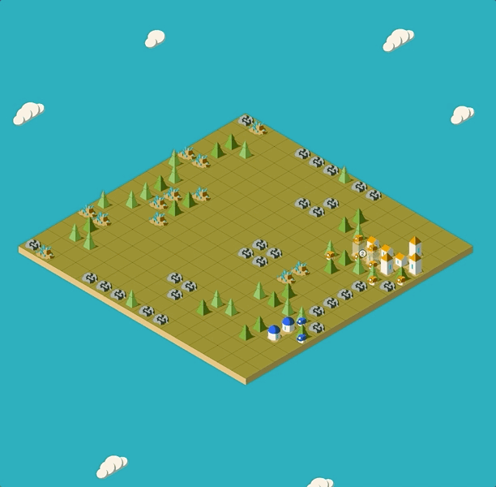
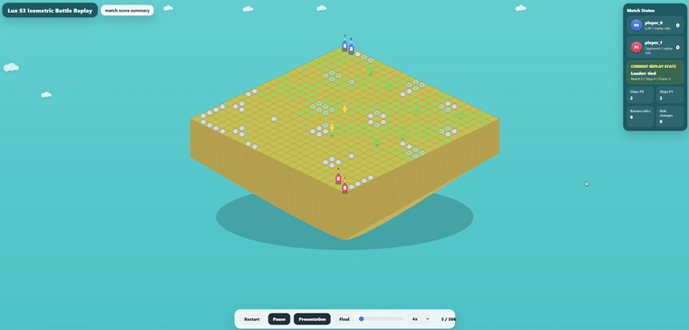

# LuxLLM-Agent Demo

<p align="center">
  <b>From the official Lux AI Season 1 visualizer to a locally verified Season 1 reference and an explainable Lux AI Season 3 LLM-agent demo.</b>
</p>

<table>

  <tr>

    <td align="center" width="50%">

      <b>Season 1 Official GIF</b><br>

      <br>

      <sub>Official Lux AI Season 1 visualizer replay GIF from the Lux-Viewer-S1 reference.</sub>

    </td>

    <td align="center" width="50%">

      <b>Season 1 Local GIF</b><br>

      <br>

      <sub>Locally verified Season 1 visualizer GIF generated from the local S1 setup.</sub>

    </td>

  </tr>

</table>


<br>


<p align="center">

  <b>Season 3 LuxLLM-Agent GIF</b>

</p>


<p align="center">

  

</p>


<p align="center">

  <sub>Our Lux AI Season 3 Run008 isometric demo with LLM-assisted evaluation evidence.</sub>

</p>

<p align="center">
  <b>LuxLLM-Agent:</b> an LLM-assisted Lux AI Season 3 agent with explainable isometric replay visualization and 50-run evaluation evidence.
</p>

<p align="center">
  Full demo video:
  <a href="https://github.com/zewang-liverpool/luxllm-agent-demo/releases/tag/demo-video">GitHub Release</a>
</p>

<p align="center">
  Season 1 visualizer source:
  <a href="https://github.com/Lux-AI-Challenge/Lux-Viewer-S1">Lux-Viewer-S1 official repository</a>
</p>

<p align="center">
  50-run evidence:
  <a href="https://github.com/zewang-liverpool/luxllm-agent-demo/tree/main/docs/demo_evidence/hpc_qwen3_32b_50run">qwen3:32b controlled evidence folder</a>
</p>

---

## Project Overview

LuxLLM-Agent is an inspectable LLM-assisted game-agent system for **Lux AI Season 3**. The project combines structured LLM strategic planning, rule-based arbitration, fallback-safe execution, decision-source logging, and replay-grounded visualization.

The project is designed as a demo-oriented research artifact for the **EMNLP 2026 System Demonstrations Track**. It is not presented as a competition-winning Lux AI bot. Instead, the main contribution is a reproducible and explainable agent runtime that makes LLM decisions, fallback behavior, and controlled evaluation evidence visible.

## Demo and Evidence Links

* **Repository:** `luxllm-agent-demo`
* **Final demo video:** [GitHub Release](https://github.com/zewang-liverpool/luxllm-agent-demo/releases/tag/demo-video)
* **Final demo GIF preview:** `assets/luxllm_agent_final_demo_run008.gif`
* **50-run evidence folder:** `docs/demo_evidence/hpc_qwen3_32b_50run/`
* **Selected demo run:** Run008
* **Selected decision trace:** `docs/demo_evidence/hpc_qwen3_32b_50run/decision_logs/decision_log_008.jsonl`

---

# EMNLP 2026 — System Demonstrations Track

Ready-to-upload LaTeX project using the **official ACL style files**, set up for the EMNLP 2026 **System Demonstrations** track.

## Upload to Overleaf

1. Zip this folder or use the prepared paper package.
2. In Overleaf: **New Project -> Upload Project** and select the zip.
3. Set the main document to `main.tex`.
4. Use compiler **pdfLaTeX**.

## Files

* `main.tex` — the paper, structured to address demo-track requirements.
* `acl.sty`, `acl_natbib.bst` — ACL style files.
* `custom.bib` — project-specific citations.
* `anthology.bib` — ACL Anthology entries.
* `figures/` — paper figures.
* `docs/` — development notes, evidence reports, evaluation summaries, and demo artifacts.
* `assets/` — repository-level demo media such as the README GIF preview.

## Key Rules Baked into the Template

* **6 pages** of content max.
* **Unlimited** references.
* **Unlimited** optional ethics or broader-impact statement.
* Appendix capped at **2 pages**.
* Single-blind author visibility is used in the current template.
* Accepted papers get **1 extra content page** for the camera-ready version.

## Submission Checklist

* [ ] Paper PDF, <= 6 pages, ACL style.
* [ ] Evaluation reported.
* [ ] Live demo URL or installable package link.
* [ ] Screencast video link or supplementary MPEG-4 file.
* [ ] Licensing stated.
* [ ] Ethics statement included.

## Important Dates

* Paper submission: **Friday, 10 July 2026** AoE.
* Notification: **20 August 2026**.
* Camera-ready: **30 August 2026**.
* Conference: **24–29 October 2026**, Budapest, Hungary.
* No rebuttal stage.

---

## Current Experimental Status

This project has reached the controlled-evaluation stage for the Lux AI Season 3 LLM-assisted agent. The current stable research configuration uses `qwen3:32b` with GPU-backed Ollama inference on Barkla2, combined with rule-based fallback, structured LLM planning, decision tracing, and replay-grounded inspection.

The current main controlled result is the **target-aware qwen3:32b strategic planner**. This configuration extends the earlier basic intent-only JSON planner by adding target coordinates, priority scores, risk labels, expected-value estimates, and lightweight rule-based arbitration.

| Configuration                        | Matches | LLM-Assisted Wins | Rule Opponent Wins | Win Rate | Strategy Use | Fallback Rate | LLM Errors | Main Observation                        |
| ------------------------------------ | ------: | ----------------: | -----------------: | -------: | -----------: | ------------: | ---------: | --------------------------------------- |
| Basic qwen3 planner                  |      50 |                28 |                 22 |      56% |        92.7% |          7.3% |          0 | Previous basic JSON planner             |
| Target-aware qwen3 strategic planner |      50 |                35 |                 15 |      70% |        96.0% |          4.0% |          0 | Current main controlled result          |
| Strategy-diverse prompting           |      50 |                29 |                 21 |      58% |            — |             — |   0.0 avg. | Earlier controlled configuration        |
| Candidate-exploitation ablation      |      50 |                26 |                 24 |      52% |            — |             — |   0.0 avg. | Stable ablation, but not an improvement |

The target-aware qwen3:32b strategic planner is now the main reported controlled result. In a 50-match controlled comparison, it improved the LLM-assisted player's descriptive win rate from 56% to 70% compared with the previous basic qwen3 planner, reduced fallback rate from 7.3% to 4.0%, and maintained zero LLM errors.

The earlier strategy-diverse prompting and candidate-exploitation configurations are retained as development evidence and ablation context. They show that the evaluation pipeline can compare design variants, but they should not be presented as the final main result.

---

## Final Demo Evidence

The latest demo uses **Run008** from the qwen3:32b controlled evidence set. The final video is distributed through GitHub Releases rather than committed directly to the repository.

### Final Demo Asset

* Demo title: **LuxLLM Agent Final Demo Run008 Isometric Visualization**
* Release page: [GitHub Release](https://github.com/zewang-liverpool/luxllm-agent-demo/releases/tag/demo-video)
* Local video filename: `LuxLLM_Agent_Final_Demo_Run008_Isometric_Visualization.mp4`
* README GIF preview: `assets/luxllm_agent_final_demo_run008.gif`

### 50-run Evidence Folder

The cleaned 50-run evidence folder is:

```text
docs/demo_evidence/hpc_qwen3_32b_50run/
```

It contains:

* `README.md`
* `hpc_qwen3_32b_multirun_summary.json`
* `hpc_qwen3_32b_multirun_summary.md`
* `match_history_full_snapshot.jsonl`
* `p55_light_qwen3_50run_closeout.md`
* `decision_logs/decision_log_008.jsonl`
* `llm_decisions/llm_decisions_001.jsonl` through `llm_decisions_050.jsonl`
* `selected_demo_run/`

These files document the controlled multi-run evaluation, step-level LLM decision traces, fallback behavior, rule arbitration, and the selected Run008 replay reference.

---

## Evidence Files

* `docs/demo_evidence/hpc_qwen3_32b_50run/`

  * Cleaned 50-run evidence folder for the final qwen3:32b controlled experiment.
  * Includes aggregated summaries, match history, Run008 decision trace, LLM decision logs, and replay references.

* `docs/evidence/qwen3_gpu_evidence_index.md`

  * Consolidated qwen3:32b GPU evidence index.
  * Includes earlier strategy-diverse and candidate-exploitation runs.
  * Identifies the target-aware qwen3 strategic planner as the current main controlled result.

* `docs/closeout_summary_qwen3_p55_light.md`

  * Closeout summary for the latest 50-match target-aware qwen3:32b strategic-planner run.
  * Records the 35/50 main result and reliability metrics.

* `docs/reviewer_response_qwen3_update.md`

  * Response notes for reviewer or supervisor concerns.
  * Explains how the project moved beyond small-model limitations.
  * Clarifies that the contribution is a structured LLM-agent runtime and replay-grounded evaluation system.

* `docs/demo_videos/README.md`

  * Documents the final demo video policy.
  * Points to the GitHub Release asset rather than storing the large MP4 directly in the repository.

---

## System Components

The project is organized around four connected components.

### 1. LLM-assisted Agent Runtime

The agent uses structured strategic planning with a fallback-safe runtime. It combines LLM decisions with rule-based arbitration and cached strategy reuse.

Main files include:

* `main.py`
* `agent.py`
* `config.py`
* `llm_decider.py`
* `rule_policy.py`
* `action_planner.py`
* `state_summarizer.py`
* `game_memory.py`
* `lux_state.py`

### 2. Decision Tracing

The runtime records structured traces for inspection and evaluation.

Representative evidence includes:

* decision source;
* LLM plan schema;
* target coordinates;
* priority scores;
* fallback usage;
* strategy cache usage;
* rule-arbitration behavior.

### 3. Replay-grounded Viewer

The viewer presents replay-grounded inspection evidence for the final demo.

Main viewer-related files include:

* `s3_log_driven_gameview.html`
* `data/isometric_replay_frames.json`
* `data/isometric_replay_frames_run008.json`
* `assets/luxllm_agent_final_demo_run008.gif`

### 4. Evaluation and Paper Artifacts

The project includes controlled-run evaluation summaries and paper-ready documentation.

Representative files include:

* `docs/evaluation_summary.md`
* `docs/evaluation_comparison_table.md`
* `docs/demo_artifact_index_v09o4.md`
* `docs/reproducibility_guide.md`
* `main.tex`
* `figures/`

---

## Final Project Positioning

This project is not presented as a state-of-the-art Lux AI competition bot or a competition-winning policy. It is presented as an inspectable LLM-assisted game-agent system for Lux AI Season 3.

The main contribution is the integration of:

1. structured LLM strategic planning;
2. schema validation;
3. rule-based arbitration;
4. fallback-safe execution;
5. cached strategy reuse;
6. decision-source logging;
7. replay-grounded inspection;
8. controlled qwen3:32b evaluation.

The strongest empirical claim is that, in controlled 50-match experiments, a target-aware qwen3:32b strategic planner achieved a higher descriptive win rate and lower fallback rate than the previous basic qwen3 planner, while maintaining zero LLM errors.

---

## Repository Media Policy

Large MP4 demo videos are not committed directly to the repository. They are distributed through GitHub Releases.

The README uses a compressed GIF preview:

```text
assets/luxllm_agent_final_demo_run008.gif
```

The complete final demo video is available here:

```text
https://github.com/zewang-liverpool/luxllm-agent-demo/releases/tag/demo-video
```

---

## Suggested Citation / Description

LuxLLM-Agent is an LLM-assisted game-agent system for Lux AI Season 3. It combines structured qwen3:32b strategic planning, rule-based arbitration, fallback-safe execution, and replay-grounded visualization. The system is evaluated through controlled 50-match experiments and demonstrated through an isometric Run008 replay visualization.
