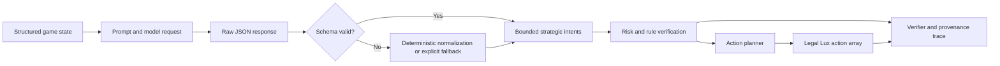

# Chapter 5: Implementation

## 5.1 Introduction

This chapter describes the implementation of LuxLLM-Agent, a decision-trace and action-verification framework for inspecting and evaluating LLM-based agents in Lux AI Season 3.

Chapter 4 presented the system design. This chapter explains how the design was implemented in the project codebase, including the runtime agent, state summarisation, LLM decision pipeline, action verification, fallback behaviour, logging, evaluation scripts, replay generation, and the LLM Decision Trace Overlay viewer.

The implementation follows the central design principle introduced earlier:

> The LLM output is treated as a strategic proposal, not as a directly executable game action.

This principle shaped the implementation choices throughout the project. The LLM is integrated as a high-level planner, while deterministic Python modules are responsible for parsing, verification, fallback, action generation, logging, and evaluation.

---

## 5.2 Project Structure

The implementation is organised around a small set of core runtime files, evidence files, viewer files, and documentation files.

Important runtime files include:

```text

agent.py

baseline_agent.py

main.py

config.py

lux_state.py

state_summarizer.py

llm_decider.py

action_planner.py

rule_policy.py

record_match_result_from_console.py

```

Important viewer and replay files include:

```text

s3_log_driven_gameview.html

docs/viewers/s3_isometric_battle_viewer_v09n12d_trace_overlay.html

data/isometric_replay_frames.json

data/run008_decision_trace_overlay.json

tools/build_run008_isometric_from_replay.py

tools/build_run008_decision_trace_overlay.py

tools/build_v09n12d_trace_overlay_viewer.py

```

Important evaluation and evidence files include:

```text

logs/match_history.jsonl

logs/decision_trace.jsonl

logs/decision_log.jsonl

logs/ablation_metrics.jsonl

docs/demo_evidence_index.md

docs/demo_evidence/llm_model_comparison_summary.md

docs/demo_evidence/hpc_deepseek_r1_32b_50run/

docs/analysis/qwen3_vs_deepseek_analysis.md

docs/analysis/failure_case_analysis.md

```

The project structure separates runtime logic, generated evidence, visualisation, and written analysis. This separation is useful for reproducibility because match execution, evaluation, and documentation are not mixed into a single script.

---

## 5.3 Agent Runtime Implementation

The main runtime implementation is centred on the Lux AI Season 3 agent.

Relevant files include:

```text

agent.py

baseline_agent.py

main.py

config.py

```

The runtime receives observations from the Lux AI Season 3 environment and returns action arrays. It supports different operation modes, including rule-only execution and LLM-enabled execution.

The runtime behaviour is controlled through environment variables. Important examples include:

```text

LUX_LLM_ENABLED

LUX_FORCE_RULE_ONLY

LUX_LLM_MODEL

LUX_EXPERIMENT_TAG

LUX_ENABLE_STRATEGY_CACHE

LUX_ENABLE_RISK_AWARE_ACTION_FILTER

```

These environment variables make it possible to run controlled comparisons without rewriting the agent. For example, the same codebase can run:

* a rule-only baseline;

* qwen3:32b-backed LLM mode;

* deepseek-r1:32b-backed LLM mode;

* strategy-cache-enabled mode;

* risk-aware-filter-enabled mode.

This configuration approach was important during experimentation because it allowed the project to test different agent variants while keeping the core runtime consistent.

---

## 5.4 State Summarisation Implementation

The state summarisation layer converts raw Lux AI Season 3 observations into compact structured information for the LLM.

Relevant files include:

```text

state_summarizer.py

lux_state.py

```

The implementation extracts information that is useful for strategic decision making, such as:

* current step;

* match phase;

* score context;

* visible units;

* unit positions;

* unit energy;

* known relic candidates;

* known scoring tiles;

* unexplored or stale areas;

* nearby enemy information;

* current strategic context.

This is necessary because raw observations are not ideal for direct prompting. They are detailed, low-level, and may include unnecessary information. The summariser reduces this noise and creates a stable input format for the LLM.

The summarised state also helps make the system easier to inspect. Since LLM decisions are based on a structured summary, the project can explain what information the LLM was expected to reason over.

This implementation supports the first sub-research question:

> How can raw Lux AI Season 3 observations be transformed into compact structured inputs for LLM-based strategic decision making?

---

## 5.5 LLM Decision Implementation

The LLM decision logic is implemented as a high-level planning module. The formal experiments use Qwen3-32B and DeepSeek-R1-32B through a local Ollama server (Yang et al., 2025; DeepSeek-AI et al., 2025; Ollama, 2024).

Relevant files include:

```text

llm_decider.py

agent.py

```

The implementation uses the configured LLM backend to generate structured strategic decisions. The model can be changed using:

```text

LUX_LLM_MODEL=qwen3:32b

LUX_LLM_MODEL=deepseek-r1:32b

```

The LLM is expected to return a structured plan rather than raw Lux AI actions. The plan may include:

* global game phase;

* main objective;

* risk posture;

* explanation or reason;

* unit-level intents;

* target positions;

* priorities;

* expected value estimates;

* unit-level reasons.

Example strategic intents include:

```text

EXPLORE_STALE_TILE

MOVE_TO_RELIC_CANDIDATE

SECURE_SCORING_TILE

HOLD_POSITION

```

The important implementation choice is that these intents are not executed directly. They are passed through parsing, verification, fallback, caching, and action planning before any executable Lux AI action is produced.

This reduces the risk of invalid LLM output causing invalid environment actions.

Figure 5.1 summarises the implemented decision path.



**Figure 5.1:** Implemented LLM decision pipeline. Raw responses cannot enter the environment directly; they pass through schema checks, normalization or fallback, verifier logic, and deterministic action construction.

---

## 5.6 Structured Parsing Implementation

After the LLM returns a response, the system attempts to parse it into structured internal data.

The parser is responsible for:

* detecting whether the response is valid;

* extracting the global plan;

* extracting unit-level intents;

* checking required fields;

* handling missing or malformed values;

* recording LLM validity;

* reporting LLM errors;

* triggering fallback when necessary.

The implementation records fields such as:

```text

llm_valid

llm_error

timed_out

fallback_used

fallback_reason

```

This stage is a key reliability boundary. Without parsing, the system would have to trust unstructured or semi-structured model output. With parsing, the system can reject invalid output and continue with fallback behaviour.

This implementation supports the project’s broader goal of making LLM-agent behaviour inspectable and evaluable.

---

## 5.7 Action Verification Implementation

Action verification checks whether the parsed LLM plan can be used in the current game state.

Relevant files include:

```text

action_planner.py

rule_policy.py

agent.py

```

The verifier and action-planning logic check whether:

* the referenced unit exists;

* the unit can act;

* the target is valid;

* the target is inside the map;

* the target is reachable;

* the intent is recognised;

* the action is legal;

* the plan appears locally safe.

If the LLM plan is not usable, the system can repair the plan, ignore the intent, or use fallback behaviour.

This implementation directly supports the second sub-research question:

> How can rule-based verification, fallback mechanisms, and strategy caching reduce invalid or unstable LLM-generated decisions?

The verification layer is one of the main reasons the project can use large LLMs without allowing arbitrary LLM output to directly control the environment.

---

## 5.8 Fallback Implementation

Fallback behaviour is implemented to ensure that the agent can continue acting even when the LLM cannot provide a usable decision.

Fallback may be used when:

* rule-only mode is enabled;

* LLM use is disabled;

* the LLM times out;

* the LLM response is invalid;

* the LLM output cannot be parsed;

* the plan fails verification;

* no suitable cached plan is available;

* rule-based behaviour is safer.

The system records fallback-related information using fields such as:

```text

fallback_used

fallback_reason

decision_source

rule_fallback

```

Fallback is not considered a simple failure case. In this project, fallback is implemented as a deliberate stability mechanism.

This is important for evaluation because the system can later analyse when the LLM contributed to behaviour and when rule-based support took over.

---

## 5.9 Strategy Cache Implementation

The strategy cache allows recent LLM plans to be reused across multiple game steps.

This was necessary because large LLMs can be slow. For example, the DeepSeek-R1-32B 50-run evidence recorded an average LLM latency of approximately 4143.595 ms and a maximum latency of 10581.076 ms.

Calling the LLM at every step would therefore be inefficient. The cache reduces:

* repeated LLM calls;

* runtime latency;

* unnecessary strategic changes;

* inference cost.

Cache-related fields include:

```text

cached_llm_turn

stale_decision

last_llm_step

llm_step_used

```

The cache also creates an evaluation issue: a cached plan may become stale if the game state changes. The project addresses this by logging stale-decision information and discussing cached-plan limitations in the failure-case analysis.

---

## 5.10 Risk-aware Action Filter Implementation

The risk-aware action filter adds another rule-based safety layer between LLM strategy and final action execution.

The filter can detect potentially unsafe actions, such as:

* moving near enemy units;

* targeting risky locations;

* sending low-energy units into dangerous areas;

* following stale or locally unsuitable plans.

Relevant logged fields include:

```text

risk_filter_enabled

risk_filter_changed

risk_filter_reason

risk_filter_changed_targets

risk_filter_events_count

```

This implementation supports the project’s argument that the LLM is not the only decision component. Instead, the final action emerges from a pipeline that combines LLM planning with rule-based verification and safety checks.

---

## 5.11 Action Planning Implementation

The action planner converts verified strategic intents into executable Lux AI Season 3 actions.

Relevant files include:

```text

action_planner.py

rule_policy.py

```

For example, a high-level intent such as:

```text

MOVE_TO_RELIC_CANDIDATE

```

must be converted into a concrete movement action for a specific unit.

The action planner considers:

* unit position;

* target position;

* legal movement directions;

* available action slots;

* unit energy;

* fallback options.

This component is important because it bridges the gap between strategic reasoning and environment execution. It ensures that high-level objectives become valid low-level actions.

---

## 5.12 Decision Trace Logging Implementation

The implementation records decision-level information in JSONL logs.

Important logs include:

```text

logs/decision_trace.jsonl

logs/decision_log.jsonl

logs/ablation_metrics.jsonl

logs/match_history.jsonl

```

The trace logs record fields such as:

```text

step

phase

player

team_id

decision_source

llm_mode

llm_model

llm_called

fresh_llm_call

cached_llm_turn

llm_valid

llm_error

fallback_used

fallback_reason

risk_filter_changed

unit_intent_count

unit_action_count

score_player_0

score_player_1

```

These logs allow the project to inspect:

* when a fresh LLM call was used;

* when cached LLM plans were reused;

* when fallback was used;

* when rule-based decisions were used;

* how often LLM errors occurred;

* how decision sources related to match outcomes.

The JSONL format is practical because each line is a separate event. This makes the logs easy to append during execution and easy to process later with Python scripts.

---

## 5.13 Match Result Recording

Match-level results are recorded using scripts such as:

```text

record_match_result_from_console.py

```

The recorded match history supports aggregate evaluation. Important match-level fields include:

* experiment tag;

* model name;

* match index;

* reward values;

* winner;

* LLM call counts;

* fallback counts;

* LLM errors;

* latency statistics;

* decision-source counts.

The results are stored in files such as:

```text

logs/match_history.jsonl

```

and are later summarised into evidence files under:

```text

docs/demo_evidence/

```

This implementation supports both the historical fixed-role runs and the formal matched-seed, role-swapped evaluation.

---

## 5.14 Controlled-run Evidence Implementation

The project includes controlled-run evidence for multiple LLM backends.

The current primary evidence includes:

| Model | Matched seeds | Role-swapped matches | Valid LLM calls | LLM wins |
| --- | ---: | ---: | ---: | ---: |
| qwen3:32b | 50 | 100 | 2,286/2,286 | 63 |
| deepseek-r1:32b | 50 | 100 | 2,305/2,305 | 60 |

Formal runs are produced by:

```text
scripts/run_paired_experiment.py
scripts/barkla_paired_experiment.sbatch
```

The compact, tracked analysis products are:

```text
reports/final_trace_evaluation.md
reports/final_trace_evaluation.json
reports/final_trace_metrics.csv
```

Historical fixed-role evidence remains under `docs/demo_evidence/` for provenance. The 32B formal raw runs and transfer archives are retained locally outside normal Git history because they are several hundred megabytes each. The tracked reports preserve aggregate metrics and analysis logic, while the reproducibility guide records how to rerun or audit the experiment.

---

## 5.15 Replay Frame Generation

The project includes replay-frame generation for the Season 3 isometric viewer.

Relevant files include:

```text

tools/build_run008_isometric_from_replay.py

data/isometric_replay_frames.json

```

The generated replay-frame file contains visual frame data for Run008. It is used by the isometric HTML viewer to display the game state step by step.

The replay-frame generation was important for demonstration because it allows the project to show agent behaviour without rerunning the match.

The viewer can be served locally using:

```text

python -m http.server 8000

```

and opened through a browser.

---

## 5.16 LLM Decision Trace Overlay Implementation

The LLM Decision Trace Overlay was added to connect replay frames with decision trace data.

Relevant files include:

```text

tools/build_run008_decision_trace_overlay.py

tools/build_v09n12d_trace_overlay_viewer.py

tools/fix_v09n12d_trace_overlay_layout.py

data/run008_decision_trace_overlay.json

docs/viewers/s3_isometric_battle_viewer_v09n12d_trace_overlay.html

```

The overlay data builder reads:

```text

data/isometric_replay_frames.json

logs/decision_trace.jsonl

logs/decision_log.jsonl

```

and writes:

```text

data/run008_decision_trace_overlay.json

```

The generated overlay data aligns replay frames with decision trace information by step number.

The current overlay generation reported:

```text

frames: 506

trace rows: 1009

llm decision rows: 23

matched step trace frames: 505

matched exact LLM frames: 23

matched recent LLM frames: 506

```

This shows that nearly all replay frames can be matched with trace information, and every frame can be associated with the most recent LLM plan.

The viewer displays:

* frame and step;

* phase;

* decision source;

* LLM model;

* current objective;

* risk posture;

* fallback status;

* risk filter status;

* score context;

* unit intents.

The overlay can be toggled with the `H` key. This supports both live demonstration and clean screenshot capture.

This implementation directly supports the third sub-research question:

> How can replay-grounded decision traces help analyse the relationship between LLM strategy, decision source, action execution, and game outcome?

---

## 5.17 Viewer Implementation

The viewer is implemented as a browser-based HTML interface.

Important viewer files include:

```text

docs/viewers/s3_isometric_battle_viewer_v09n12d_trace_overlay.html

docs/viewers/s3_isometric_battle_viewer_v09n12d_trace_overlay.html

```

The viewer displays an isometric map, battle timeline, score information, match status, and playback controls.

The v09n12d version extends the previous viewer by injecting an LLM Decision Trace Overlay panel. The overlay is positioned so that it does not cover the original match-status panel.

The viewer can be opened locally using a simple HTTP server:

```text

python -m http.server 8000

```

Then the viewer can be opened in a browser:

```text

http://localhost:8000/docs/viewers/s3_isometric_battle_viewer_v09n12d_trace_overlay.html

```

This implementation makes the project easier to demonstrate and provides visual evidence for the dissertation.

---

## 5.18 Evidence and Documentation Implementation

The project stores evidence and analysis under the `docs/` directory.

Important documentation files include:

```text

docs/technical/system_architecture.md

docs/technical/llm_decision_pipeline.md

docs/technical/action_verification_and_fallback.md

docs/technical/decision_trace_overlay.md

docs/technical/evaluation_metrics.md

docs/analysis/qwen3_vs_deepseek_analysis.md

docs/analysis/failure_case_analysis.md

```

These files were created to support the dissertation and make the system easier to inspect.

The documentation separates:

* technical architecture;

* LLM decision pipeline;

* action verification and fallback;

* overlay implementation;

* evaluation metrics;

* model comparison;

* failure analysis.

This structure helps convert the project from an engineering prototype into a dissertation-ready research artefact.

---

## 5.19 Implementation Challenges

Several implementation challenges occurred during the project.

### 5.19.1 Integrating LLMs with a fast game loop

Lux AI Season 3 requires agents to produce actions repeatedly. Large LLMs can take several seconds to respond, so direct step-by-step LLM control would be impractical.

The implementation addresses this through strategy caching, controlled LLM call intervals, fallback behaviour, and deterministic action planning.

### 5.19.2 Handling invalid or unavailable LLM output

The LLM may fail, time out, or produce invalid output. The system handles this through parsing, validation, and fallback.

This reduces the risk of runtime failure.

### 5.19.3 Connecting logs to replay frames

The decision trace overlay required matching replay frames with decision logs. This required careful step alignment between:

```text

data/isometric_replay_frames.json

logs/decision_trace.jsonl

logs/decision_log.jsonl

```

The resulting overlay makes the replay more informative, but it also introduces a need for clear labelling when logs and replays are generated from specific runs.

### 5.19.4 Managing evidence files

Controlled runs can produce many files. The implementation therefore separates key summary evidence from raw run folders. This makes the repository easier to maintain while preserving important results.

### 5.19.5 Maintaining reproducibility

The system uses scripts, JSON/JSONL evidence, and markdown documentation to make experiments reproducible. However, large videos, temporary files, and raw logs must be managed carefully to avoid bloating the repository.

---

## 5.20 Summary

This chapter has described the implementation of LuxLLM-Agent.

The implementation includes a Lux AI Season 3 runtime agent, structured state summarisation, configurable LLM decision making, structured parsing, rule-based action verification, fallback mechanisms, strategy caching, risk-aware filtering, action planning, decision trace logging, controlled-run evidence generation, replay frame generation, and a decision trace overlay viewer.

The key implementation contribution is the controlled pipeline between LLM strategic reasoning and executable game actions. This pipeline makes the system more stable, inspectable, and evaluable.

The next chapter evaluates the system using gameplay outcomes, LLM execution metrics, decision-source analysis, model comparison, replay-grounded inspection, and failure-case analysis.

