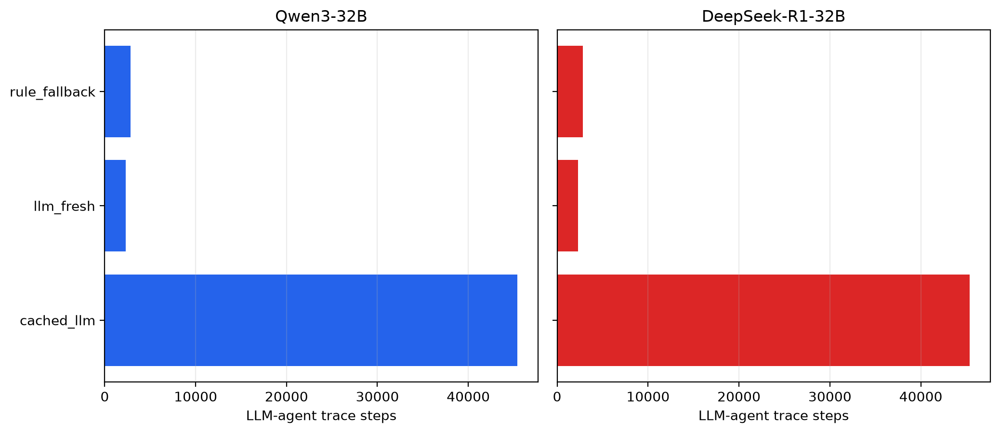
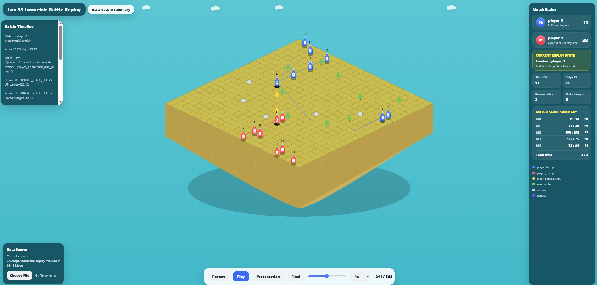

# Chapter 6: Evaluation

## 6.1 Introduction

This chapter evaluates the project-specific DTAV method for LLM decision making in Lux AI Season 3 and defines the controlled direct-prompting comparison required by the revised research question.

The evaluation is guided by the main research question:

> How effectively can directly prompted LLMs make decisions in a partially observable, multi-agent, long-horizon, and rule-constrained strategy game such as Lux AI Season 3, and how can the project-specific Decision-Trace and Action-Verification (DTAV) method address the observed limitations?

The evaluation does not only consider whether the agent wins or loses. While gameplay outcome is important, final scores alone cannot explain how the agent behaved, whether the LLM was used, when fallback was required, whether cached decisions were reused, or whether the framework remained stable.

Therefore, this chapter evaluates the system across several dimensions:

* gameplay outcome;

* LLM execution stability;

* LLM latency;

* decision-source distribution;

* fallback and verification behaviour;

* model comparison;

* replay-grounded inspection;

* failure-case analysis;

* limitations of the evaluation.

This multi-dimensional evaluation is important because LuxLLM-Agent is not only a game-playing agent. The comparison must show both what a directly prompted LLM can do and which observable limitations are addressed by DTAV.

---

## 6.2 Evaluation Objectives

The evaluation has four measurement dimensions, applied to the direct-prompt and DTAV conditions.

### 6.2.1 Evaluate gameplay outcome

The first objective is to measure whether the agent can complete controlled Lux AI Season 3 matches and produce meaningful match outcomes.

The main metrics are:

* total runs;

* player_0 wins;

* player_1 wins;

* draw count;

* player_0 win rate;

* average reward;

* winner distribution.

### 6.2.2 Evaluate LLM execution stability

The second objective is to evaluate whether LLM-backed agent execution remains stable.

The main metrics are:

* LLM errors;

* parsing errors;

* timeout events;

* valid LLM decisions;

* successful controlled runs.

This is important because an LLM-based game agent may fail not only through poor strategy, but also through invalid output, malformed responses, or runtime instability.

### 6.2.3 Evaluate decision provenance

The third objective is to analyse where decisions come from.

Important decision sources include:

```text id="248e1f"

llm_fresh

cached_llm

fallback

rule_fallback

rule_player

rule_only

```

Decision provenance helps determine whether actions are produced by fresh LLM decisions, cached LLM plans, fallback behaviour, or rule-based logic.

### 6.2.4 Evaluate replay-grounded inspectability

The fourth objective is to evaluate whether the system can connect decisions to replay frames.

The LLM Decision Trace Overlay is used to inspect:

* current frame and step;

* decision source;

* LLM model;

* objective;

* risk posture;

* fallback status;

* risk filter status;

* score context;

* unit intents.

This allows the evaluation to include qualitative inspection rather than only aggregate statistics.

---

## 6.3 Evaluation Setup

The evaluation uses controlled Lux AI Season 3 runs and replay-grounded visual inspection.

The main LLM backends evaluated are:

| Model           | Role                   |
| --------------- | ---------------------- |
| qwen3:32b       | Main LLM backend       |
| deepseek-r1:32b | Comparison LLM backend |

The purpose of comparing these models is not to create a general LLM leaderboard. Instead, the comparison tests whether the same decision-trace and rule-based action-verification framework can support different reasoning-oriented LLM backends.

The main evidence sources are:

```text id="u2bffa"

docs/demo_evidence/hpc_qwen3_32b_50run/

docs/demo_evidence/hpc_deepseek_r1_32b_50run/

docs/demo_evidence/llm_model_comparison_summary.md

docs/technical/evaluation_metrics.md

docs/analysis/qwen3_vs_deepseek_analysis.md

docs/analysis/failure_case_analysis.md

data/run008_decision_trace_overlay.json

docs/viewers/s3_isometric_battle_viewer_v09n12d_trace_overlay.html

```

The evaluation also uses decision logs such as:

```text id="8ua3d5"

logs/decision_trace.jsonl

logs/decision_log.jsonl

logs/ablation_metrics.jsonl

logs/match_history.jsonl

```

---

## 6.4 Evaluation Metrics

The evaluation uses several categories of metrics.

### 6.4.1 Gameplay metrics

Gameplay metrics include:

| Metric                  | Description                              |
| ----------------------- | ---------------------------------------- |
| Total runs              | Number of controlled matches             |
| player_0 wins           | Number of matches won by player_0        |
| player_1 wins           | Number of matches won by player_1        |
| Draws                   | Number of matches without a clear winner |
| player_0 win rate       | player_0 wins divided by total runs      |
| Average player_0 reward | Mean reward for player_0                 |
| Average player_1 reward | Mean reward for player_1                 |

These metrics show the final outcome of controlled runs.

### 6.4.2 LLM execution metrics

LLM execution metrics include:

| Metric              | Description                                     |
| ------------------- | ----------------------------------------------- |
| Fresh LLM calls     | Number of new LLM calls                         |
| LLM strategy used   | Number of times usable LLM strategy was applied |
| Cached LLM turns    | Number of turns using a previous LLM plan       |
| LLM errors          | Number of LLM or parser failures                |
| Average LLM latency | Mean LLM response time                          |
| Maximum LLM latency | Highest observed LLM response time              |

These metrics evaluate whether the LLM pipeline remains stable and practical.

### 6.4.3 Decision-source metrics

Decision-source metrics record where actions came from.

| Decision source | Meaning                                             |
| --------------- | --------------------------------------------------- |
| `llm_fresh`     | A fresh LLM decision was used                       |
| `cached_llm`    | A recent LLM plan was reused                        |
| `fallback`      | General fallback behaviour was used                 |
| `rule_fallback` | Rule-based fallback repaired or replaced a decision |
| `rule_player`   | Rule-based player logic produced the action         |
| `rule_only`     | Rule-only mode was active                           |

These metrics are central to the evaluation because they show how much the LLM contributed and how much behaviour came from deterministic support mechanisms.

### 6.4.4 Replay-grounded metrics

Replay-grounded metrics include:

| Metric                    | Description                                        |
| ------------------------- | -------------------------------------------------- |
| Replay frames             | Number of generated replay frames                  |
| Decision trace rows       | Number of trace rows available                     |
| LLM decision rows         | Number of fresh LLM decision rows                  |
| Matched step trace frames | Number of replay frames aligned with step traces   |
| Matched exact LLM frames  | Number of frames with exact fresh LLM decisions    |
| Matched recent LLM frames | Number of frames associated with a recent LLM plan |

These metrics evaluate whether visual inspection can be connected to decision logs.

---

## 6.5 Formal Matched-seed and Role-swapped Evaluation

The primary evaluation supersedes the earlier fixed-role 50-run comparison. It uses 50 matched Lux environment seeds for each backend and evaluates the LLM-controlled agent in both player roles, producing 100 matches per backend and 200 matches overall.

### 6.5.1 Completion and outcome evidence

| Metric | qwen3:32b | deepseek-r1:32b |
| --- | ---: | ---: |
| Completed matches | 100/100 | 100/100 |
| Matched seed pairs | 50 | 50 |
| LLM wins | 63 | 60 |
| LLM losses | 37 | 40 |
| LLM win rate | 63% | 60% |
| Wilson 95% CI | 53.2%-71.8% | 50.2%-69.1% |
| Exact binomial p-value vs 0.5 | 0.0120 | 0.0569 |

Qwen won 29/50 matches as `player_0` and 34/50 as `player_1`. DeepSeek won 30/50 in each role. Within-model matched-role analysis did not identify a statistically supported role effect: Qwen's paired-bootstrap interval for the player-role outcome-score difference was [-0.32, 0.12], while DeepSeek's was [-0.20, 0.20].

The matched Qwen-versus-DeepSeek comparison covered 100 seed-role strata. Qwen alone won 14 strata and DeepSeek alone won 11. The mean outcome-score difference was 0.03, its paired-bootstrap 95% interval was [-0.07, 0.13], and the McNemar exact p-value was 0.690. This does not support a general claim that one backend is superior.

### 6.5.2 Decision-trace and verification evidence

| Metric | Qwen3-32B | DeepSeek-R1-32B |
| --- | ---: | ---: |
| Structured trace records | 103,286 | 103,305 |
| Matches with trace | 100 (100%) | 100 (100%) |
| Agent-step trace completeness | 100% | 100% |
| LLM-call trace completeness | 100% | 100% |
| Replay-linkage coverage | 100% | 100% |
| LLM calls | 2,286 | 2,305 |
| Post-check structured-valid calls | 2,286 (100%) | 2,305 (100%) |
| Raw schema-valid calls | 1,766 (77.3%) | 2,305 (100%) |
| Deterministic normalizations | 520 | 0 |
| Cached-decision steps | 45,399 | 45,380 |
| Observable rule-fallback steps | 2,815 | 2,815 |
| Risk-filter changed steps | 5,590 | 7,090 |
| Risk-filter changed targets | 31,128 | 34,379 |
| Action-array shape validity | 100% | 100% |
| LLM timeouts / errors | 0 / 0 | 0 / 0 |
| Downstream action fallback steps | 0 | 0 |

These metrics provide the primary answer to the research question. Trace completeness and replay linkage show that decisions can be inspected after execution. Raw-schema checks and normalization counts expose where the framework intervened before planning. Risk-filter changes show that rule-based verification affected proposed targets. Action-shape validity, completed matches, and the absence of downstream action fallback show reliable execution in the observed runs, without claiming proof of safety for every possible model output.

The evidence is generated by `tools/analyse_trace_evidence.py` and summarised in `reports/final_trace_evaluation.md`, `reports/final_trace_evaluation.json`, and `reports/final_trace_metrics.csv`.

### 6.5.3 Offline verifier intervention audit

To make the verifier evidence more direct, `tools/audit_verifier_interventions.py` re-analyses the retained raw formal logs without making new model calls. It reports normalization and risk-filter interventions by backend, decision source, game phase, reason, and changed-target count.

The strict-schema counterfactual shows that 520 Qwen calls would have been rejected if the framework required the full raw object schema and did not implement its deterministic string-intent normalization. All 520 normalized calls passed the post-check representation. DeepSeek produced no responses requiring this normalization in the formal run.

Risk filtering changed 31,128 Qwen targets across 5,590 steps and 34,379 DeepSeek targets across 7,090 steps. Most interventions occurred while a cached LLM strategy was active: 5,153 Qwen steps and 6,569 DeepSeek steps. The recorded reason in every affected step was that the original target was inside the visible-enemy risk radius and a safer target was selected. This evidence demonstrates that verification was operational rather than merely specified in the architecture.

The audit does not claim that every changed target caused a better match outcome. It establishes a narrower and reproducible result: the framework detected recorded risk conditions, changed proposed targets before action construction, and retained the reason and provenance needed for inspection. The outputs are stored in `reports/verifier_intervention_audit.md`, `.json`, and `.csv`.


**Figure 6.1:** Formal framework evidence rates. Trace completeness, post-check validity, raw-schema quality, and observed verifier intervention are shown separately so that successful execution is not confused with unmodified model output.

---

## 6.6 Historical qwen3:32b Fixed-role Evidence

The qwen3:32b evaluation provides the main LLM-backed controlled-run result.

The recorded 50-run result is:

| Metric            |     Value |
| ----------------- | --------: |
| Model             | qwen3:32b |
| Total runs        |        50 |
| player_0 wins     |        35 |
| player_1 wins     |        15 |
| Draws             |         0 |
| player_0 win rate |       70% |
| Wilson 95% CI     | 56.2%-80.9% |
| Exact binomial p-value vs 0.5 | 0.006600 |
| LLM errors        |         0 |

This result shows that the qwen3:32b-backed system completed 50 controlled Lux AI Season 3 runs with zero LLM errors.

The 70% player_0 win rate suggests that the qwen3:32b-backed configuration produced stronger gameplay outcomes than the comparison DeepSeek-R1-32B configuration in the current evaluation setup.

However, this should be interpreted carefully. The result does not prove that qwen3:32b is generally superior as an LLM. It only shows that qwen3:32b performed better in this particular LuxLLM-Agent pipeline, with the current prompt design, action verifier, fallback mechanism, and evaluation configuration.

The more important framework-level finding is that qwen3:32b can be integrated into the system with stable execution and zero recorded LLM errors.

---

## 6.7 Historical DeepSeek-R1-32B Fixed-role Evidence

The DeepSeek-R1-32B evaluation was added as a comparison LLM backend.

The recorded 50-run result is:

| Metric                    |           Value |
| ------------------------- | --------------: |
| Model                     | deepseek-r1:32b |
| Total runs                |              50 |
| player_0 wins             |              26 |
| player_1 wins             |              24 |
| player_0 win rate         |             52% |
| Wilson 95% CI             |      38.5%-65.2% |
| Exact binomial p-value vs 0.5 |        0.887725 |
| Average player_0 reward   |             2.7 |
| Average player_1 reward   |             2.3 |
| Average fresh LLM calls   |            33.2 |
| Average LLM strategy used |           27.24 |
| Average cached LLM turns  |          412.62 |
| Average fallback count    |          570.14 |
| Average LLM errors        |             0.0 |
| Average LLM latency       |     4143.595 ms |
| Maximum LLM latency       |    10581.076 ms |
| Average trace steps       |          1010.0 |

The DeepSeek-R1-32B-backed system also completed 50 controlled runs with zero LLM errors.

The player_0 win rate was 52%, which is lower than the qwen3:32b result but still demonstrates stable controlled execution.

The latency values are particularly important. An average latency of approximately 4.14 seconds and a maximum latency of approximately 10.58 seconds show that large LLM calls are too expensive to use at every game step. This supports the implementation of strategy caching and fallback behaviour.

---

## 6.8 Historical Fixed-role Comparison

The following earlier comparison is retained as development history rather than used as the primary result:

| Model           | Runs | player_0 wins | player_1 wins | player_0 win rate | Wilson 95% CI | LLM errors |
| --------------- | ---: | ------------: | ------------: | ----------------: | ------------: | ---------: |
| qwen3:32b       |   50 |            35 |            15 |               70% | 56.2%-80.9% |          0 |
| deepseek-r1:32b |   50 |            26 |            24 |               52% | 38.5%-65.2% |          0 |

The qwen3:32b-backed configuration achieved a stronger gameplay outcome in this historical fixed-role evaluation.

However, the most important dissertation-level interpretation is not simply that qwen3:32b won more matches. A stronger interpretation is:

> The same structured decision-trace and rule-based action-verification framework can support multiple reasoning-oriented LLM backends. Both qwen3:32b and DeepSeek-R1-32B completed 50 controlled Lux AI Season 3 runs with zero LLM errors, while producing different gameplay outcomes.

This interpretation connects the results to the research question. The framework separates model-level strategic behaviour from system-level execution stability.

The comparison also shows why final win rate should not be the only metric. Although the two models produced different gameplay outcomes, both were stable under the same pipeline. Therefore, model quality, prompt suitability, fallback behaviour, caching, and action verification all contribute to the final result.

---

## 6.9 Decision-source Analysis

Decision-source analysis is central to the project because it explains how behaviour was produced.

For the DeepSeek-R1-32B 50-run experiment, the decision-source distribution was:

| Decision source | Count |
| --------------- | ----: |
| `rule_player`   | 25250 |
| `fallback`      |    94 |
| `rule_fallback` |  3163 |
| `llm_fresh`     |  1362 |
| `cached_llm`    | 20631 |

The total number of decision-source events was:

```text id="5or03k"

50500

```

LLM-related decision events were:

```text id="7phd4j"

llm_fresh + cached_llm = 1362 + 20631 = 21993

```

Fallback-related decision events were:

```text id="3d0z8l"

fallback + rule_fallback = 94 + 3163 = 3257

```

Approximate rates were:

```text id="47lesq"

LLM decision-source rate = 21993 / 50500 = approximately 43.55%

Fallback decision-source rate = 3257 / 50500 = approximately 6.45%

```

These values show that the DeepSeek-backed agent behaviour was produced by a hybrid pipeline. It was not purely LLM-driven, and it was not purely rule-driven.

The agent used:

* fresh LLM decisions;

* cached LLM plans;

* rule-player actions;

* fallback actions;

* rule fallback.

This is a strength of the evaluation because the system can explain decision provenance instead of only reporting final match outcomes.



**Figure 6.2:** Formal decision-source distribution. Fresh LLM decisions, cached strategies, and rule fallback are retained as separate provenance categories for both model backends.

---

## 6.10 Fallback and Verification Analysis

Fallback and verification are important because the LLM output is not directly executed.

The system uses fallback when:

* the LLM is disabled;

* the LLM is not called at the current step;

* the LLM response is invalid;

* the LLM times out;

* the plan fails parsing;

* the plan fails verification;

* a rule-based action is safer.

Fallback-related fields include:

```text id="ep3jsa"

fallback_used

fallback_reason

decision_source

rule_fallback

```

The DeepSeek-R1-32B evidence shows that fallback-related decision-source events occurred, but they were not dominant compared with the total number of events.

This supports the system design. The framework can use LLM decisions when available, reuse cached decisions when appropriate, and fall back to deterministic behaviour when needed.

However, fallback also complicates result interpretation. If an agent wins a match, the result should not be attributed only to the LLM. The rule-based verifier, fallback policy, and action planner also contribute to behaviour.

Therefore, the dissertation should interpret the system as a hybrid LLM-rule framework rather than a purely LLM-controlled agent.

---

## 6.11 Latency and Strategy Cache Analysis

The DeepSeek-R1-32B evaluation recorded:

| Latency metric      |        Value |
| ------------------- | -----------: |
| Average LLM latency |  4143.595 ms |
| Maximum LLM latency | 10581.076 ms |

These results confirm that large LLM calls are expensive in a sequential game-agent setting.

If the LLM were called at every step, the agent would be too slow for practical use. Therefore, strategy caching is necessary.

The DeepSeek-R1-32B evidence also recorded:

| Cache-related metric     |  Value |
| ------------------------ | -----: |
| Average cached LLM turns | 412.62 |

This shows that cached LLM plans were reused many times across the evaluation.

The cache provides several benefits:

* reduces repeated LLM calls;

* reduces latency cost;

* prevents excessive strategic oscillation;

* makes large-model integration more practical.

However, caching also introduces a limitation. Cached plans may become stale when the game state changes. This limitation is examined in the failure-case analysis.

---

## 6.12 Replay-grounded Inspection Evaluation

The LLM Decision Trace Overlay evaluates whether decision traces can be connected to replay frames.

The overlay generation result was:

| Metric                    | Value |
| ------------------------- | ----: |
| Replay frames             |   506 |
| Decision trace rows       |  1009 |
| LLM decision rows         |    23 |
| Matched step trace frames |   505 |
| Matched exact LLM frames  |    23 |
| Matched recent LLM frames |   506 |

This result shows that nearly all replay frames were matched with step trace information, and all frames were associated with a recent LLM plan.

The overlay displays:

* frame and step;

* phase;

* decision source;

* LLM model;

* objective;

* risk posture;

* fallback status;

* risk filter status;

* score context;

* unit intents.

This supports replay-grounded inspection because a user can view a frame and inspect the decision context that corresponds to that moment.

The viewer therefore supports the third sub-research question:

> How can replay-grounded decision traces help analyse the relationship between LLM strategy, decision source, action execution, and game outcome?

The overlay is particularly useful because final match results cannot show whether a visible action came from a fresh LLM decision, a cached plan, fallback, or rule-based logic.



**Figure 6.3:** Run008 isometric replay viewer. The replay artefact provides the visual environment context to which step-level decision traces are aligned; the interactive repository version additionally exposes the detailed trace overlay.

---

## 6.13 Direct-Prompting versus DTAV Comparison

The revised research question requires a method comparison rather than only
model-versus-rule and model-versus-model studies. The repository now exposes
`direct_prompt` and `dtav` through the same matched-seed, role-swapped runner.
Both conditions use the same compact observation, LLM backend, temperature,
seed, role assignment, generation budget, and LLM call schedule.

The direct-prompt condition disables deterministic output normalisation,
strategy reuse, and risk-aware target filtering. DTAV enables them. Both retain
the minimal parser, legal-action adapter, and logged emergency fallback because
the Lux runner cannot execute free-form model text. This shared boundary means
the baseline is “direct prompting through the minimum executable interface,”
not unrestricted text sent directly to the environment.

Local acceptance testing has completed one mock-model seed pair with roles
swapped. Both matches completed, the method label was present in environment,
match, LLM-call, and agent-step records, and
`tools/validate_paired_method_result.py` passed. These mock results validate the
pipeline only and are not empirical evidence about LLM game-playing quality.

The formal comparison remains to be run on Barkla2 with 50 matched seed pairs
for each condition from the same source commit. Until those results are
validated and inserted here, the retained 300 formal matches demonstrate DTAV
operation, model support, and intervention observability, but they do not by
themselves estimate the difference between direct prompting and DTAV. No
comparative performance or reliability claim should be made before that run.

The planned comparison reports:

| Metric family | Measures |
| --- | --- |
| Proposal quality | raw-schema validity, recognised-intent validity, incomplete/invalid calls |
| Reliability | completed matches, timeout/error rate, fallback rate, action-shape validity |
| DTAV intervention | normalisation, strategy-reuse, and risk-filter event counts |
| Efficiency | fresh-call count and latency distribution |
| Gameplay | paired win/loss outcomes, role effects, confidence interval |
| Inspectability | method-labelled trace completeness and replay linkage |

---

## 6.14 Supplementary Direct LLM-versus-LLM Evaluation

Following supervisor feedback, a supplementary experiment tested whether two LLM-assisted agents could play directly against each other while both remained inside the same decision-trace and rule-verification framework. The experiment used qwen3:32b and DeepSeek-R1-32B over 50 matched Lux environment seeds. Each seed was run twice with the model roles swapped, producing 100 completed matches.

The purpose of this experiment was not to redefine the dissertation as a model-comparison study. It tested whether the framework could retain complete, isolated provenance and deterministic verification when both players generated LLM proposals concurrently.

| Metric | Result |
| --- | ---: |
| Completed matches | 100 / 100 |
| Proper role-swapped seed pairs | 50 / 50 |
| Qwen wins / DeepSeek wins / draws | 54 / 46 / 0 |
| Qwen win rate | 54% |
| Seed-clustered bootstrap 95% interval | 45%-63% |
| Seed-level exact sign p-value | 0.503 |
| Structured trace records | 106,317 |
| Valid fresh LLM calls | 4,676 / 4,676 |
| Raw-schema-valid calls | 4,105 / 4,676 |
| Deterministic normalizations | 571 |
| Risk-filter changed steps | 15,721 |
| Risk-filter changed targets | 85,805 |
| Trace completeness / replay linkage | 100% / 100% |
| Timeouts / LLM errors / action fallbacks | 0 / 0 / 0 |

The 54:46 outcome is not statistically distinguishable from parity under the matched-seed analysis. The outcome therefore does not support a general claim that Qwen is better than DeepSeek. The more relevant result is operational: both simultaneous LLM agents produced complete provenance, all fresh calls passed the bounded post-check schema, deterministic normalization repaired 571 non-conforming raw responses, and risk verification remained observable before action construction.

The direct experiment also exposed an engineering requirement that was less visible in the model-versus-rule runs. Concurrent agents must not append to the same JSONL file. The implementation therefore isolates `player_0` and `player_1` log streams and validates that each run contains calls from both player-model assignments without malformed records.

This supplementary evidence strengthens the answer to the main research question by showing that decision tracing and rule-based verification support inspection and evaluation even when both sides of the environment are LLM-assisted. It remains supplementary because the central contribution is the framework rather than the 54:46 model outcome.

---

## 6.15 Failure-case Analysis

The project includes failure-case analysis to avoid only reporting successful results.

Representative failure and limitation cases include:

### 6.15.1 Valid LLM plan but limited strategic impact

An LLM may produce a valid plan such as exploring stale tiles or moving toward relic candidates. This output can be structurally valid and parseable, but it may still have limited strategic impact.

This shows that LLM validity is not the same as strategic quality.

### 6.15.2 Fallback replaces or supports LLM decision

Trace records may show that behaviour came from `rule_only`, `fallback`, or `rule_fallback`. This is useful for stability, but it means final actions cannot always be attributed directly to the LLM.

This shows that fallback is both a strength and an evaluation complication.

### 6.15.3 Cached plan may become stale

A frame may use a recent LLM plan rather than an exact fresh decision. This is necessary for efficiency, but the cached plan may become less suitable as the game state changes.

This shows the trade-off between latency reduction and adaptiveness.

### 6.15.4 Stable execution but different model outcomes

Both qwen3:32b and DeepSeek-R1-32B completed the primary 100-match formal evaluation and the supplementary direct experiment with no recorded LLM error, but their observed outcomes still varied. This shows that execution stability does not imply equal strategic performance.

### 6.15.5 Viewer trace alignment requires careful labelling

The overlay aligns replay frames and trace logs by step. This is useful, but the dissertation should clearly label which replay and trace sources are used, especially if data comes from specific controlled runs.

These failure cases strengthen the evaluation because they demonstrate critical reflection rather than only positive reporting.

---

## 6.16 Discussion of Results

The evaluation supports several findings.

### 6.16.1 The method supports multiple LLM backends

Both qwen3:32b and DeepSeek-R1-32B completed the primary controlled runs and the direct dual-LLM supplementary runs without an observed LLM error. This suggests that the framework can integrate different reasoning-oriented LLMs on one or both sides of a match.

### 6.16.2 Decision tracing improves interpretability

Decision-source logs and the overlay make it possible to inspect whether actions come from fresh LLM decisions, cached plans, fallback, or rule-based logic.

### 6.16.3 Rule-based verification improves stability

The verifier and fallback mechanisms prevent arbitrary LLM output from directly controlling actions. This supports stable execution.

### 6.16.4 Caching is necessary for large LLMs

Latency evidence shows that large LLMs are too slow to call at every step. Strategy caching is therefore necessary for practical integration.

### 6.16.5 Win rate is not sufficient for evaluation

Final outcome metrics are useful, but they must be interpreted together with decision-source, fallback, latency, and replay-grounded inspection metrics.

---

## 6.17 Threats to Validity

The evaluation has several threats to validity.

### 6.17.1 Limited number of LLM backends

The evaluation compares qwen3:32b and DeepSeek-R1-32B. This is useful, but it does not cover all possible LLMs.

### 6.17.2 Prompt sensitivity

Different models may respond differently to the same prompt. The current comparison uses the same framework, but model-specific prompt tuning could change the results.

### 6.17.3 Hybrid system attribution

The final behaviour is produced by a hybrid system. It includes LLM planning, cached decisions, rule-based verification, fallback, and action planning. Therefore, final win rate cannot be attributed only to the LLM.

### 6.17.4 Run-specific evidence

Some evidence, such as the Run008 viewer and overlay, is based on specific replay and trace files. The dissertation should avoid generalising too strongly from a single replay.

### 6.17.5 Gameplay performance is not leaderboard-level

The system is designed for inspection and evaluation rather than maximum Lux AI leaderboard performance. This should be clearly stated.

---

## 6.18 Limitations

The current evaluation has several limitations.

First, the evaluation covers two local 32B reasoning-oriented backends and 50 matched seeds per backend. This is substantially stronger than the historical fixed-role runs, but it is not a large-scale multi-model benchmark.

Second, the primary formal evaluation swaps roles under matched seeds against the same rule-based policy. The supplementary experiment replaces that opponent with the other LLM backend, but still covers only one model pair. The findings therefore apply to this agent, prompt, verifier, opponents, model quantisation, and Lux configuration.

Third, the formal matched comparison reports Wilson intervals, seed-clustered bootstrap intervals, role analysis, and a matched McNemar test. These quantify uncertainty but do not turn the experiment into a hardware-independent causal model ranking. The historical fixed-player results remain descriptive only.

Fourth, the failure-case analysis is currently representative rather than exhaustive. Future work could automatically identify and classify failure cases from logs.

Fifth, fallback counts can be difficult to interpret because fallback may be recorded at different levels, such as unit-level fallback or decision-source fallback.

Sixth, the replay overlay provides strong qualitative evidence, but it depends on correct alignment between replay frames and decision traces.

Seventh, the current system evaluates framework stability and inspectability more strongly than optimal gameplay performance.

These limitations should not be hidden. They help define the scope of the project and show that the system is a dissertation artefact focused on the project-specific DTAV decision-trace approach and evaluation.

---

## 6.19 Summary

This chapter evaluated LuxLLM-Agent using gameplay outcomes, LLM execution metrics, decision-source analysis, fallback analysis, latency analysis, replay-grounded inspection, and failure-case analysis.

The formal evaluation completed 100 role-swapped matches for each backend. Qwen won 63/100 and DeepSeek won 60/100, but the matched backend difference was not statistically supported. Across 206,591 structured trace records, trace completeness, replay linkage, and action-array shape validity were 100%. All 4,591 LLM calls were valid after deterministic checks, with 520 Qwen responses requiring normalization. Risk filtering changed proposed targets on thousands of steps, while no timeout, LLM error, or downstream action fallback was observed.

The supplementary direct LLM-versus-LLM experiment completed another 100 role-swapped matches. Qwen won 54 and DeepSeek won 46, but the matched seed-level result was not statistically significant. Its main value is framework evidence: 106,317 trace records remained complete, all 4,676 fresh calls were valid after checks, and normalization and risk-filter interventions remained observable for both concurrent LLM players.

The evaluation shows that LuxLLM-Agent can support multiple LLM backends within the same structured decision-trace and rule-based action-verification framework. Decision-source metrics and the replay overlay show how the system makes agent behaviour more inspectable than a standard final-score evaluation.

The main conclusion is that the project-specific DTAV decision-trace approach and rule-based action verification support the inspection and evaluation of LLM-based agents by making decisions more stable, traceable, and replay-grounded.

