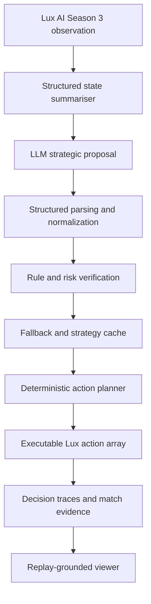
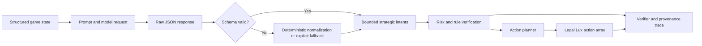

# LuxLLM-Agent: A Decision-Trace and Action-Verification Method for LLM Decision-Making in Lux AI Season 3

**Author:** Ze Wang

**Student ID:** 201868809

**Institution:** University of Liverpool

**Email:** Z.Wang300@liverpool.ac.uk

**Supervisor:** Meng Fang

**Project:** COMP702 MSc Project

**Date:** July 2026

---

## Abstract

Large language models can provide high-level planning in sequential environments, but their outputs are not automatically valid, timely, or attributable to executable actions. This dissertation asks how effectively directly prompted LLMs can make decisions in Lux AI Season 3, a partially observable, adversarial multi-agent, long-horizon, and rule-constrained strategy game. It presents the project-specific Decision-Trace and Action-Verification (DTAV) method, which converts raw observations into compact summaries, constrains model responses to bounded strategic intents, applies deterministic normalisation and rule-based checks, constructs legal action arrays, records operational provenance, and links execution evidence to replay state. DTAV is a name introduced for the method in this project; its trace is a predefined audit record rather than hidden model chain of thought.

The primary evaluation uses 50 matched Lux environment seeds with role swapping for each of two local 32B backends, Qwen3 and DeepSeek-R1, producing 200 completed matches. Across 206,591 structured trace records, agent-step and LLM-call field completeness, replay linkage, and action-array shape validity were all 100%. All 4,591 LLM calls were valid after deterministic checks; 520 Qwen responses required normalization. Risk filtering changed proposed targets on 5,590 Qwen steps and 7,090 DeepSeek steps. No LLM timeout, API error, or downstream action fallback was observed in the formal runs. Qwen won 63/100 matches and DeepSeek won 60/100, but their matched outcome difference was not statistically supported. A supplementary direct Qwen-versus-DeepSeek experiment completed a further 100 role-swapped matches while both players used the framework; its complete traces and observable verifier interventions demonstrate simultaneous two-sided inspection without turning the study into a model-ranking exercise.

The results show that structured traces make decision source and verifier intervention auditable, while rule-based verification provides a controlled boundary between model proposals and environment actions. The project does not claim a universal model ranking or leaderboard-level policy. Its contribution is a reproducible framework and evidence pipeline for examining how LLM-supported decisions are produced, checked, executed, and inspected.

**Keywords:** LLM agents; decision tracing; action verification; reproducibility; Lux AI Season 3; replay inspection

---

---

# Chapter 1: Introduction

## 1.1 Background

Large language models have increasingly been explored as components of autonomous agents. Their ability to process structured information, generate plans, and produce natural-language explanations makes them attractive for complex decision-making tasks. However, using an LLM as part of an interactive agent is different from using it for static text generation. In a game or simulation environment, the agent must repeatedly observe the state, make decisions, produce valid actions, and adapt to changes over time.

This project studies LLM-based agent design in the context of Lux AI Season 3. Lux AI Season 3 is a partially observable, adversarial multi-agent, long-horizon, and rule-constrained strategy game. An agent must coordinate multiple units, retain useful information across a long sequence, explore hidden areas, discover scoring opportunities, react to an opponent, and continually produce actions in an exact environment schema. It is not a social-interaction task; its value as a test case comes from sequential uncertainty, multi-unit coordination, competition, and strict execution constraints.

A directly prompted LLM is difficult to use in this setting. It may produce invalid or incomplete responses, lose relevant state, fail to coordinate units, propose stale plans, or violate the action schema. Large LLMs may also be too slow to call at every game step. This motivates a controlled comparison between direct prompting and a project-specific method that summarises state, requests bounded proposals, verifies those proposals, falls back to rule-based behaviour when necessary, and records an operational audit trail for later inspection.

This dissertation presents LuxLLM-Agent and the project-specific Decision-Trace and Action-Verification (DTAV) method for LLM decision making in Lux AI Season 3. DTAV is the name of the method developed in this project rather than an established term in the literature.

---

## 1.2 Motivation

The motivation for this project comes from the gap between LLM reasoning ability and reliable agent execution.

LLMs can be useful for high-level planning. For example, an LLM may suggest that an agent should explore unknown areas, move toward candidate scoring locations, or adopt a low-risk strategy. However, these suggestions are not automatically executable game actions. They must be translated into valid unit-level actions that satisfy the environment rules.

This creates several practical challenges:

* raw game observations are too detailed for direct LLM use;

* LLM output may be malformed or incomplete;

* LLM-generated plans may be strategically reasonable but impossible to execute;

* LLM calls may introduce high latency;

* cached LLM plans may become stale;

* fallback behaviour may be needed when the LLM is unavailable or unsuitable;

* final win/loss results do not explain how decisions were made.

These challenges motivated the design of a hybrid LLM-rule system. In this project, the LLM is not treated as a direct action controller. Instead, it is treated as a strategic planner whose outputs are parsed, verified, cached, repaired, or replaced before execution.

The project is also motivated by the need for inspectable evaluation. If an LLM-based agent wins or loses a match, the final score alone does not explain whether the LLM contributed, whether fallback was used, or whether actions came from cached plans. For this reason, LuxLLM-Agent records decision-source information and provides a replay-grounded viewer with an LLM Decision Trace Overlay.

---

## 1.3 Problem Statement

The main problem addressed by this project is whether direct LLM prompting can support reliable decision making in this type of game and whether DTAV can address the limitations observed under controlled conditions.

A simple LLM agent may directly ask the model for actions and execute the output. This approach is risky in Lux AI Season 3 because actions must be legal, timely, and consistent with the current game state. Invalid or delayed decisions can make the agent unreliable. At the same time, using only a final match score as evaluation hides important behaviour, such as fallback usage, cached decisions, and rule-based corrections.

Therefore, the project addresses the following problem:

> How effectively can directly prompted LLMs make decisions in a partially observable, multi-agent, long-horizon, and rule-constrained strategy game such as Lux AI Season 3, and how can the project-specific DTAV method address the observed limitations?

This problem is both practical and research-oriented. It requires implementing a working agent system, but it also requires designing evaluation methods that reveal how the agent behaves internally.

---

## 1.4 Aim and Objectives

The aim of the project is:

> To design and evaluate an LLM-based decision method that helps an agent operate reliably in Lux AI Season 3 while making the route from observation to proposal, verification, executed action, and replay outcome inspectable.

To keep the investigation focused, this aim is divided into three objectives.

### Objective 1: Establish a direct-prompting baseline

Use compact Lux observations with fixed model settings, matched seeds, role swapping, and a minimal action adapter to measure how directly prompted LLM decisions behave.

### Objective 2: Implement the DTAV method

Apply deterministic normalisation, strategy reuse, rule-based checks, fallback, and risk-aware filtering to LLM proposals before constructing executable actions.

### Objective 3: Compare reliability and inspectability

Compare direct prompting and DTAV using validity, fallback and intervention rates, reliability, latency, match outcomes, and replay-linked visual inspection.

---

## 1.5 Research Question

The main research question is:

> How effectively can directly prompted LLMs make decisions in a partially observable, multi-agent, long-horizon, and rule-constrained strategy game such as Lux AI Season 3, and how can the project-specific Decision-Trace and Action-Verification (DTAV) method address the observed limitations?

The three objectives above operationalise this single research question. They are not presented as separate competing research questions.

### Evaluation focus 1: Direct-prompt feasibility

Measure whether directly prompted model outputs remain valid, current, and usable under the game's observation, coordination, horizon, and action constraints.

This establishes the unassisted comparison point for the method evaluation.

### Evaluation focus 2: DTAV interventions

Measure when DTAV normalises, reuses, filters, or replaces a proposal and distinguish proposal validity from the action that finally reaches the environment.

This identifies which limitations require deterministic intervention.

### Evaluation focus 3: Controlled comparison and inspection

Compare direct prompting and DTAV under the same model, seed, role, temperature, prompt-budget, and call-schedule controls, then link recorded events to replay states.

This connects quantitative differences with inspectable examples.

---

## 1.6 Project Contributions

This project makes several contributions.

### 1.6.1 A project-specific LLM decision method

The project implements DTAV, which connects state summarisation, LLM strategic proposals, parsing, action verification, fallback, caching, action planning, logging, and visualisation.

### 1.6.2 Rule-based verification of LLM proposals

The system treats LLM output as a strategic proposal rather than a directly executable action. This creates a controlled boundary between LLM reasoning and environment execution.

### 1.6.3 Decision-source logging

The system records whether decisions come from fresh LLM calls, cached LLM plans, fallback behaviour, rule fallback, or rule-based policy. This makes agent behaviour more inspectable.

### 1.6.4 Controlled evaluation with multiple LLM backends

The project evaluates qwen3:32b and DeepSeek-R1-32B under the same framework using 50 matched environment seeds with role swapping. Each backend completed 100 matches against the same rule-based opponent, giving 200 formal matches in the primary evaluation. All 4,591 recorded LLM calls were valid after deterministic checks. A supplementary 100-match experiment then placed the two LLM-assisted agents directly against each other with model roles swapped for every seed. This second experiment tests whether the framework can retain separate, valid traces and verifier evidence for two concurrent LLM-controlled players; it is not used to claim a universal model ranking.

### 1.6.5 Replay-grounded decision trace overlay

The project implements an LLM Decision Trace Overlay for the Season 3 viewer. This overlay displays step-aligned decision information during replay playback, including decision source, objective, fallback status, risk posture, score context, and unit intents.

### 1.6.6 Dissertation-oriented analysis and documentation

The project includes technical documentation, evaluation analysis, model comparison, and failure-case analysis. These artefacts support a structured dissertation rather than only an engineering demo.

---

## 1.7 Project Scope

The scope of the project is limited to Lux AI Season 3 and the implemented LuxLLM-Agent method.

The project focuses on:

* LLM-assisted strategic planning;

* rule-based action verification;

* fallback and strategy caching;

* controlled multi-run evaluation;

* decision trace logging;

* replay-grounded inspection.

The project does not claim to produce a leaderboard-winning Lux AI agent. It also does not claim that qwen3:32b is universally better than DeepSeek-R1-32B. The model comparison is specific to the current framework, prompt design, environment, and evaluation setup.

The project is best understood as an artefact-based investigation of direct LLM decision making and a project-specific method for addressing observable reliability and inspection limitations in a bounded game environment.

---

## 1.8 Summary of Evaluation Evidence

The primary evaluation uses the same 50 environment seeds for each backend and swaps the LLM between `player_0` and `player_1`. This controls seed and role effects more directly than the earlier fixed-role experiments.

| Model | Matches | LLM wins | Win rate | Wilson 95% CI | Valid LLM calls |
| --- | ---: | ---: | ---: | ---: | ---: |
| qwen3:32b | 100 | 63 | 63% | 53.2%-71.8% | 2,286/2,286 |
| deepseek-r1:32b | 100 | 60 | 60% | 50.2%-69.1% | 2,305/2,305 |

Across both backends, the evaluation contains 206,591 structured trace records. Agent-step and LLM-call trace completeness, replay linkage, and action-array shape validity were all 100%. Qwen required 520 deterministic normalization interventions, while DeepSeek required none. The risk filter changed proposed targets on 5,590 Qwen steps and 7,090 DeepSeek steps, providing observable evidence that rule-based verification affected execution rather than merely existing in the architecture.

The Qwen-versus-DeepSeek matched comparison found a mean outcome-score difference of 0.03 with a paired-bootstrap 95% interval of [-0.07, 0.13] and a McNemar exact p-value of 0.690. Therefore, the results support controlled framework evaluation but do not establish a general ranking between the two models.

The supplementary direct experiment completed another 100 role-swapped matches. Qwen won 54 and DeepSeek won 46, with a seed-level exact sign p-value of 0.503. More importantly for the research question, all 4,676 fresh LLM calls were valid after deterministic checks, all 106,317 trace records were complete, and normalization and risk-filter interventions were recorded separately for both players. These results extend the operational evidence from one LLM-controlled side to two without changing the project focus from framework evaluation to model comparison.

---

## 1.9 Dissertation Structure

The rest of the dissertation is organised as follows.

### Chapter 2: Background and Related Work

This chapter introduces relevant background on LLM-based agents, game AI, hybrid rule-based and LLM systems, action verification, explainability, and evaluation methods.

### Chapter 3: Requirements and Methodology

This chapter presents the project requirements and methodology. It explains the functional and non-functional requirements, the choice of Lux AI Season 3, the LLM integration method, and the evaluation method.

### Chapter 4: System Design

This chapter presents the system architecture of LuxLLM-Agent. It explains state summarisation, LLM decision making, parsing, verification, fallback, caching, risk filtering, action planning, logging, and replay-grounded inspection.

### Chapter 5: Implementation

This chapter describes how the system was implemented in the project codebase. It explains the main runtime files, logging implementation, controlled-run evidence, replay generation, and LLM Decision Trace Overlay viewer.

### Chapter 6: Evaluation

This chapter evaluates the system using gameplay outcomes, LLM execution metrics, decision-source distribution, fallback analysis, latency analysis, replay-grounded inspection, and failure-case analysis.

### Chapter 7: Discussion and Conclusion

This chapter discusses the main findings, limitations, threats to validity, future work, and final conclusions.

---

## 1.10 Summary

This chapter introduced the LuxLLM-Agent project and explained its motivation, problem statement, aim, research question, objectives, contributions, scope, and dissertation structure.

The central argument is that LLM-based game agents should not be evaluated only by final match outcomes. Their decisions should also be structured, verified, traced, and inspected. LuxLLM-Agent addresses this by treating the LLM as a strategic planner inside a controlled execution pipeline, supported by rule-based verification, fallback, caching, decision-source logging, controlled evaluation, and replay-grounded visualisation.

The next chapter introduces the background and related work needed to situate this project.

---

# Chapter 2: Background and Related Work

## 2.1 Introduction and Review Scope

This chapter establishes the academic context for LuxLLM-Agent and develops the argument for its three design priorities: bounded state representation, deterministic action verification, and replay-grounded decision tracing. The main research question is:

> How effectively can directly prompted LLMs make decisions in a partially observable, multi-agent, long-horizon, and rule-constrained strategy game such as Lux AI Season 3, and how can the project-specific Decision-Trace and Action-Verification (DTAV) method address the observed limitations?

The review is organised around the concepts needed to answer this question rather than around a chronological list of papers. It covers:

* LLMs as interactive agents;
* state representation under partial observability;
* language-model planning and its limitations;
* game AI and sequential decision making;
* hybrid LLM-rule architectures;
* grounding, action verification, and shielding;
* decision provenance and the limits of generated explanations;
* trajectory-level evaluation of LLM agents; and
* Lux AI Season 3 as an experimental environment.

The chapter is a focused narrative review, not a systematic literature review. Priority is given to peer-reviewed work from established AI, machine-learning, and human-computer-interaction venues, together with official Lux AI sources and model technical reports where necessary. The discussion does not assume that a method developed for robotics, reinforcement learning, or language interaction transfers directly to Lux AI. Instead, each comparison identifies both the relevant principle and the limits of the analogy.

---

## 2.2 LLMs as Components of Interactive Agents

An LLM-based agent differs from a single-turn text generator because it must repeatedly interpret observations, select objectives, act through an interface, and respond to the resulting state. A simplified interaction loop is:

```text
observation -> state representation -> proposal -> verification
            -> executable action -> environment transition -> new observation
```

This distinction matters because fluent text is not sufficient evidence of competent agent behaviour. The model must maintain useful context across turns, produce output that can be grounded in the environment, and tolerate the consequences of earlier decisions.

Several influential systems demonstrate different ways to embed an LLM within a broader agent architecture. ReAct interleaves model-generated reasoning and task actions, allowing observations from the environment to influence later steps (Yao et al., 2023a). Reflexion adds verbal feedback and memory so that an agent can adapt after failure (Shinn et al., 2023). Generative Agents combines memory, reflection, and planning to produce persistent behaviour in an interactive simulation (Park et al., 2023). Toolformer investigates how a language model can learn to invoke external tools rather than relying only on its internal parameters (Schick et al., 2023). CAMEL studies role-conditioned communication between LLM agents (Li et al., 2023).

These systems support the general claim that LLMs can contribute reasoning, planning, memory, or tool selection within an agent. They do not establish that unconstrained model output is a reliable controller. In each case, the model operates through an architecture that supplies prompts, memory, actions, tools, feedback, or environment interfaces.

LuxLLM-Agent adopts this architectural view but gives the LLM a deliberately bounded role. The model proposes high-level strategic intents; deterministic components parse, normalize, verify, cache, replace, and translate those intents before any action reaches the game environment. This separation is central to the project because it enables the proposal and the executed behaviour to be inspected independently.

---

## 2.3 State Representation under Partial Observability

### 2.3.1 Why raw observations are insufficient

Lux AI Season 3 is a sequential and partially observable environment. At each step, the agent sees only an observation of the underlying game state, while useful decisions may depend on earlier observations, inferred map structure, discovered relic locations, unit state, opponent visibility, score progression, and match phase.

Partially observable Markov decision processes formalise the general problem of acting when the complete environment state is unavailable (Kaelbling et al., 1998). An agent may therefore require a belief or memory derived from observation history rather than treating the latest observation as a complete state. LuxLLM-Agent does not implement a formal Bayesian belief-state solver, but the POMDP perspective explains why a current raw observation is not an adequate strategic prompt.

Passing the complete raw game state to an LLM would also create practical problems:

* the representation would be large and repetitive;
* implementation details could obscure strategically relevant facts;
* coordinates and unit identifiers could be difficult to use consistently;
* prompt length and inference latency would increase; and
* changes between adjacent steps would be difficult to distinguish.

### 2.3.2 Structured summaries as an interface

Embodied-agent research provides evidence that language-model plans become more useful when connected to a restricted environment interface. Huang et al. (2022) show that high-level language plans often fail to map directly to admissible actions and improve executability by translating them into an available action set. SayCan similarly combines language-model preferences with affordance values that represent which robot skills are feasible in the current situation (Ahn et al., 2022).

LuxLLM-Agent applies the interface principle at the input as well as the output. Its state summarizer converts environment observations and retained game knowledge into a compact schema containing strategically relevant fields. The aim is not to produce a lossless copy of the environment. It is to create a bounded interface between a numerical game state and a language model.

This design supports the first research objective, but it introduces an important trade-off. Compression improves prompt stability and inspectability, while omitted information may remove evidence required for a better strategy. The summarizer must therefore be evaluated as part of the agent rather than treated as a neutral preprocessing step. LuxLLM-Agent records prompt-related and state-related information so that later inspection can distinguish a poor proposal from a potentially incomplete representation.

---

## 2.4 Language Models for Planning: Potential and Limitations

### 2.4.1 Evidence supporting high-level planning

Language models can express high-level objectives in a form that is useful to an agent. ReAct demonstrates that language reasoning can be combined with observations and actions in interactive tasks (Yao et al., 2023a). Huang et al. (2022) show that LMs can decompose natural-language goals into intermediate steps when the plans are subsequently mapped to admissible actions. Tree of Thoughts explores deliberate reasoning through the generation and evaluation of multiple candidate reasoning paths (Yao et al., 2023b). Voyager combines an LLM with environment feedback, an executable skill library, and iterative verification in Minecraft (Wang et al., 2023).

Together, these studies suggest a useful role for an LLM as a source of semantic decomposition, heuristic guidance, or high-level strategy. This is the role used by LuxLLM-Agent: the model selects bounded intents such as exploring stale information, moving towards a candidate target, or exploiting a confirmed scoring location.

### 2.4.2 Evidence against direct autonomous planning

Positive demonstrations must be balanced against evidence that fluent plans are not necessarily executable plans. Valmeekam et al. (2023) evaluate LLMs on planning domains and report limited autonomous plan correctness, while finding more promise when LLM output is used as heuristic guidance or checked by external verifiers. Huang et al. (2022) likewise report that naively generated plans often fail to match admissible environment actions.

These findings challenge a design in which the model directly controls the environment. They also motivate three decisions in LuxLLM-Agent:

1. the LLM produces a small structured proposal rather than a full low-level plan;
2. deterministic logic checks and repairs the proposal before use; and
3. a rule policy remains available when a proposal is invalid, stale, unavailable, or unsuitable.

Strategy caching addresses a further sequential problem. Calling the model at every environment step may increase latency and cause rapid changes in objective. Reusing a previously verified strategy for a bounded interval can improve continuity, but a cached plan can itself become stale. The decision trace must therefore record whether a plan is fresh, cached, or replaced.

The literature does not justify the claim that LLM planning is generally reliable. It supports a narrower conclusion: LLMs can provide useful high-level guidance when their output is grounded, verified, and evaluated within a larger execution system.

---

## 2.5 Game AI and Sequential Decision Making

Games are established testbeds for sequential decision making because they provide explicit rules, measurable outcomes, controllable experiments, and replayable trajectories. Different traditions illustrate the range of methods used in game AI.

Monte Carlo Tree Search represents explicit search over possible future decisions and has been applied across many game and planning settings (Browne et al., 2012). DQN demonstrated that deep reinforcement learning could learn policies from high-dimensional Atari observations (Mnih et al., 2015). AlphaStar and OpenAI Five extended learning-based game agents to complex strategy games with long horizons, partial observability, large action spaces, and multi-agent interaction (Vinyals et al., 2019; Berner et al., 2019).

LuxLLM-Agent is not a replacement for search or reinforcement learning and does not claim their performance or formal properties. These systems are relevant because they show that game outcomes emerge from repeated decisions under controlled rules, and that evaluation must account for the environment, opponent, position, and experimental protocol.

Lux AI Season 3 offers a smaller but still meaningful setting:

* decisions repeat across steps and matches;
* information is incomplete and changes over time;
* multiple units require coordinated action;
* the opponent influences the value of a plan;
* player role and environment seed can affect results; and
* complete matches can be replayed and compared.

These properties make the environment suitable for studying a hybrid LLM-based agent. They also require controlled evaluation. A raw win percentage without matched seeds, role swapping, provenance, or failure information would conflate model behaviour with environment and system effects.

---

## 2.6 Hybrid LLM-Rule Architectures

Prior agent systems repeatedly show that an LLM is most useful when surrounded by environment-specific mechanisms. Toolformer connects model generation to external APIs (Schick et al., 2023). ReAct connects language reasoning to a restricted action interface and observations (Yao et al., 2023a). SayCan separates semantic task relevance from skill feasibility (Ahn et al., 2022). Voyager couples planning with executable programs, feedback, and verification (Wang et al., 2023).

The shared architectural pattern is not that rules and models perform identical work. It is that they provide different capabilities:

| LLM contribution | Deterministic contribution |
| --- | --- |
| semantic interpretation | schema enforcement |
| high-level objective selection | action legality and array construction |
| flexible strategic proposal | coordinate, unit, and target validation |
| context-dependent intent generation | risk filtering and local movement |
| natural-language rationale field | fallback and bounded execution |

This division has two advantages. First, it preserves a valid execution path when the LLM is unavailable or produces unusable output. Second, it creates observable boundaries: the system can record which component proposed, repaired, rejected, cached, or executed a decision.

The division also limits attribution. A winning action may result from an LLM proposal, deterministic normalization, a cached strategy, a risk-filter change, or rule fallback. Therefore, LuxLLM-Agent does not equate the final agent with the LLM backend. The unit of study is the hybrid decision pipeline.

---

## 2.7 Action Grounding, Verification, and Safety Boundaries

### 2.7.1 Grounding proposals in executable actions

SayCan is especially relevant to action grounding. It ranks high-level language instructions using both semantic usefulness and learned affordance values, so an instruction must be useful and executable before selection (Ahn et al., 2022). Huang et al. (2022) similarly translate language-generated steps to actions admitted by the environment. These methods support the principle that semantic plausibility alone is insufficient for control.

LuxLLM-Agent applies a related principle in a game-specific pipeline:

```text
LLM proposal
    -> JSON parsing
    -> schema and identifier normalization
    -> intent validation
    -> target and risk checks
    -> deterministic action planning
    -> Lux action array
```

The LLM is therefore a proposal generator, not an action authority.

### 2.7.2 Relationship to shielding

Safe reinforcement learning via shielding provides a stronger formal example of placing a corrective layer between a learned policy and an environment. Alshiekh et al. (2018) define a shield that monitors selected actions and corrects actions that would violate a temporal-logic safety specification. The concept is useful for LuxLLM-Agent because both architectures separate a learned decision source from a deterministic intervention layer.

The analogy must not be overstated. LuxLLM-Agent's verifier is not a formally synthesised shield, and the project does not prove temporal-logic safety or global optimality. Its checks cover implemented schemas, identifiers, action construction, observable risks, and fallback conditions. The empirical question is whether these checks operate as documented and leave auditable evidence, not whether they guarantee every desirable property for every possible state.

This distinction improves the precision of the DTAV intervention objective. The project evaluates:

* whether model output satisfies the bounded schema;
* whether deterministic normalization repairs specific deviations;
* whether risk verification changes proposed targets;
* whether fallback remains available;
* whether legal action arrays are constructed in the observed runs; and
* whether each intervention is recorded with its reason and provenance.

The relevant contribution is observable runtime control. It is narrower than formal safety, but stronger than merely stating that a verifier exists.

---

## 2.8 Decision Tracing, Provenance, and Explanation Limits

### 2.8.1 From generated text to operational provenance

ReAct exposes model-generated reasoning alongside actions, while Reflexion and Generative Agents retain textual records that influence later behaviour (Yao et al., 2023a; Shinn et al., 2023; Park et al., 2023). These works show the practical value of retaining intermediate agent information.

However, an agent log can support different kinds of claim:

1. **Generation record:** what text or structured proposal the model returned.
2. **Decision provenance:** which component supplied the plan used at a step.
3. **Transformation record:** how deterministic components altered the proposal.
4. **Execution record:** which action array was sent to the environment.
5. **Causal explanation:** why the model internally produced a particular proposal.

LuxLLM-Agent supplies the first four forms of evidence. It does not claim the fifth.

### 2.8.2 Why a rationale is not automatically a faithful explanation

Turpin et al. (2023) show that chain-of-thought explanations can omit factors that influenced a model's answer and can rationalise biased outputs. This is important because a plausible natural-language reason should not automatically be interpreted as a faithful account of the model's internal computation.

LuxLLM-Agent therefore treats any model-provided `reason` field as part of the proposal record, not as privileged access to internal reasoning. Its stronger evidence comes from externally observable events:

* the exact structured proposal;
* whether parsing and schema checks succeeded;
* whether normalization occurred;
* whether a cached or fallback source was used;
* whether risk filtering changed a target;
* the resulting unit intents and action array; and
* the replay state associated with the step.

This operational definition makes “traceability” more defensible. The trace can show what the system received and did, even when it cannot prove why the model generated the content.

### 2.8.3 Replay-grounded inspection

A normal game replay shows state transitions but not the decision pipeline that produced them. A text log shows pipeline events but can be difficult to interpret without spatial and temporal context. LuxLLM-Agent links these two evidence sources through a decision-trace overlay.

The overlay distinguishes sources such as:

```text
llm_fresh
cached_llm
fallback
rule_fallback
rule_player
rule_only
```

It also displays the proposal, verifier status, match phase, score context, unit intents, and executed state. This supports the comparison and inspection objective by allowing an assessor to move from a quantitative summary to a specific replay step and inspect the recorded transformation chain.

---

## 2.9 Evaluation of LLM-Based Agents

### 2.9.1 Why final success is insufficient

AgentBench evaluates LLMs across eight interactive environments and identifies long-term reasoning, decision making, and instruction following as important failure sources (Liu et al., 2024). It demonstrates the need to evaluate models through environment interaction rather than only static language tasks.

AgentBoard goes further by arguing that final success rate reveals little about behaviour during multi-turn interaction. It introduces fine-grained progress measures and interactive analysis for partially observable agent trajectories (Ma et al., 2024). This is closely aligned with the evaluation motivation of LuxLLM-Agent: a final win or loss cannot show whether the LLM output was valid, whether rules intervened, or which source controlled a particular step.

### 2.9.2 Outcome, process, and reliability evidence

For a hybrid LLM game agent, evaluation should separate at least three layers:

| Evidence layer | Example questions |
| --- | --- |
| Outcome | Did the agent complete the match, win, or score? |
| Process | Was the strategy fresh, cached, normalized, filtered, or replaced? |
| Reliability | Were calls valid, actions well formed, traces complete, and failures observable? |

These layers answer different questions. A high win rate cannot prove trace completeness. A 100% post-check validity rate cannot prove that raw model output was always conforming. A large intervention count proves that the verifier changed proposals, but not that every change improved the outcome.

### 2.9.3 Controlled comparison

Game evaluation must also control nuisance variables. LuxLLM-Agent uses matched environment seeds and role swapping so that each seed is evaluated with both player assignments. It reports uncertainty intervals and paired analyses rather than treating matches as context-free samples. Backend outcomes are secondary to the framework evidence because the hybrid pipeline, prompt, rule policy, environment, and inference settings all contribute to performance.

The direct LLM-versus-LLM experiment is similarly bounded. It tests whether provenance and verification remain attributable when both players use LLM proposals. It is not designed to establish a hardware-independent or generally applicable model ranking.

---

## 2.10 Lux AI Season 3 as an Evaluation Environment

Lux AI Season 3 was a NeurIPS 2024 multi-agent competition concerned with adaptation to changing game dynamics (Tao et al., 2024). The official Lux-Design-S3 repository provides the environment, kits, and specification used by this project (Lux AI Challenge, 2024). The specification defines a two-team game on a two-dimensional map, organised as a best-of-five sequence with 100 time steps per match.

The environment provides:

* sequential decisions under partial observability;
* repeated exploration and exploitation;
* multiple controllable units;
* resource, target, and movement constraints;
* direct opponent interaction;
* measurable scores and winners; and
* replayable state transitions.

These properties create a useful middle ground. The environment is substantially more structured than an open-ended embodied world, making deterministic action checks and repeated experiments feasible. At the same time, it is sufficiently dynamic to expose stale plans, role effects, opponent-dependent risks, and the limitations of direct language-model control.

The official environment is the experimental object; the replay viewer is an analysis tool built around retained evidence. This distinction prevents the project from treating a visual demonstration as a substitute for controlled evaluation.

---

## 2.11 Comparative Synthesis and Research Gap

### 2.11.1 Comparison with the most relevant prior work

| Work | Main contribution | Relevance to LuxLLM-Agent | Limitation relative to this project |
| --- | --- | --- | --- |
| ReAct (Yao et al., 2023a) | Interleaves reasoning and actions | Supports interactive proposal-action loops | Does not provide this project's game-specific verifier and replay-provenance audit |
| SayCan (Ahn et al., 2022) | Grounds language instructions in feasible robot skills | Strong precedent for separating semantic preference from executability | Robotics affordance model rather than Lux rules, trace metrics, and role-swapped game evaluation |
| Huang et al. (2022) | Maps high-level LM plans to admissible actions | Shows why raw language plans need an action interface | Focuses on embodied task planning rather than competitive multi-agent traces |
| Voyager (Wang et al., 2023) | Uses executable skills, environment feedback, and self-verification | Supports hybrid LLM-plus-execution architecture | Focuses on open-ended skill acquisition rather than controlled matched-seed evaluation |
| Valmeekam et al. (2023) | Critically evaluates autonomous LLM planning | Supports using LLMs as heuristic proposal sources with external verification | Evaluates symbolic planning domains rather than a real-time hybrid game agent |
| Shielding (Alshiekh et al., 2018) | Corrects unsafe learned-policy actions using formal specifications | Provides a conceptual basis for an intervention layer | LuxLLM-Agent does not provide formal shielding guarantees |
| AgentBench (Liu et al., 2024) | Benchmarks LLMs in interactive environments | Supports multi-environment agent evaluation and failure analysis | Emphasises benchmark performance rather than domain-specific proposal-to-action provenance |
| AgentBoard (Ma et al., 2024) | Adds fine-grained progress and trajectory analysis | Closest evaluation precedent for moving beyond final success | Does not implement the Lux-specific verification and replay linkage used here |
| Turpin et al. (2023) | Demonstrates unfaithful generated explanations | Motivates cautious interpretation of LLM rationale fields | Studies explanation faithfulness, not environment action provenance |

### 2.11.2 Identified gap

The reviewed literature provides strong individual precedents for interactive LLM agents, admissible-action grounding, external verification, shielding, trajectory-level evaluation, and visual analysis. Within this focused review, however, no single work combines all of the following in Lux AI Season 3:

1. a bounded structured representation of a partially observable game state;
2. an LLM used only for high-level strategic proposals;
3. deterministic normalization, risk checks, fallback, and action construction;
4. explicit provenance across fresh, cached, fallback, and rule decisions;
5. step-aligned linkage between proposals, verifier interventions, actions, and replay state; and
6. matched-seed, role-swapped evaluation with retained machine-readable evidence.

This gap defines the project's contribution. LuxLLM-Agent is not presented as a new foundation model, a formally safe controller, or a state-of-the-art competition agent. It is an artefact and evaluation framework that integrates these ideas so that LLM-assisted game behaviour can be inspected at the boundary between model proposal and environment execution.

### 2.11.3 Alignment with the research questions

| Research question | Main literature foundation | Project response |
| --- | --- | --- |
| Objective 1: Direct-prompt baseline | Partial observability; grounded environment interfaces; limits of autonomous planning (Kaelbling et al., 1998; Huang et al., 2022; Valmeekam et al., 2023) | Same compact state and call schedule with DTAV interventions disabled |
| Objective 2: DTAV interventions | Affordance grounding and shielding (Ahn et al., 2022; Alshiekh et al., 2018) | Parsing, normalisation, risk filtering, strategy reuse, fallback, and deterministic action construction |
| Objective 3: Comparison and inspection | Interactive and trajectory-level evaluation; explanation limits (Liu et al., 2024; Ma et al., 2024; Turpin et al., 2023) | Matched method comparison, provenance logs, verifier audits, and a replay-linked audit overlay |

This mapping ensures that the literature review motivates the actual methodology and evaluation rather than acting as a detached survey.

---

## 2.12 Summary

The literature supports a qualified case for LLM-based agents. LLMs can contribute semantic decomposition, strategic proposals, memory, and interaction, but direct autonomous planning remains unreliable. Environment-interacting agents therefore benefit from bounded interfaces, executable skills, deterministic checks, and fallback mechanisms.

Research on shielding provides a conceptual precedent for monitoring and correcting learned decisions, while also clarifying that LuxLLM-Agent's empirical verifier should not be confused with a formally verified safety shield. Research on AgentBench and AgentBoard shows why agent evaluation should include interactive trajectories and process evidence rather than only final success. Work on unfaithful chain-of-thought explanations further motivates the project's emphasis on observable proposal, transformation, and execution records instead of claims about private model reasoning.

These findings justify the architecture and evaluation used in the following chapters. Chapter 3 translates the identified gap into requirements and methodology. Chapters 4 and 5 describe the implementation, Chapter 6 evaluates outcomes and trace-and-verification evidence, and Chapter 7 answers the research questions while stating the limits of the claims.

---

# Chapter 3: Requirements and Methodology

## 3.1 Introduction

This chapter presents the requirements and methodology of the LuxLLM-Agent project.

The project investigates the following research question:

> How effectively can directly prompted LLMs make decisions in a partially observable, multi-agent, long-horizon, and rule-constrained strategy game such as Lux AI Season 3, and how can the project-specific Decision-Trace and Action-Verification (DTAV) method address the observed limitations?

To answer this question, the project first establishes a controlled direct-prompting condition and then compares it with DTAV, which integrates bounded LLM proposals with deterministic normalisation, action verification, fallback behaviour, strategy reuse, operational audit logging, controlled-run evaluation, and replay-grounded visual inspection.

This chapter explains the requirements that guided the system, the methodology used to design and evaluate it, and the reasons for selecting Lux AI Season 3 as the experimental environment.

---

## 3.2 Project Aim

The aim of the project is to design and evaluate an LLM-based decision method for a partially observable, adversarial multi-agent, long-horizon, and rule-constrained strategy game.

The project is not intended only to build a stronger competition bot. Instead, it focuses on how LLM-based agent decisions can be structured, verified, traced, and evaluated.

The main project aim can be summarised as follows:

> To evaluate whether DTAV addresses limitations observed in a controlled direct-prompting baseline while preserving an inspectable path from observation to executed action and outcome.

This aim leads to three sub-objectives:

1. Establish a controlled direct-prompting baseline using compact state, matched seeds, role swapping, and fixed model settings.

2. Implement DTAV so LLM proposals can be normalised, reused, checked, filtered, or replaced before execution.

3. Compare validity, fallback/intervention rates, reliability, latency, outcomes, and replay-linked inspection evidence.

---

## 3.3 Research Question and Evaluation Focuses

The main research question is:

> How effectively can directly prompted LLMs make decisions in a partially observable, multi-agent, long-horizon, and rule-constrained strategy game such as Lux AI Season 3, and how can the project-specific Decision-Trace and Action-Verification (DTAV) method address the observed limitations?

The study retains one central research question. The following are evaluation focuses tied to the three objectives rather than additional research questions.

### 3.3.1 Direct-prompt feasibility

This focus measures whether a directly prompted LLM produces valid and usable decisions from the same compact game information supplied to DTAV.

### 3.3.2 DTAV intervention behaviour

This focus measures proposal normalisation, strategy reuse, rule-based checks, risk filtering, and fallback. The LLM output is treated as a proposal rather than a directly executable action.

### 3.3.3 Controlled comparison and replay-grounded inspection

This focus compares the two methods under matched controls and connects predefined audit records to replay frames and evaluation metrics. The records describe operational provenance, not hidden chain-of-thought reasoning.

---

## 3.4 Project Requirements

The system requirements are divided into functional and non-functional requirements.

Functional requirements describe what the system should do. Non-functional requirements describe qualities such as stability, inspectability, reproducibility, and maintainability.

---

## 3.5 Functional Requirements

### 3.5.1 FR1: Run a Lux AI Season 3 agent

The system must be able to run a Lux AI Season 3 agent and produce valid environment actions.

This requirement is necessary because the project is implemented as a working game-agent system rather than only a conceptual framework.

The agent must support:

* receiving observations;

* producing actions;

* completing full matches;

* recording match outcomes.

---

### 3.5.2 FR2: Support rule-only and LLM-enabled modes

The system must support both rule-only and LLM-enabled configurations.

This is necessary for controlled comparison and fallback testing. The same codebase should support different modes through configuration rather than separate implementations.

Examples of configuration variables include:

```text

LUX_LLM_ENABLED

LUX_FORCE_RULE_ONLY

LUX_LLM_MODEL

LUX_EXPERIMENT_TAG

LUX_DECISION_METHOD

```

This allows the project to compare rule-only behaviour, direct prompting, and the full DTAV method without maintaining separate agent implementations.

---

### 3.5.3 FR3: Summarise game state for LLM planning

The system must convert raw Lux AI Season 3 observations into compact structured summaries.

The summary should include information such as:

* current step;

* game phase;

* score context;

* unit positions;

* unit energy;

* known relic candidates;

* known scoring tiles;

* unexplored or stale tiles;

* risk context;

* available strategic options.

This requirement supports the controlled direct-prompt baseline and DTAV conditions.

---

### 3.5.4 FR4: Generate structured LLM decisions

The system must use an LLM to generate high-level strategic decisions.

The LLM should not directly output raw Lux AI action arrays. Instead, it should produce structured strategic proposals such as:

* main objective;

* risk posture;

* global reason;

* unit intent;

* target location;

* priority;

* expected value;

* unit-level reason.

This design makes the LLM output easier to parse, verify, log, and inspect.

---

### 3.5.5 FR5: Parse LLM output into internal structures

The system must parse the LLM response into an internal representation.

The parser should detect:

* valid outputs;

* malformed outputs;

* missing fields;

* invalid intents;

* timeout or error cases.

This requirement is necessary because LLM output cannot be assumed to be reliable.

---

### 3.5.6 FR6: Verify and convert strategic proposals into actions

The system must verify LLM-generated strategic proposals before execution.

Verification should check whether:

* the referenced unit exists;

* the target is valid;

* the target is reachable;

* the intent is recognised;

* the action is legal;

* the action appears locally safe.

Only after verification should the system convert the strategy into executable Lux AI Season 3 actions.

This requirement supports the DTAV intervention objective.

---

### 3.5.7 FR7: Provide fallback behaviour

The system must provide fallback behaviour when LLM decisions are unavailable, invalid, unsafe, or disabled.

Fallback should allow the agent to continue acting rather than failing.

Fallback may be used when:

* rule-only mode is enabled;

* LLM use is disabled;

* the LLM times out;

* the LLM output is invalid;

* the plan fails verification;

* a safer rule-based action is required.

---

### 3.5.8 FR8: Support strategy caching

The system must support strategy caching so that recent LLM plans can be reused across multiple game steps.

This is necessary because large LLM calls may be slow. Calling the LLM at every step is impractical.

The system should record when cached plans are used so that cached behaviour can be analysed later.

---

### 3.5.9 FR9: Record decision traces and metrics

The system must record decision traces and evaluation metrics.

Important logged fields include:

```text

step

phase

decision_source

llm_mode

llm_model

llm_called

llm_valid

llm_error

fallback_used

fallback_reason

cached_llm_turn

stale_decision

risk_filter_changed

unit_intent_count

unit_action_count

score_player_0

score_player_1

```

These logs support controlled evaluation and replay-grounded inspection.

---

### 3.5.10 FR10: Support controlled multi-run evaluation

The system must support controlled multi-run evaluation for different LLM backends.

The evaluation should record:

* total runs;

* winner counts;

* average rewards;

* LLM call counts;

* LLM errors;

* latency;

* fallback count;

* decision-source distribution.

This requirement allows qwen3:32b and DeepSeek-R1-32B to be compared under the same framework.

---

### 3.5.11 FR11: Provide replay-grounded visual inspection

The system must provide a replay viewer that can display game behaviour and decision trace information.

The LLM Decision Trace Overlay should show:

* frame and step;

* phase;

* decision source;

* LLM model;

* objective;

* risk posture;

* fallback status;

* risk filter status;

* score context;

* unit intents.

This requirement supports the comparison and replay-inspection objective.

---

## 3.6 Non-functional Requirements

### 3.6.1 NFR1: Stability

The system should remain stable even when the LLM is disabled, slow, invalid, or unavailable.

Fallback and rule-based verification are required to support this.

---

### 3.6.2 NFR2: Inspectability

The system should make agent behaviour inspectable through decision traces, logs, metrics, and viewer overlays.

This is central to the project because the goal is not only to run an agent but also to understand how it behaves.

---

### 3.6.3 NFR3: Reproducibility

The system should support reproducible evaluation through scripts, configuration variables, JSON/JSONL logs, evidence directories, and version-controlled documentation.

---

### 3.6.4 NFR4: Modularity

The implementation should separate major components such as state summarisation, LLM decision making, verification, fallback, action planning, logging, and viewer generation.

This makes the project easier to test, document, and extend.

---

### 3.6.5 NFR5: Practicality

The system should work with local or HPC-hosted LLMs. Since large LLMs can be slow, the system should reduce unnecessary calls through caching and fallback behaviour.

---

### 3.6.6 NFR6: Demonstrability

The system should provide visual artefacts that can be used for project demonstration and dissertation figures.

The replay viewer and LLM Decision Trace Overlay support this requirement.

---

## 3.7 Methodology Overview

The project uses an artefact-based engineering methodology.

Instead of only analysing LLM-based agents theoretically, the project implements a working system and evaluates it using controlled experiments and replay-grounded inspection.

The methodology consists of five stages:

```text

1. Environment and baseline setup

2. LLM-assisted agent design

3. Rule-based verification and fallback implementation

4. Controlled-run evaluation

5. Replay-grounded inspection and failure analysis

```

This methodology is appropriate because the research question concerns how a system can support inspection and evaluation. Therefore, the project requires both implementation and empirical evidence.

---

## 3.8 Environment and Task Selection

Lux AI Season 3 was selected as the main experimental environment.

It is suitable for this project because it is:

* sequential;

* partially observable;

* multi-agent;

* strategic;

* uncertain;

* action-constrained;

* suitable for replay analysis.

These properties make it a good environment for studying LLM-based agent decision making. The agent must repeatedly choose actions under uncertainty, and the final outcome depends on both strategic planning and local execution.

Lux AI Season 3 is also suitable because it produces replay data that can be converted into visual inspection artefacts.

---

## 3.9 LLM Integration Method

The LLM is integrated as a high-level strategic planner.

The integration method follows this pipeline:

```text

Structured State Summary

        |

        v

Prompt Construction

        |

        v

LLM Strategic Decision

        |

        v

Structured Output Parsing

        |

        v

Verification and Fallback

        |

        v

Action Planning

```

The key design choice is that the LLM does not directly control units. It proposes strategies, which are then checked and converted into legal actions.

This method reduces the risk of invalid LLM output and makes the system easier to evaluate.

The project evaluates two LLM backends:

| Model           | Purpose                |
| --------------- | ---------------------- |
| qwen3:32b       | Main LLM backend       |
| deepseek-r1:32b | Comparison LLM backend |

The comparison tests whether the same framework can support multiple reasoning-oriented LLMs.

---

## 3.10 Verification and Fallback Method

The verification and fallback method is designed to make LLM decisions safer and more stable.

The system verifies whether LLM proposals are usable in the current game state. If the plan cannot be used, the system may repair it or replace it with fallback behaviour.

Fallback is used when:

* LLM mode is disabled;

* the LLM fails;

* the LLM output is invalid;

* the parsed plan is not usable;

* the action is unsafe;

* a cached plan is unavailable or stale.

This method supports the research focus on rule-based action verification.

The fallback mechanism also makes evaluation more honest because the system records when fallback is used. This allows the dissertation to distinguish LLM contribution from rule-based support.

---

## 3.11 Strategy Cache Method

The strategy cache method addresses the practical cost of large LLM inference.

Large LLMs may take several seconds to respond. For example, the DeepSeek-R1-32B evaluation recorded an average LLM latency of approximately 4143.595 ms.

Because of this, the system reuses recent LLM plans across multiple steps instead of calling the LLM at every frame.

The cache method records:

```text

cached_llm_turn

stale_decision

last_llm_step

llm_step_used

```

This makes it possible to analyse both the benefits and limitations of caching.

Caching improves runtime practicality, but it can introduce stale decisions. This trade-off is discussed in the evaluation and discussion chapters.

---

## 3.12 Evaluation Method

The evaluation method combines quantitative and qualitative analysis.

### 3.12.1 Quantitative evaluation

The quantitative evaluation uses controlled multi-run results.

Main metrics include:

* total runs;

* player_0 wins;

* player_1 wins;

* win rate;

* rewards;

* fresh LLM calls;

* cached LLM turns;

* fallback counts;

* LLM errors;

* LLM latency;

* decision-source distribution.

The primary experiment uses 50 matched Lux environment seeds per backend. For each seed, the LLM-controlled agent is evaluated once as `player_0` and once as `player_1`, producing 100 matches per backend. The LLM sampling temperature is 0.0, and the same integer is used for the paired environment and LLM seed policy.

| Model | Seed pairs | Matches | Role-swapped pairs | Planned sampling |
| --- | ---: | ---: | ---: | --- |
| qwen3:32b | 50 | 100 | 50 | temperature 0.0 |
| deepseek-r1:32b | 50 | 100 | 50 | temperature 0.0 |

The quantitative analysis reports completion, decision validity, trace coverage, replay linkage, verification interventions, Wilson confidence intervals, seed-clustered bootstrap intervals, role effects, and matched backend comparison. Gameplay outcomes are secondary evidence; the primary evaluation concerns inspectability and action-verification behaviour.

Following the 14 August 2026 supervisor feedback, the same paired runner also
implements a direct-prompt versus DTAV comparison. The conditions keep the
compact observation, model, temperature, environment/LLM seed, player role,
generation budget, and call schedule fixed.

| Condition | Output normalisation | Strategy reuse | Risk-aware filtering | Minimal Lux action adapter and logged fallback |
| --- | --- | --- | --- | --- |
| `direct_prompt` | Disabled | Disabled | Disabled | Retained |
| `dtav` | Enabled | Enabled | Enabled | Retained |

The action adapter cannot be removed because the Lux runner accepts only a
fixed-shape numeric action array. It is therefore treated as an implementation
constraint shared by both conditions, while every fallback remains observable.
The formal comparison uses the same source commit and 50 role-swapped seed
pairs for both conditions. Method metadata is written to the environment,
match, LLM-call, and agent-step records and checked by
`tools/validate_paired_method_result.py`.

A supplementary direct LLM-versus-LLM experiment uses the same 50-seed, two-role structure. In one match Qwen controls `player_0` and DeepSeek controls `player_1`; the assignment is reversed in the paired match. Both agents use the same tracing and verification framework, while per-player logs and model assignments remain isolated. This experiment answers a narrower operational question: whether the framework can inspect and verify two concurrent LLM-assisted agents. The analysis therefore reports trace completeness, call validity, verifier interventions, role balance, and seed-clustered uncertainty. The observed model outcome is treated as contextual evidence rather than as a new research question or a general model ranking.

---

### 3.12.2 Decision-source evaluation

Decision-source evaluation analyses how behaviour is produced.

Important decision sources include:

```text

llm_fresh

cached_llm

fallback

rule_fallback

rule_player

rule_only

```

This makes it possible to measure how much behaviour comes from the LLM, cached LLM plans, fallback, or rule-based logic.

---

### 3.12.3 Replay-grounded evaluation

Replay-grounded evaluation uses the LLM Decision Trace Overlay to inspect decisions during playback.

The overlay connects replay frames to decision information such as:

* decision source;

* objective;

* fallback status;

* risk posture;

* score context;

* unit intents.

This allows qualitative analysis of representative cases.

---

### 3.12.4 Failure-case analysis

Failure-case analysis is used to examine limitations and representative problem cases.

Examples include:

* valid LLM plans with limited strategic impact;

* fallback replacing or supporting LLM decisions;

* cached plans becoming stale;

* stable execution but different model outcomes;

* trace alignment requiring careful labelling.

This analysis is important because a high-quality dissertation should not only report successful results but should also examine system limitations.

---

## 3.13 Evidence Management

The project uses evidence directories and version control to manage results.

Important evidence files include:

```text

docs/demo_evidence_index.md

docs/demo_evidence/llm_model_comparison_summary.md

docs/demo_evidence/hpc_deepseek_r1_32b_50run/

docs/analysis/qwen3_vs_deepseek_analysis.md

docs/analysis/failure_case_analysis.md

reports/dual_llm_trace_evaluation.md

reports/dual_llm_verifier_audit.md

```

The project separates summary evidence from large raw outputs. This keeps the repository manageable while preserving the key information needed for evaluation.

---

## 3.14 Ethical and Practical Considerations

The project does not involve human participants or personal data. The main ethical considerations are therefore related to transparency, reproducibility, and honest reporting.

The dissertation should avoid overclaiming. In particular, it should not claim that LuxLLM-Agent is an optimal Lux AI agent or that one LLM is universally better than another.

Instead, the project should clearly state that:

* the system is a hybrid LLM-rule framework;

* final outcomes are not caused only by the LLM;

* fallback and verification contribute to behaviour;

* evaluation results are specific to the current setup;

* replay alignment assumptions should be clearly labelled.

Practical considerations include hardware availability, LLM latency, local and HPC configuration, and repository management.

---

## 3.15 Summary

This chapter presented the requirements and methodology of the LuxLLM-Agent project.

The system requirements focus on running a Lux AI Season 3 agent, integrating LLM-based strategic planning, verifying LLM proposals, supporting fallback and caching, recording decision traces, evaluating controlled runs, and providing replay-grounded visual inspection.

The methodology is artefact-based. It develops a working system and evaluates it through controlled multi-run experiments, decision-source analysis, replay-grounded inspection, and failure-case analysis.

This chapter provides the foundation for the following chapters. Chapter 4 presents the system design, Chapter 5 describes the implementation, and Chapter 6 evaluates the system using the methodology described here.

---

# Chapter 4: System Design

## 4.1 Introduction

This chapter presents the system design of LuxLLM-Agent, a decision-trace and action-verification framework for inspecting and evaluating LLM-based agents in Lux AI Season 3.

The project is designed around the following research question:

> How effectively can directly prompted LLMs make decisions in a partially observable, multi-agent, long-horizon, and rule-constrained strategy game such as Lux AI Season 3, and how can the project-specific Decision-Trace and Action-Verification (DTAV) method address the observed limitations?

The system is not designed only as a game-playing agent. Instead, it is designed as a complete framework that connects LLM-based strategic decision making with deterministic action verification, fallback handling, controlled evaluation, logging, and replay-grounded visual inspection.

The main design principle is:

> The LLM output is treated as a strategic proposal, not as a directly executable game action.

This principle is important because large language models may produce outputs that are incomplete, invalid, stale, inconsistent with the current game state, or too slow to request at every step. LuxLLM-Agent therefore separates high-level LLM reasoning from low-level action execution.

This chapter describes the architecture, data flow, main components, design rationale, and traceability mechanisms of the system.

---

## 4.2 Design Goals

The design of LuxLLM-Agent is guided by five goals.

### 4.2.1 Inspectability

The system should make agent behaviour inspectable. It should be possible to determine whether a decision came from a fresh LLM call, a cached LLM plan, fallback behaviour, rule fallback, or rule-based policy.

This is necessary because final game outcomes alone do not explain how an LLM-based agent behaved.

### 4.2.2 Stability

The system should remain stable even when the LLM is disabled, unavailable, slow, or produces unusable output.

To support this, the system includes fallback mechanisms, strategy caching, rule-based verification, and risk-aware filtering.

### 4.2.3 Controlled LLM Use

The LLM should be used as a strategic planner rather than a direct action controller.

This reduces the risk of invalid Lux AI actions and makes the system easier to evaluate.

### 4.2.4 Evaluation Support

The system should produce logs and metrics that support controlled multi-run evaluation.

Important evaluation dimensions include:

* win/loss results;

* rewards;

* LLM errors;

* LLM latency;

* fresh LLM calls;

* cached LLM turns;

* fallback frequency;

* decision-source distribution;

* replay-grounded inspection.

### 4.2.5 Reproducibility and Demonstrability

The system should support reproducible experiments and visual demonstration. This is achieved through controlled run scripts, evidence directories, JSON/JSONL logs, replay frame generation, and an HTML-based viewer.

---

## 4.3 High-level Architecture

The high-level architecture is shown in Figure 4.1.



**Figure 4.1:** LuxLLM-Agent system architecture. The LLM is bounded to strategic proposals; deterministic components retain control of action construction, verification, evidence recording, and replay inspection.

This architecture separates strategic reasoning from executable action generation.

The LLM decision module produces high-level plans and unit-level intents. These are then parsed, checked, filtered, cached, or replaced by fallback behaviour before being converted into executable Lux AI Season 3 actions.

This design is different from a direct LLM controller. In a direct controller, the LLM would output low-level actions directly. In LuxLLM-Agent, the LLM only proposes strategy, while deterministic components maintain action validity and traceability.

---

## 4.4 System Components

### 4.4.1 Lux AI Season 3 Runtime

The runtime layer connects the project to the Lux AI Season 3 environment.

Its responsibilities include:

* receiving observations;

* producing actions;

* supporting rule-only and LLM-enabled modes;

* running controlled matches;

* recording match results;

* generating replay and evaluation evidence.

Relevant canonical files include:

```text
src/agent/agent.py
src/agent/baseline_agent.py
src/agent/main.py
src/agent/config.py
scripts/run_paired_experiment.py
scripts/run_rule_smoke.py
```

The runtime supports different experimental settings through environment variables, including:

```text

LUX_LLM_ENABLED

LUX_FORCE_RULE_ONLY

LUX_LLM_MODEL

LUX_EXPERIMENT_TAG

LUX_ENABLE_STRATEGY_CACHE

LUX_ENABLE_RISK_AWARE_ACTION_FILTER

```

This allows the same system to be tested under different settings, including rule-only mode, qwen3:32b-backed mode, and DeepSeek-R1-32B-backed mode.

---

### 4.4.2 Structured State Summariser

The structured state summariser converts raw Lux AI Season 3 observations into compact information suitable for LLM-based planning.

Raw environment observations are not ideal for direct LLM prompting because they are detailed, low-level, and may include information that is not relevant to high-level strategy. The summariser extracts strategic information such as:

* current step;

* game phase;

* score context;

* visible units;

* unit positions;

* unit energy;

* known relic candidates;

* known scoring tiles;

* unexplored or stale tiles;

* local risk context;

* available units and actions.

This design supports the first sub-research question:

> How can raw Lux AI Season 3 observations be transformed into compact structured inputs for LLM-based strategic decision making?

The summariser reduces prompt noise and helps the LLM reason about strategy rather than raw environment mechanics.

---

### 4.4.3 LLM Decision Module

The LLM decision module uses a large language model to generate high-level strategic plans.

The LLM backend can be configured through:

```text

LUX_LLM_MODEL=qwen3:32b

LUX_LLM_MODEL=deepseek-r1:32b

```

The LLM output is expected to contain structured strategic information, including:

* phase;

* main objective;

* risk posture;

* global reason;

* unit-level intents;

* target locations;

* priorities;

* expected value;

* unit-level reasons.

For example, the LLM may suggest that a unit should explore stale tiles or move to a relic candidate. These are strategic intents, not executable actions.

The LLM decision module therefore contributes high-level reasoning while leaving execution control to deterministic components.

---

### 4.4.4 Structured Plan Parser

The structured plan parser converts the LLM response into an internal representation.

Its responsibilities include:

* checking whether the LLM output is parseable;

* extracting the global plan;

* extracting unit-level intents;

* detecting missing fields;

* detecting invalid fields;

* recording LLM errors;

* triggering fallback behaviour when needed.

The parser is a safety boundary between LLM output and the action pipeline. Without this boundary, malformed LLM output could directly affect the game agent.

---

### 4.4.5 Rule-based Action Verifier

The rule-based action verifier checks whether the parsed LLM plan is usable in the current game state.

The verifier may check:

* whether a referenced unit exists;

* whether the unit can act;

* whether the target is valid;

* whether the target is inside the map;

* whether the target is reachable;

* whether the intent is recognised;

* whether the proposed behaviour is legal;

* whether the plan appears locally risky.

If a plan is invalid, unsafe, or unusable, the system may repair it or replace it with fallback behaviour.

This supports the second sub-research question:

> How can rule-based verification, fallback mechanisms, and strategy caching reduce invalid or unstable LLM-generated decisions?

The verifier is one of the main technical contributions of LuxLLM-Agent because it prevents arbitrary LLM output from directly controlling units.

---

### 4.4.6 Fallback Mechanism

Fallback behaviour is used when the LLM decision cannot be used safely or reliably.

Fallback may occur when:

* rule-only mode is enabled;

* LLM use is disabled;

* the LLM times out;

* the LLM output is invalid;

* the LLM response cannot be parsed;

* the plan fails verification;

* no suitable LLM plan is available;

* a rule-based action is safer.

The system records fallback-related information through fields such as:

```text

fallback_used

fallback_reason

decision_source

rule_fallback

```

Fallback is not treated as a system failure. Instead, it is a deliberate stability mechanism. It allows the agent to continue acting when the LLM is unavailable or unsuitable.

---

### 4.4.7 Strategy Cache

The strategy cache allows the system to reuse recent LLM plans across multiple steps.

This is necessary because large LLMs may have high latency. Calling the LLM at every game step would be inefficient and impractical.

The cache reduces:

* repeated LLM calls;

* latency overhead;

* unnecessary strategic oscillation;

* runtime cost.

Cached decisions are recorded using fields such as:

```text

cached_llm_turn

stale_decision

last_llm_step

llm_step_used

```

The strategy cache introduces a trade-off. It improves efficiency, but cached plans may become stale when the game state changes. This limitation is later examined in the evaluation and discussion chapters.

---

### 4.4.8 Risk-aware Action Filter

The risk-aware action filter provides another layer of rule-based safety.

It may detect cases where the selected action appears unsafe, such as:

* moving near enemy units;

* targeting a low-value area;

* moving with low energy;

* following a stale or risky plan;

* selecting a target that conflicts with local tactical conditions.

The system records risk-filter behaviour using fields such as:

```text

risk_filter_enabled

risk_filter_changed

risk_filter_reason

risk_filter_changed_targets

risk_filter_events_count

```

The risk-aware filter supports the broader design goal of treating LLM decisions as proposals that can be modified by deterministic checks.

---

### 4.4.9 Action Planner

The action planner converts verified strategic intents into executable Lux AI Season 3 actions.

For example, an LLM intent such as:

```text

EXPLORE_STALE_TILE

```

or:

```text

MOVE_TO_RELIC_CANDIDATE

```

must be converted into a concrete unit movement action.

The action planner considers:

* current unit location;

* target location;

* legal movement directions;

* unit energy;

* available action slots;

* fallback options.

This component bridges the gap between strategic planning and environment execution.

---

### 4.4.10 Decision Trace Logger

The decision trace logger records step-level information about how decisions are produced.

Important log files include:

```text

logs/decision_trace.jsonl

logs/decision_log.jsonl

logs/ablation_metrics.jsonl

logs/match_history.jsonl

```

Important logged fields include:

```text

step

phase

player

decision_source

llm_mode

llm_model

llm_called

llm_valid

llm_error

fallback_used

fallback_reason

cached_llm_turn

stale_decision

risk_filter_changed

unit_intent_count

unit_action_count

score_player_0

score_player_1

```

These logs allow evaluation to go beyond final scores. They make it possible to analyse when the LLM contributed, when fallback was used, when cached plans were reused, and how decision sources relate to outcomes.

---

## 4.5 Data Flow

The complete data flow is:

```text

1. The Lux AI Season 3 environment provides an observation.

2. The runtime passes the observation to the agent.

3. The state summariser extracts a compact structured summary.

4. The LLM decision module receives the structured prompt.

5. The LLM returns a strategic plan.

6. The parser converts the plan into structured internal data.

7. The verifier checks whether the plan is usable.

8. The fallback mechanism handles invalid or unavailable decisions.

9. The strategy cache may reuse a previous LLM plan.

10. The risk-aware filter may change unsafe actions.

11. The action planner generates executable Lux AI actions.

12. The environment executes the actions.

13. The system records decision traces, metrics, and match results.

14. Replay frames are generated for visual inspection.

15. The viewer displays replay frames with decision trace overlay data.

```

This data flow shows how the project connects gameplay, LLM reasoning, rule-based verification, logging, and visual explanation.

---

## 4.6 Decision Provenance Design

Decision provenance is the ability to identify where a decision came from.

LuxLLM-Agent records decision sources such as:

| Decision source | Meaning                                             |
| --------------- | --------------------------------------------------- |
| `llm_fresh`     | A fresh LLM decision was used                       |
| `cached_llm`    | A recent LLM plan was reused                        |
| `fallback`      | General fallback behaviour was used                 |
| `rule_fallback` | Rule-based fallback repaired or replaced a decision |
| `rule_player`   | Rule-based player logic produced the action         |
| `rule_only`     | Rule-only mode was active                           |

This design is important because it prevents misleading evaluation. If a match is won, the system can inspect whether the result came mainly from LLM reasoning, cached plans, fallback, or rule-based logic.

Decision provenance also supports failure analysis. For example, if a visible action is poor, the trace can help identify whether the problem came from a fresh LLM plan, a stale cached decision, or rule fallback.

---

## 4.7 Replay-grounded Inspection

The system includes a Season 3 isometric replay viewer with an LLM Decision Trace Overlay.

Relevant files include:

```text

docs/viewers/s3_isometric_battle_viewer_v09n12d_trace_overlay.html

data/run008_decision_trace_overlay.json

tools/build_run008_decision_trace_overlay.py

```

The overlay displays:

* frame and step;

* phase;

* decision source;

* LLM model;

* current objective;

* risk posture;

* fallback status;

* risk filter status;

* score context;

* unit intents.

This supports the third sub-research question:

> How can replay-grounded decision traces help analyse the relationship between LLM strategy, decision source, action execution, and game outcome?

The overlay turns the viewer from a replay-only tool into a decision inspection interface. This is important for the dissertation because it provides visual evidence of the project's central contribution: the project-specific DTAV decision-trace approach and replay-grounded evaluation.

---

## 4.8 Evaluation-oriented Design

The architecture is designed to support controlled evaluation.

The system can compare:

* rule-only behaviour;

* qwen3:32b-backed LLM behaviour;

* DeepSeek-R1-32B-backed LLM behaviour.

The evaluation is not based only on win/loss. It also records:

* LLM errors;

* LLM latency;

* fresh LLM calls;

* cached LLM turns;

* fallback counts;

* decision-source distribution;

* replay-frame alignment;

* trace steps.

This design supports a stronger dissertation evaluation because it measures both gameplay outcome and system behaviour.

---

## 4.9 Design Rationale

The system design is motivated by three main challenges.

### 4.9.1 LLM Output May Be Invalid

LLMs may produce malformed or non-executable outputs. The parser, verifier, and fallback system reduce this risk.

### 4.9.2 LLM Calls Are Expensive

Large LLMs can take several seconds to respond. The strategy cache and controlled LLM call scheduling reduce the need for frequent calls.

### 4.9.3 Win/Loss Alone Is Not Explainable

A final score does not explain how decisions were made. Decision trace logging and the overlay provide additional evidence for inspection and analysis.

---

## 4.10 Limitations of the Design

The design also has limitations.

First, fallback may make attribution difficult. If many actions come from fallback or rule-based behaviour, final outcomes cannot be attributed only to the LLM.

Second, cached plans may become stale. The system improves efficiency by reusing plans, but game-state changes may make older plans less suitable.

Third, rule-based verification may reject some creative LLM strategies. This improves safety but may reduce strategic diversity.

Fourth, the viewer overlay depends on available logs and correct alignment between replay frames and decision traces.

Fifth, the system is designed for inspection and evaluation rather than leaderboard-level Lux AI performance.

These limitations are not hidden. They are important parts of the evaluation and discussion chapters.

---

## 4.11 Summary

This chapter has presented the design of LuxLLM-Agent as a decision-trace and action-verification framework for LLM-based agents in Lux AI Season 3.

The system separates LLM strategic reasoning from low-level action execution. It uses structured state summarisation, LLM planning, parsing, rule-based verification, fallback, strategy caching, risk-aware filtering, action planning, decision trace logging, and replay-grounded inspection.

The key technical contribution is the controlled boundary between LLM reasoning and executable game actions. This boundary makes the system more stable, inspectable, and evaluable.

The next chapter describes the implementation of these design components in more detail.

---

# Chapter 5: Implementation

## 5.1 Introduction

This chapter describes the implementation of LuxLLM-Agent, a decision-trace and action-verification framework for inspecting and evaluating LLM-based agents in Lux AI Season 3.

Chapter 4 presented the system design. This chapter explains how the design was implemented in the project codebase, including the runtime agent, state summarisation, LLM decision pipeline, action verification, fallback behaviour, logging, evaluation scripts, replay generation, and the LLM Decision Trace Overlay viewer.

The implementation follows the central design principle introduced earlier:

> The LLM output is treated as a strategic proposal, not as a directly executable game action.

This principle shaped the implementation choices throughout the project. The LLM is integrated as a high-level planner, while deterministic Python modules are responsible for parsing, verification, fallback, action generation, logging, and evaluation.

---

## 5.2 Project Structure

The implementation is organised around a small set of core runtime files, evidence files, viewer files, and documentation files.

Important runtime files include:

```text

agent.py

baseline_agent.py

main.py

config.py

lux_state.py

state_summarizer.py

llm_decider.py

action_planner.py

rule_policy.py

record_match_result_from_console.py

```

Important viewer and replay files include:

```text

s3_log_driven_gameview.html

docs/viewers/s3_isometric_battle_viewer_v09n12d_trace_overlay.html

data/isometric_replay_frames.json

data/run008_decision_trace_overlay.json

tools/build_run008_isometric_from_replay.py

tools/build_run008_decision_trace_overlay.py

tools/build_v09n12d_trace_overlay_viewer.py

```

Important evaluation and evidence files include:

```text

logs/match_history.jsonl

logs/decision_trace.jsonl

logs/decision_log.jsonl

logs/ablation_metrics.jsonl

docs/demo_evidence_index.md

docs/demo_evidence/llm_model_comparison_summary.md

docs/demo_evidence/hpc_deepseek_r1_32b_50run/

docs/analysis/qwen3_vs_deepseek_analysis.md

docs/analysis/failure_case_analysis.md

```

The project structure separates runtime logic, generated evidence, visualisation, and written analysis. This separation is useful for reproducibility because match execution, evaluation, and documentation are not mixed into a single script.

---

## 5.3 Agent Runtime Implementation

The main runtime implementation is centred on the Lux AI Season 3 agent.

Relevant files include:

```text

agent.py

baseline_agent.py

main.py

config.py

```

The runtime receives observations from the Lux AI Season 3 environment and returns action arrays. It supports different operation modes, including rule-only execution and LLM-enabled execution.

The runtime behaviour is controlled through environment variables. Important examples include:

```text

LUX_LLM_ENABLED

LUX_FORCE_RULE_ONLY

LUX_LLM_MODEL

LUX_EXPERIMENT_TAG

LUX_ENABLE_STRATEGY_CACHE

LUX_ENABLE_RISK_AWARE_ACTION_FILTER

```

These environment variables make it possible to run controlled comparisons without rewriting the agent. For example, the same codebase can run:

* a rule-only baseline;

* qwen3:32b-backed LLM mode;

* deepseek-r1:32b-backed LLM mode;

* strategy-cache-enabled mode;

* risk-aware-filter-enabled mode.

This configuration approach was important during experimentation because it allowed the project to test different agent variants while keeping the core runtime consistent.

---

## 5.4 State Summarisation Implementation

The state summarisation layer converts raw Lux AI Season 3 observations into compact structured information for the LLM.

Relevant files include:

```text

state_summarizer.py

lux_state.py

```

The implementation extracts information that is useful for strategic decision making, such as:

* current step;

* match phase;

* score context;

* visible units;

* unit positions;

* unit energy;

* known relic candidates;

* known scoring tiles;

* unexplored or stale areas;

* nearby enemy information;

* current strategic context.

This is necessary because raw observations are not ideal for direct prompting. They are detailed, low-level, and may include unnecessary information. The summariser reduces this noise and creates a stable input format for the LLM.

The summarised state also helps make the system easier to inspect. Since LLM decisions are based on a structured summary, the project can explain what information the LLM was expected to reason over.

This implementation supports the first sub-research question:

> How can raw Lux AI Season 3 observations be transformed into compact structured inputs for LLM-based strategic decision making?

---

## 5.5 LLM Decision Implementation

The LLM decision logic is implemented as a high-level planning module. The formal experiments use Qwen3-32B and DeepSeek-R1-32B through a local Ollama server (Yang et al., 2025; DeepSeek-AI et al., 2025; Ollama, 2024).

Relevant files include:

```text

llm_decider.py

agent.py

```

The implementation uses the configured LLM backend to generate structured strategic decisions. The model can be changed using:

```text

LUX_LLM_MODEL=qwen3:32b

LUX_LLM_MODEL=deepseek-r1:32b

```

The LLM is expected to return a structured plan rather than raw Lux AI actions. The plan may include:

* global game phase;

* main objective;

* risk posture;

* explanation or reason;

* unit-level intents;

* target positions;

* priorities;

* expected value estimates;

* unit-level reasons.

Example strategic intents include:

```text

EXPLORE_STALE_TILE

MOVE_TO_RELIC_CANDIDATE

SECURE_SCORING_TILE

HOLD_POSITION

```

The important implementation choice is that these intents are not executed directly. They are passed through parsing, verification, fallback, caching, and action planning before any executable Lux AI action is produced.

This reduces the risk of invalid LLM output causing invalid environment actions.

Figure 5.1 summarises the implemented decision path.



**Figure 5.1:** Implemented LLM decision pipeline. Raw responses cannot enter the environment directly; they pass through schema checks, normalization or fallback, verifier logic, and deterministic action construction.

---

## 5.6 Structured Parsing Implementation

After the LLM returns a response, the system attempts to parse it into structured internal data.

The parser is responsible for:

* detecting whether the response is valid;

* extracting the global plan;

* extracting unit-level intents;

* checking required fields;

* handling missing or malformed values;

* recording LLM validity;

* reporting LLM errors;

* triggering fallback when necessary.

The implementation records fields such as:

```text

llm_valid

llm_error

timed_out

fallback_used

fallback_reason

```

This stage is a key reliability boundary. Without parsing, the system would have to trust unstructured or semi-structured model output. With parsing, the system can reject invalid output and continue with fallback behaviour.

This implementation supports the project’s broader goal of making LLM-agent behaviour inspectable and evaluable.

---

## 5.7 Action Verification Implementation

Action verification checks whether the parsed LLM plan can be used in the current game state.

Relevant files include:

```text

action_planner.py

rule_policy.py

agent.py

```

The verifier and action-planning logic check whether:

* the referenced unit exists;

* the unit can act;

* the target is valid;

* the target is inside the map;

* the target is reachable;

* the intent is recognised;

* the action is legal;

* the plan appears locally safe.

If the LLM plan is not usable, the system can repair the plan, ignore the intent, or use fallback behaviour.

This implementation directly supports the second sub-research question:

> How can rule-based verification, fallback mechanisms, and strategy caching reduce invalid or unstable LLM-generated decisions?

The verification layer is one of the main reasons the project can use large LLMs without allowing arbitrary LLM output to directly control the environment.

---

## 5.8 Fallback Implementation

Fallback behaviour is implemented to ensure that the agent can continue acting even when the LLM cannot provide a usable decision.

Fallback may be used when:

* rule-only mode is enabled;

* LLM use is disabled;

* the LLM times out;

* the LLM response is invalid;

* the LLM output cannot be parsed;

* the plan fails verification;

* no suitable cached plan is available;

* rule-based behaviour is safer.

The system records fallback-related information using fields such as:

```text

fallback_used

fallback_reason

decision_source

rule_fallback

```

Fallback is not considered a simple failure case. In this project, fallback is implemented as a deliberate stability mechanism.

This is important for evaluation because the system can later analyse when the LLM contributed to behaviour and when rule-based support took over.

---

## 5.9 Strategy Cache Implementation

The strategy cache allows recent LLM plans to be reused across multiple game steps.

This was necessary because large LLMs can be slow. For example, the DeepSeek-R1-32B 50-run evidence recorded an average LLM latency of approximately 4143.595 ms and a maximum latency of 10581.076 ms.

Calling the LLM at every step would therefore be inefficient. The cache reduces:

* repeated LLM calls;

* runtime latency;

* unnecessary strategic changes;

* inference cost.

Cache-related fields include:

```text

cached_llm_turn

stale_decision

last_llm_step

llm_step_used

```

The cache also creates an evaluation issue: a cached plan may become stale if the game state changes. The project addresses this by logging stale-decision information and discussing cached-plan limitations in the failure-case analysis.

---

## 5.10 Risk-aware Action Filter Implementation

The risk-aware action filter adds another rule-based safety layer between LLM strategy and final action execution.

The filter can detect potentially unsafe actions, such as:

* moving near enemy units;

* targeting risky locations;

* sending low-energy units into dangerous areas;

* following stale or locally unsuitable plans.

Relevant logged fields include:

```text

risk_filter_enabled

risk_filter_changed

risk_filter_reason

risk_filter_changed_targets

risk_filter_events_count

```

This implementation supports the project’s argument that the LLM is not the only decision component. Instead, the final action emerges from a pipeline that combines LLM planning with rule-based verification and safety checks.

---

## 5.11 Action Planning Implementation

The action planner converts verified strategic intents into executable Lux AI Season 3 actions.

Relevant files include:

```text

action_planner.py

rule_policy.py

```

For example, a high-level intent such as:

```text

MOVE_TO_RELIC_CANDIDATE

```

must be converted into a concrete movement action for a specific unit.

The action planner considers:

* unit position;

* target position;

* legal movement directions;

* available action slots;

* unit energy;

* fallback options.

This component is important because it bridges the gap between strategic reasoning and environment execution. It ensures that high-level objectives become valid low-level actions.

---

## 5.12 Decision Trace Logging Implementation

The implementation records decision-level information in JSONL logs.

Important logs include:

```text

logs/decision_trace.jsonl

logs/decision_log.jsonl

logs/ablation_metrics.jsonl

logs/match_history.jsonl

```

The trace logs record fields such as:

```text

step

phase

player

team_id

decision_source

llm_mode

llm_model

llm_called

fresh_llm_call

cached_llm_turn

llm_valid

llm_error

fallback_used

fallback_reason

risk_filter_changed

unit_intent_count

unit_action_count

score_player_0

score_player_1

```

These logs allow the project to inspect:

* when a fresh LLM call was used;

* when cached LLM plans were reused;

* when fallback was used;

* when rule-based decisions were used;

* how often LLM errors occurred;

* how decision sources related to match outcomes.

The JSONL format is practical because each line is a separate event. This makes the logs easy to append during execution and easy to process later with Python scripts.

---

## 5.13 Match Result Recording

Match-level results are recorded using scripts such as:

```text

record_match_result_from_console.py

```

The recorded match history supports aggregate evaluation. Important match-level fields include:

* experiment tag;

* model name;

* match index;

* reward values;

* winner;

* LLM call counts;

* fallback counts;

* LLM errors;

* latency statistics;

* decision-source counts.

The results are stored in files such as:

```text

logs/match_history.jsonl

```

and are later summarised into evidence files under:

```text

docs/demo_evidence/

```

This implementation supports both the historical fixed-role runs and the formal matched-seed, role-swapped evaluation.

---

## 5.14 Controlled-run Evidence Implementation

The project includes controlled-run evidence for multiple LLM backends.

The current primary evidence includes:

| Model | Matched seeds | Role-swapped matches | Valid LLM calls | LLM wins |
| --- | ---: | ---: | ---: | ---: |
| qwen3:32b | 50 | 100 | 2,286/2,286 | 63 |
| deepseek-r1:32b | 50 | 100 | 2,305/2,305 | 60 |

Formal runs are produced by:

```text
scripts/run_paired_experiment.py
scripts/barkla_paired_experiment.sbatch
```

The compact, tracked analysis products are:

```text
reports/final_trace_evaluation.md
reports/final_trace_evaluation.json
reports/final_trace_metrics.csv
```

Historical fixed-role evidence remains under `docs/demo_evidence/` for provenance. The 32B formal raw runs and transfer archives are retained locally outside normal Git history because they are several hundred megabytes each. The tracked reports preserve aggregate metrics and analysis logic, while the reproducibility guide records how to rerun or audit the experiment.

---

## 5.15 Replay Frame Generation

The project includes replay-frame generation for the Season 3 isometric viewer.

Relevant files include:

```text

tools/build_run008_isometric_from_replay.py

data/isometric_replay_frames.json

```

The generated replay-frame file contains visual frame data for Run008. It is used by the isometric HTML viewer to display the game state step by step.

The replay-frame generation was important for demonstration because it allows the project to show agent behaviour without rerunning the match.

The viewer can be served locally using:

```text

python -m http.server 8000

```

and opened through a browser.

---

## 5.16 LLM Decision Trace Overlay Implementation

The LLM Decision Trace Overlay was added to connect replay frames with decision trace data.

Relevant files include:

```text

tools/build_run008_decision_trace_overlay.py

tools/build_v09n12d_trace_overlay_viewer.py

tools/fix_v09n12d_trace_overlay_layout.py

data/run008_decision_trace_overlay.json

docs/viewers/s3_isometric_battle_viewer_v09n12d_trace_overlay.html

```

The overlay data builder reads:

```text

data/isometric_replay_frames.json

logs/decision_trace.jsonl

logs/decision_log.jsonl

```

and writes:

```text

data/run008_decision_trace_overlay.json

```

The generated overlay data aligns replay frames with decision trace information by step number.

The current overlay generation reported:

```text

frames: 506

trace rows: 1009

llm decision rows: 23

matched step trace frames: 505

matched exact LLM frames: 23

matched recent LLM frames: 506

```

This shows that nearly all replay frames can be matched with trace information, and every frame can be associated with the most recent LLM plan.

The viewer displays:

* frame and step;

* phase;

* decision source;

* LLM model;

* current objective;

* risk posture;

* fallback status;

* risk filter status;

* score context;

* unit intents.

The overlay can be toggled with the `H` key. This supports both live demonstration and clean screenshot capture.

This implementation directly supports the third sub-research question:

> How can replay-grounded decision traces help analyse the relationship between LLM strategy, decision source, action execution, and game outcome?

---

## 5.17 Viewer Implementation

The viewer is implemented as a browser-based HTML interface.

Important viewer files include:

```text

docs/viewers/s3_isometric_battle_viewer_v09n12d_trace_overlay.html

docs/viewers/s3_isometric_battle_viewer_v09n12d_trace_overlay.html

```

The viewer displays an isometric map, battle timeline, score information, match status, and playback controls.

The v09n12d version extends the previous viewer by injecting an LLM Decision Trace Overlay panel. The overlay is positioned so that it does not cover the original match-status panel.

The viewer can be opened locally using a simple HTTP server:

```text

python -m http.server 8000

```

Then the viewer can be opened in a browser:

```text

http://localhost:8000/docs/viewers/s3_isometric_battle_viewer_v09n12d_trace_overlay.html

```

This implementation makes the project easier to demonstrate and provides visual evidence for the dissertation.

---

## 5.18 Evidence and Documentation Implementation

The project stores evidence and analysis under the `docs/` directory.

Important documentation files include:

```text

docs/technical/system_architecture.md

docs/technical/llm_decision_pipeline.md

docs/technical/action_verification_and_fallback.md

docs/technical/decision_trace_overlay.md

docs/technical/evaluation_metrics.md

docs/analysis/qwen3_vs_deepseek_analysis.md

docs/analysis/failure_case_analysis.md

```

These files were created to support the dissertation and make the system easier to inspect.

The documentation separates:

* technical architecture;

* LLM decision pipeline;

* action verification and fallback;

* overlay implementation;

* evaluation metrics;

* model comparison;

* failure analysis.

This structure helps convert the project from an engineering prototype into a dissertation-ready research artefact.

---

## 5.19 Implementation Challenges

Several implementation challenges occurred during the project.

### 5.19.1 Integrating LLMs with a fast game loop

Lux AI Season 3 requires agents to produce actions repeatedly. Large LLMs can take several seconds to respond, so direct step-by-step LLM control would be impractical.

The implementation addresses this through strategy caching, controlled LLM call intervals, fallback behaviour, and deterministic action planning.

### 5.19.2 Handling invalid or unavailable LLM output

The LLM may fail, time out, or produce invalid output. The system handles this through parsing, validation, and fallback.

This reduces the risk of runtime failure.

### 5.19.3 Connecting logs to replay frames

The decision trace overlay required matching replay frames with decision logs. This required careful step alignment between:

```text

data/isometric_replay_frames.json

logs/decision_trace.jsonl

logs/decision_log.jsonl

```

The resulting overlay makes the replay more informative, but it also introduces a need for clear labelling when logs and replays are generated from specific runs.

### 5.19.4 Managing evidence files

Controlled runs can produce many files. The implementation therefore separates key summary evidence from raw run folders. This makes the repository easier to maintain while preserving important results.

### 5.19.5 Maintaining reproducibility

The system uses scripts, JSON/JSONL evidence, and markdown documentation to make experiments reproducible. However, large videos, temporary files, and raw logs must be managed carefully to avoid bloating the repository.

---

## 5.20 Summary

This chapter has described the implementation of LuxLLM-Agent.

The implementation includes a Lux AI Season 3 runtime agent, structured state summarisation, configurable LLM decision making, structured parsing, rule-based action verification, fallback mechanisms, strategy caching, risk-aware filtering, action planning, decision trace logging, controlled-run evidence generation, replay frame generation, and a decision trace overlay viewer.

The key implementation contribution is the controlled pipeline between LLM strategic reasoning and executable game actions. This pipeline makes the system more stable, inspectable, and evaluable.

The next chapter evaluates the system using gameplay outcomes, LLM execution metrics, decision-source analysis, model comparison, replay-grounded inspection, and failure-case analysis.

---

# Chapter 6: Evaluation

## 6.1 Introduction

This chapter evaluates the project-specific DTAV method for LLM decision making in Lux AI Season 3 and defines the controlled direct-prompting comparison required by the revised research question.

The evaluation is guided by the main research question:

> How effectively can directly prompted LLMs make decisions in a partially observable, multi-agent, long-horizon, and rule-constrained strategy game such as Lux AI Season 3, and how can the project-specific Decision-Trace and Action-Verification (DTAV) method address the observed limitations?

The evaluation does not only consider whether the agent wins or loses. While gameplay outcome is important, final scores alone cannot explain how the agent behaved, whether the LLM was used, when fallback was required, whether cached decisions were reused, or whether the framework remained stable.

Therefore, this chapter evaluates the system across several dimensions:

* gameplay outcome;

* LLM execution stability;

* LLM latency;

* decision-source distribution;

* fallback and verification behaviour;

* model comparison;

* replay-grounded inspection;

* failure-case analysis;

* limitations of the evaluation.

This multi-dimensional evaluation is important because LuxLLM-Agent is not only a game-playing agent. The comparison must show both what a directly prompted LLM can do and which observable limitations are addressed by DTAV.

---

## 6.2 Evaluation Objectives

The evaluation has four measurement dimensions, applied to the direct-prompt and DTAV conditions.

### 6.2.1 Evaluate gameplay outcome

The first objective is to measure whether the agent can complete controlled Lux AI Season 3 matches and produce meaningful match outcomes.

The main metrics are:

* total runs;

* player_0 wins;

* player_1 wins;

* draw count;

* player_0 win rate;

* average reward;

* winner distribution.

### 6.2.2 Evaluate LLM execution stability

The second objective is to evaluate whether LLM-backed agent execution remains stable.

The main metrics are:

* LLM errors;

* parsing errors;

* timeout events;

* valid LLM decisions;

* successful controlled runs.

This is important because an LLM-based game agent may fail not only through poor strategy, but also through invalid output, malformed responses, or runtime instability.

### 6.2.3 Evaluate decision provenance

The third objective is to analyse where decisions come from.

Important decision sources include:

```text id="248e1f"

llm_fresh

cached_llm

fallback

rule_fallback

rule_player

rule_only

```

Decision provenance helps determine whether actions are produced by fresh LLM decisions, cached LLM plans, fallback behaviour, or rule-based logic.

### 6.2.4 Evaluate replay-grounded inspectability

The fourth objective is to evaluate whether the system can connect decisions to replay frames.

The LLM Decision Trace Overlay is used to inspect:

* current frame and step;

* decision source;

* LLM model;

* objective;

* risk posture;

* fallback status;

* risk filter status;

* score context;

* unit intents.

This allows the evaluation to include qualitative inspection rather than only aggregate statistics.

---

## 6.3 Evaluation Setup

The evaluation uses controlled Lux AI Season 3 runs and replay-grounded visual inspection.

The main LLM backends evaluated are:

| Model           | Role                   |
| --------------- | ---------------------- |
| qwen3:32b       | Main LLM backend       |
| deepseek-r1:32b | Comparison LLM backend |

The purpose of comparing these models is not to create a general LLM leaderboard. Instead, the comparison tests whether the same decision-trace and rule-based action-verification framework can support different reasoning-oriented LLM backends.

The main evidence sources are:

```text id="u2bffa"

docs/demo_evidence/hpc_qwen3_32b_50run/

docs/demo_evidence/hpc_deepseek_r1_32b_50run/

docs/demo_evidence/llm_model_comparison_summary.md

docs/technical/evaluation_metrics.md

docs/analysis/qwen3_vs_deepseek_analysis.md

docs/analysis/failure_case_analysis.md

data/run008_decision_trace_overlay.json

docs/viewers/s3_isometric_battle_viewer_v09n12d_trace_overlay.html

```

The evaluation also uses decision logs such as:

```text id="8ua3d5"

logs/decision_trace.jsonl

logs/decision_log.jsonl

logs/ablation_metrics.jsonl

logs/match_history.jsonl

```

---

## 6.4 Evaluation Metrics

The evaluation uses several categories of metrics.

### 6.4.1 Gameplay metrics

Gameplay metrics include:

| Metric                  | Description                              |
| ----------------------- | ---------------------------------------- |
| Total runs              | Number of controlled matches             |
| player_0 wins           | Number of matches won by player_0        |
| player_1 wins           | Number of matches won by player_1        |
| Draws                   | Number of matches without a clear winner |
| player_0 win rate       | player_0 wins divided by total runs      |
| Average player_0 reward | Mean reward for player_0                 |
| Average player_1 reward | Mean reward for player_1                 |

These metrics show the final outcome of controlled runs.

### 6.4.2 LLM execution metrics

LLM execution metrics include:

| Metric              | Description                                     |
| ------------------- | ----------------------------------------------- |
| Fresh LLM calls     | Number of new LLM calls                         |
| LLM strategy used   | Number of times usable LLM strategy was applied |
| Cached LLM turns    | Number of turns using a previous LLM plan       |
| LLM errors          | Number of LLM or parser failures                |
| Average LLM latency | Mean LLM response time                          |
| Maximum LLM latency | Highest observed LLM response time              |

These metrics evaluate whether the LLM pipeline remains stable and practical.

### 6.4.3 Decision-source metrics

Decision-source metrics record where actions came from.

| Decision source | Meaning                                             |
| --------------- | --------------------------------------------------- |
| `llm_fresh`     | A fresh LLM decision was used                       |
| `cached_llm`    | A recent LLM plan was reused                        |
| `fallback`      | General fallback behaviour was used                 |
| `rule_fallback` | Rule-based fallback repaired or replaced a decision |
| `rule_player`   | Rule-based player logic produced the action         |
| `rule_only`     | Rule-only mode was active                           |

These metrics are central to the evaluation because they show how much the LLM contributed and how much behaviour came from deterministic support mechanisms.

### 6.4.4 Replay-grounded metrics

Replay-grounded metrics include:

| Metric                    | Description                                        |
| ------------------------- | -------------------------------------------------- |
| Replay frames             | Number of generated replay frames                  |
| Decision trace rows       | Number of trace rows available                     |
| LLM decision rows         | Number of fresh LLM decision rows                  |
| Matched step trace frames | Number of replay frames aligned with step traces   |
| Matched exact LLM frames  | Number of frames with exact fresh LLM decisions    |
| Matched recent LLM frames | Number of frames associated with a recent LLM plan |

These metrics evaluate whether visual inspection can be connected to decision logs.

---

## 6.5 Formal Matched-seed and Role-swapped Evaluation

The primary evaluation supersedes the earlier fixed-role 50-run comparison. It uses 50 matched Lux environment seeds for each backend and evaluates the LLM-controlled agent in both player roles, producing 100 matches per backend and 200 matches overall.

### 6.5.1 Completion and outcome evidence

| Metric | qwen3:32b | deepseek-r1:32b |
| --- | ---: | ---: |
| Completed matches | 100/100 | 100/100 |
| Matched seed pairs | 50 | 50 |
| LLM wins | 63 | 60 |
| LLM losses | 37 | 40 |
| LLM win rate | 63% | 60% |
| Wilson 95% CI | 53.2%-71.8% | 50.2%-69.1% |
| Exact binomial p-value vs 0.5 | 0.0120 | 0.0569 |

Qwen won 29/50 matches as `player_0` and 34/50 as `player_1`. DeepSeek won 30/50 in each role. Within-model matched-role analysis did not identify a statistically supported role effect: Qwen's paired-bootstrap interval for the player-role outcome-score difference was [-0.32, 0.12], while DeepSeek's was [-0.20, 0.20].

The matched Qwen-versus-DeepSeek comparison covered 100 seed-role strata. Qwen alone won 14 strata and DeepSeek alone won 11. The mean outcome-score difference was 0.03, its paired-bootstrap 95% interval was [-0.07, 0.13], and the McNemar exact p-value was 0.690. This does not support a general claim that one backend is superior.

### 6.5.2 Decision-trace and verification evidence

| Metric | Qwen3-32B | DeepSeek-R1-32B |
| --- | ---: | ---: |
| Structured trace records | 103,286 | 103,305 |
| Matches with trace | 100 (100%) | 100 (100%) |
| Agent-step trace completeness | 100% | 100% |
| LLM-call trace completeness | 100% | 100% |
| Replay-linkage coverage | 100% | 100% |
| LLM calls | 2,286 | 2,305 |
| Post-check structured-valid calls | 2,286 (100%) | 2,305 (100%) |
| Raw schema-valid calls | 1,766 (77.3%) | 2,305 (100%) |
| Deterministic normalizations | 520 | 0 |
| Cached-decision steps | 45,399 | 45,380 |
| Observable rule-fallback steps | 2,815 | 2,815 |
| Risk-filter changed steps | 5,590 | 7,090 |
| Risk-filter changed targets | 31,128 | 34,379 |
| Action-array shape validity | 100% | 100% |
| LLM timeouts / errors | 0 / 0 | 0 / 0 |
| Downstream action fallback steps | 0 | 0 |

These metrics provide the primary answer to the research question. Trace completeness and replay linkage show that decisions can be inspected after execution. Raw-schema checks and normalization counts expose where the framework intervened before planning. Risk-filter changes show that rule-based verification affected proposed targets. Action-shape validity, completed matches, and the absence of downstream action fallback show reliable execution in the observed runs, without claiming proof of safety for every possible model output.

The evidence is generated by `tools/analyse_trace_evidence.py` and summarised in `reports/final_trace_evaluation.md`, `reports/final_trace_evaluation.json`, and `reports/final_trace_metrics.csv`.

### 6.5.3 Offline verifier intervention audit

To make the verifier evidence more direct, `tools/audit_verifier_interventions.py` re-analyses the retained raw formal logs without making new model calls. It reports normalization and risk-filter interventions by backend, decision source, game phase, reason, and changed-target count.

The strict-schema counterfactual shows that 520 Qwen calls would have been rejected if the framework required the full raw object schema and did not implement its deterministic string-intent normalization. All 520 normalized calls passed the post-check representation. DeepSeek produced no responses requiring this normalization in the formal run.

Risk filtering changed 31,128 Qwen targets across 5,590 steps and 34,379 DeepSeek targets across 7,090 steps. Most interventions occurred while a cached LLM strategy was active: 5,153 Qwen steps and 6,569 DeepSeek steps. The recorded reason in every affected step was that the original target was inside the visible-enemy risk radius and a safer target was selected. This evidence demonstrates that verification was operational rather than merely specified in the architecture.

The audit does not claim that every changed target caused a better match outcome. It establishes a narrower and reproducible result: the framework detected recorded risk conditions, changed proposed targets before action construction, and retained the reason and provenance needed for inspection. The outputs are stored in `reports/verifier_intervention_audit.md`, `.json`, and `.csv`.


**Figure 6.1:** Formal framework evidence rates. Trace completeness, post-check validity, raw-schema quality, and observed verifier intervention are shown separately so that successful execution is not confused with unmodified model output.

---

## 6.6 Historical qwen3:32b Fixed-role Evidence

The qwen3:32b evaluation provides the main LLM-backed controlled-run result.

The recorded 50-run result is:

| Metric            |     Value |
| ----------------- | --------: |
| Model             | qwen3:32b |
| Total runs        |        50 |
| player_0 wins     |        35 |
| player_1 wins     |        15 |
| Draws             |         0 |
| player_0 win rate |       70% |
| Wilson 95% CI     | 56.2%-80.9% |
| Exact binomial p-value vs 0.5 | 0.006600 |
| LLM errors        |         0 |

This result shows that the qwen3:32b-backed system completed 50 controlled Lux AI Season 3 runs with zero LLM errors.

The 70% player_0 win rate suggests that the qwen3:32b-backed configuration produced stronger gameplay outcomes than the comparison DeepSeek-R1-32B configuration in the current evaluation setup.

However, this should be interpreted carefully. The result does not prove that qwen3:32b is generally superior as an LLM. It only shows that qwen3:32b performed better in this particular LuxLLM-Agent pipeline, with the current prompt design, action verifier, fallback mechanism, and evaluation configuration.

The more important framework-level finding is that qwen3:32b can be integrated into the system with stable execution and zero recorded LLM errors.

---

## 6.7 Historical DeepSeek-R1-32B Fixed-role Evidence

The DeepSeek-R1-32B evaluation was added as a comparison LLM backend.

The recorded 50-run result is:

| Metric                    |           Value |
| ------------------------- | --------------: |
| Model                     | deepseek-r1:32b |
| Total runs                |              50 |
| player_0 wins             |              26 |
| player_1 wins             |              24 |
| player_0 win rate         |             52% |
| Wilson 95% CI             |      38.5%-65.2% |
| Exact binomial p-value vs 0.5 |        0.887725 |
| Average player_0 reward   |             2.7 |
| Average player_1 reward   |             2.3 |
| Average fresh LLM calls   |            33.2 |
| Average LLM strategy used |           27.24 |
| Average cached LLM turns  |          412.62 |
| Average fallback count    |          570.14 |
| Average LLM errors        |             0.0 |
| Average LLM latency       |     4143.595 ms |
| Maximum LLM latency       |    10581.076 ms |
| Average trace steps       |          1010.0 |

The DeepSeek-R1-32B-backed system also completed 50 controlled runs with zero LLM errors.

The player_0 win rate was 52%, which is lower than the qwen3:32b result but still demonstrates stable controlled execution.

The latency values are particularly important. An average latency of approximately 4.14 seconds and a maximum latency of approximately 10.58 seconds show that large LLM calls are too expensive to use at every game step. This supports the implementation of strategy caching and fallback behaviour.

---

## 6.8 Historical Fixed-role Comparison

The following earlier comparison is retained as development history rather than used as the primary result:

| Model           | Runs | player_0 wins | player_1 wins | player_0 win rate | Wilson 95% CI | LLM errors |
| --------------- | ---: | ------------: | ------------: | ----------------: | ------------: | ---------: |
| qwen3:32b       |   50 |            35 |            15 |               70% | 56.2%-80.9% |          0 |
| deepseek-r1:32b |   50 |            26 |            24 |               52% | 38.5%-65.2% |          0 |

The qwen3:32b-backed configuration achieved a stronger gameplay outcome in this historical fixed-role evaluation.

However, the most important dissertation-level interpretation is not simply that qwen3:32b won more matches. A stronger interpretation is:

> The same structured decision-trace and rule-based action-verification framework can support multiple reasoning-oriented LLM backends. Both qwen3:32b and DeepSeek-R1-32B completed 50 controlled Lux AI Season 3 runs with zero LLM errors, while producing different gameplay outcomes.

This interpretation connects the results to the research question. The framework separates model-level strategic behaviour from system-level execution stability.

The comparison also shows why final win rate should not be the only metric. Although the two models produced different gameplay outcomes, both were stable under the same pipeline. Therefore, model quality, prompt suitability, fallback behaviour, caching, and action verification all contribute to the final result.

---

## 6.9 Decision-source Analysis

Decision-source analysis is central to the project because it explains how behaviour was produced.

For the DeepSeek-R1-32B 50-run experiment, the decision-source distribution was:

| Decision source | Count |
| --------------- | ----: |
| `rule_player`   | 25250 |
| `fallback`      |    94 |
| `rule_fallback` |  3163 |
| `llm_fresh`     |  1362 |
| `cached_llm`    | 20631 |

The total number of decision-source events was:

```text id="5or03k"

50500

```

LLM-related decision events were:

```text id="7phd4j"

llm_fresh + cached_llm = 1362 + 20631 = 21993

```

Fallback-related decision events were:

```text id="3d0z8l"

fallback + rule_fallback = 94 + 3163 = 3257

```

Approximate rates were:

```text id="47lesq"

LLM decision-source rate = 21993 / 50500 = approximately 43.55%

Fallback decision-source rate = 3257 / 50500 = approximately 6.45%

```

These values show that the DeepSeek-backed agent behaviour was produced by a hybrid pipeline. It was not purely LLM-driven, and it was not purely rule-driven.

The agent used:

* fresh LLM decisions;

* cached LLM plans;

* rule-player actions;

* fallback actions;

* rule fallback.

This is a strength of the evaluation because the system can explain decision provenance instead of only reporting final match outcomes.


**Figure 6.2:** Formal decision-source distribution. Fresh LLM decisions, cached strategies, and rule fallback are retained as separate provenance categories for both model backends.

---

## 6.10 Fallback and Verification Analysis

Fallback and verification are important because the LLM output is not directly executed.

The system uses fallback when:

* the LLM is disabled;

* the LLM is not called at the current step;

* the LLM response is invalid;

* the LLM times out;

* the plan fails parsing;

* the plan fails verification;

* a rule-based action is safer.

Fallback-related fields include:

```text id="ep3jsa"

fallback_used

fallback_reason

decision_source

rule_fallback

```

The DeepSeek-R1-32B evidence shows that fallback-related decision-source events occurred, but they were not dominant compared with the total number of events.

This supports the system design. The framework can use LLM decisions when available, reuse cached decisions when appropriate, and fall back to deterministic behaviour when needed.

However, fallback also complicates result interpretation. If an agent wins a match, the result should not be attributed only to the LLM. The rule-based verifier, fallback policy, and action planner also contribute to behaviour.

Therefore, the dissertation should interpret the system as a hybrid LLM-rule framework rather than a purely LLM-controlled agent.

---

## 6.11 Latency and Strategy Cache Analysis

The DeepSeek-R1-32B evaluation recorded:

| Latency metric      |        Value |
| ------------------- | -----------: |
| Average LLM latency |  4143.595 ms |
| Maximum LLM latency | 10581.076 ms |

These results confirm that large LLM calls are expensive in a sequential game-agent setting.

If the LLM were called at every step, the agent would be too slow for practical use. Therefore, strategy caching is necessary.

The DeepSeek-R1-32B evidence also recorded:

| Cache-related metric     |  Value |
| ------------------------ | -----: |
| Average cached LLM turns | 412.62 |

This shows that cached LLM plans were reused many times across the evaluation.

The cache provides several benefits:

* reduces repeated LLM calls;

* reduces latency cost;

* prevents excessive strategic oscillation;

* makes large-model integration more practical.

However, caching also introduces a limitation. Cached plans may become stale when the game state changes. This limitation is examined in the failure-case analysis.

---

## 6.12 Replay-grounded Inspection Evaluation

The LLM Decision Trace Overlay evaluates whether decision traces can be connected to replay frames.

The overlay generation result was:

| Metric                    | Value |
| ------------------------- | ----: |
| Replay frames             |   506 |
| Decision trace rows       |  1009 |
| LLM decision rows         |    23 |
| Matched step trace frames |   505 |
| Matched exact LLM frames  |    23 |
| Matched recent LLM frames |   506 |

This result shows that nearly all replay frames were matched with step trace information, and all frames were associated with a recent LLM plan.

The overlay displays:

* frame and step;

* phase;

* decision source;

* LLM model;

* objective;

* risk posture;

* fallback status;

* risk filter status;

* score context;

* unit intents.

This supports replay-grounded inspection because a user can view a frame and inspect the decision context that corresponds to that moment.

The viewer therefore supports the third sub-research question:

> How can replay-grounded decision traces help analyse the relationship between LLM strategy, decision source, action execution, and game outcome?

The overlay is particularly useful because final match results cannot show whether a visible action came from a fresh LLM decision, a cached plan, fallback, or rule-based logic.


**Figure 6.3:** Run008 isometric replay viewer. The replay artefact provides the visual environment context to which step-level decision traces are aligned; the interactive repository version additionally exposes the detailed trace overlay.

---

## 6.13 Direct-Prompting versus DTAV Comparison

The revised research question requires a method comparison rather than only
model-versus-rule and model-versus-model studies. The repository now exposes
`direct_prompt` and `dtav` through the same matched-seed, role-swapped runner.
Both conditions use the same compact observation, LLM backend, temperature,
seed, role assignment, generation budget, and LLM call schedule.

The direct-prompt condition disables deterministic output normalisation,
strategy reuse, and risk-aware target filtering. DTAV enables them. Both retain
the minimal parser, legal-action adapter, and logged emergency fallback because
the Lux runner cannot execute free-form model text. This shared boundary means
the baseline is “direct prompting through the minimum executable interface,”
not unrestricted text sent directly to the environment.

Local acceptance testing has completed one mock-model seed pair with roles
swapped. Both matches completed, the method label was present in environment,
match, LLM-call, and agent-step records, and
`tools/validate_paired_method_result.py` passed. These mock results validate the
pipeline only and are not empirical evidence about LLM game-playing quality.

The formal comparison remains to be run on Barkla2 with 50 matched seed pairs
for each condition from the same source commit. Until those results are
validated and inserted here, the retained 300 formal matches demonstrate DTAV
operation, model support, and intervention observability, but they do not by
themselves estimate the difference between direct prompting and DTAV. No
comparative performance or reliability claim should be made before that run.

The planned comparison reports:

| Metric family | Measures |
| --- | --- |
| Proposal quality | raw-schema validity, recognised-intent validity, incomplete/invalid calls |
| Reliability | completed matches, timeout/error rate, fallback rate, action-shape validity |
| DTAV intervention | normalisation, strategy-reuse, and risk-filter event counts |
| Efficiency | fresh-call count and latency distribution |
| Gameplay | paired win/loss outcomes, role effects, confidence interval |
| Inspectability | method-labelled trace completeness and replay linkage |

---

## 6.14 Supplementary Direct LLM-versus-LLM Evaluation

Following supervisor feedback, a supplementary experiment tested whether two LLM-assisted agents could play directly against each other while both remained inside the same decision-trace and rule-verification framework. The experiment used qwen3:32b and DeepSeek-R1-32B over 50 matched Lux environment seeds. Each seed was run twice with the model roles swapped, producing 100 completed matches.

The purpose of this experiment was not to redefine the dissertation as a model-comparison study. It tested whether the framework could retain complete, isolated provenance and deterministic verification when both players generated LLM proposals concurrently.

| Metric | Result |
| --- | ---: |
| Completed matches | 100 / 100 |
| Proper role-swapped seed pairs | 50 / 50 |
| Qwen wins / DeepSeek wins / draws | 54 / 46 / 0 |
| Qwen win rate | 54% |
| Seed-clustered bootstrap 95% interval | 45%-63% |
| Seed-level exact sign p-value | 0.503 |
| Structured trace records | 106,317 |
| Valid fresh LLM calls | 4,676 / 4,676 |
| Raw-schema-valid calls | 4,105 / 4,676 |
| Deterministic normalizations | 571 |
| Risk-filter changed steps | 15,721 |
| Risk-filter changed targets | 85,805 |
| Trace completeness / replay linkage | 100% / 100% |
| Timeouts / LLM errors / action fallbacks | 0 / 0 / 0 |

The 54:46 outcome is not statistically distinguishable from parity under the matched-seed analysis. The outcome therefore does not support a general claim that Qwen is better than DeepSeek. The more relevant result is operational: both simultaneous LLM agents produced complete provenance, all fresh calls passed the bounded post-check schema, deterministic normalization repaired 571 non-conforming raw responses, and risk verification remained observable before action construction.

The direct experiment also exposed an engineering requirement that was less visible in the model-versus-rule runs. Concurrent agents must not append to the same JSONL file. The implementation therefore isolates `player_0` and `player_1` log streams and validates that each run contains calls from both player-model assignments without malformed records.

This supplementary evidence strengthens the answer to the main research question by showing that decision tracing and rule-based verification support inspection and evaluation even when both sides of the environment are LLM-assisted. It remains supplementary because the central contribution is the framework rather than the 54:46 model outcome.

---

## 6.15 Failure-case Analysis

The project includes failure-case analysis to avoid only reporting successful results.

Representative failure and limitation cases include:

### 6.15.1 Valid LLM plan but limited strategic impact

An LLM may produce a valid plan such as exploring stale tiles or moving toward relic candidates. This output can be structurally valid and parseable, but it may still have limited strategic impact.

This shows that LLM validity is not the same as strategic quality.

### 6.15.2 Fallback replaces or supports LLM decision

Trace records may show that behaviour came from `rule_only`, `fallback`, or `rule_fallback`. This is useful for stability, but it means final actions cannot always be attributed directly to the LLM.

This shows that fallback is both a strength and an evaluation complication.

### 6.15.3 Cached plan may become stale

A frame may use a recent LLM plan rather than an exact fresh decision. This is necessary for efficiency, but the cached plan may become less suitable as the game state changes.

This shows the trade-off between latency reduction and adaptiveness.

### 6.15.4 Stable execution but different model outcomes

Both qwen3:32b and DeepSeek-R1-32B completed the primary 100-match formal evaluation and the supplementary direct experiment with no recorded LLM error, but their observed outcomes still varied. This shows that execution stability does not imply equal strategic performance.

### 6.15.5 Viewer trace alignment requires careful labelling

The overlay aligns replay frames and trace logs by step. This is useful, but the dissertation should clearly label which replay and trace sources are used, especially if data comes from specific controlled runs.

These failure cases strengthen the evaluation because they demonstrate critical reflection rather than only positive reporting.

---

## 6.16 Discussion of Results

The evaluation supports several findings.

### 6.16.1 The method supports multiple LLM backends

Both qwen3:32b and DeepSeek-R1-32B completed the primary controlled runs and the direct dual-LLM supplementary runs without an observed LLM error. This suggests that the framework can integrate different reasoning-oriented LLMs on one or both sides of a match.

### 6.16.2 Decision tracing improves interpretability

Decision-source logs and the overlay make it possible to inspect whether actions come from fresh LLM decisions, cached plans, fallback, or rule-based logic.

### 6.16.3 Rule-based verification improves stability

The verifier and fallback mechanisms prevent arbitrary LLM output from directly controlling actions. This supports stable execution.

### 6.16.4 Caching is necessary for large LLMs

Latency evidence shows that large LLMs are too slow to call at every step. Strategy caching is therefore necessary for practical integration.

### 6.16.5 Win rate is not sufficient for evaluation

Final outcome metrics are useful, but they must be interpreted together with decision-source, fallback, latency, and replay-grounded inspection metrics.

---

## 6.17 Threats to Validity

The evaluation has several threats to validity.

### 6.17.1 Limited number of LLM backends

The evaluation compares qwen3:32b and DeepSeek-R1-32B. This is useful, but it does not cover all possible LLMs.

### 6.17.2 Prompt sensitivity

Different models may respond differently to the same prompt. The current comparison uses the same framework, but model-specific prompt tuning could change the results.

### 6.17.3 Hybrid system attribution

The final behaviour is produced by a hybrid system. It includes LLM planning, cached decisions, rule-based verification, fallback, and action planning. Therefore, final win rate cannot be attributed only to the LLM.

### 6.17.4 Run-specific evidence

Some evidence, such as the Run008 viewer and overlay, is based on specific replay and trace files. The dissertation should avoid generalising too strongly from a single replay.

### 6.17.5 Gameplay performance is not leaderboard-level

The system is designed for inspection and evaluation rather than maximum Lux AI leaderboard performance. This should be clearly stated.

---

## 6.18 Limitations

The current evaluation has several limitations.

First, the evaluation covers two local 32B reasoning-oriented backends and 50 matched seeds per backend. This is substantially stronger than the historical fixed-role runs, but it is not a large-scale multi-model benchmark.

Second, the primary formal evaluation swaps roles under matched seeds against the same rule-based policy. The supplementary experiment replaces that opponent with the other LLM backend, but still covers only one model pair. The findings therefore apply to this agent, prompt, verifier, opponents, model quantisation, and Lux configuration.

Third, the formal matched comparison reports Wilson intervals, seed-clustered bootstrap intervals, role analysis, and a matched McNemar test. These quantify uncertainty but do not turn the experiment into a hardware-independent causal model ranking. The historical fixed-player results remain descriptive only.

Fourth, the failure-case analysis is currently representative rather than exhaustive. Future work could automatically identify and classify failure cases from logs.

Fifth, fallback counts can be difficult to interpret because fallback may be recorded at different levels, such as unit-level fallback or decision-source fallback.

Sixth, the replay overlay provides strong qualitative evidence, but it depends on correct alignment between replay frames and decision traces.

Seventh, the current system evaluates framework stability and inspectability more strongly than optimal gameplay performance.

These limitations should not be hidden. They help define the scope of the project and show that the system is a dissertation artefact focused on the project-specific DTAV decision-trace approach and evaluation.

---

## 6.19 Summary

This chapter evaluated LuxLLM-Agent using gameplay outcomes, LLM execution metrics, decision-source analysis, fallback analysis, latency analysis, replay-grounded inspection, and failure-case analysis.

The formal evaluation completed 100 role-swapped matches for each backend. Qwen won 63/100 and DeepSeek won 60/100, but the matched backend difference was not statistically supported. Across 206,591 structured trace records, trace completeness, replay linkage, and action-array shape validity were 100%. All 4,591 LLM calls were valid after deterministic checks, with 520 Qwen responses requiring normalization. Risk filtering changed proposed targets on thousands of steps, while no timeout, LLM error, or downstream action fallback was observed.

The supplementary direct LLM-versus-LLM experiment completed another 100 role-swapped matches. Qwen won 54 and DeepSeek won 46, but the matched seed-level result was not statistically significant. Its main value is framework evidence: 106,317 trace records remained complete, all 4,676 fresh calls were valid after checks, and normalization and risk-filter interventions remained observable for both concurrent LLM players.

The evaluation shows that LuxLLM-Agent can support multiple LLM backends within the same structured decision-trace and rule-based action-verification framework. Decision-source metrics and the replay overlay show how the system makes agent behaviour more inspectable than a standard final-score evaluation.

The main conclusion is that the project-specific DTAV decision-trace approach and rule-based action verification support the inspection and evaluation of LLM-based agents by making decisions more stable, traceable, and replay-grounded.

---

# Chapter 7: Discussion and Conclusion

## 7.1 Introduction

This chapter discusses the main findings, contributions, limitations, and future work of LuxLLM-Agent.

The project set out to investigate the following research question:

> How effectively can directly prompted LLMs make decisions in a partially observable, multi-agent, long-horizon, and rule-constrained strategy game such as Lux AI Season 3, and how can the project-specific Decision-Trace and Action-Verification (DTAV) method address the observed limitations?

The previous chapters presented the system design, implementation, and evaluation of LuxLLM-Agent. The project developed DTAV as an LLM-based decision method rather than only building a game-playing agent. It combines compact state summarisation, LLM-based strategic proposals, deterministic action verification, fallback behaviour, strategy reuse, operational audit logging, controlled evaluation, and replay-grounded visual inspection.

This chapter reflects on how well the project answered the research question, what the main findings were, what technical contributions were made, and what limitations remain.

---

## 7.2 Answering the Research Question

The main research question was:

> How effectively can directly prompted LLMs make decisions in a partially observable, multi-agent, long-horizon, and rule-constrained strategy game such as Lux AI Season 3, and how can the project-specific Decision-Trace and Action-Verification (DTAV) method address the observed limitations?

The retained formal studies show how DTAV operates and provide evidence about validity, interventions, reliability, outcomes, and inspectability. They do not contain a direct-prompt control condition and therefore cannot, by themselves, estimate how much of the observed behaviour is caused by DTAV rather than the shared prompt and action adapter. The new matched direct-prompt versus DTAV runner and validation protocol address this design gap; the comparative conclusion must remain provisional until the formal paired run is completed.

Within that boundary, the existing evidence shows that DTAV supports LLM-based agents in three main ways.

First, the project-specific DTAV decision-trace approach makes agent behaviour more inspectable. Instead of only recording final match scores, LuxLLM-Agent records decision source, LLM mode, model name, fallback status, cached-plan usage, risk-filter behaviour, LLM errors, latency, unit intents, and score context. This allows the system to explain whether a decision came from a fresh LLM call, a cached LLM plan, fallback behaviour, rule fallback, or rule-based policy.

Second, rule-based action verification provides a controlled boundary between LLM reasoning and executable game actions. The LLM does not directly control Lux AI Season 3 units. Instead, it proposes high-level strategic intents, which are then parsed, checked, filtered, cached, repaired, or replaced before being converted into legal actions. This improves stability and reduces the risk of invalid LLM output affecting the environment.

Third, replay-grounded inspection connects decision traces to visual game behaviour. The LLM Decision Trace Overlay allows replay frames to be inspected together with the corresponding decision source, objective, fallback status, risk posture, and unit intents. This makes evaluation more informative than using final score alone.

Overall, the project demonstrates that the project-specific DTAV decision-trace approach and rule-based verification can make LLM-based game agents more stable, inspectable, and evaluable.

---

## 7.3 Discussion of Main Findings

### 7.3.1 LLM-based agents require more than prompt engineering

One important finding is that prompt engineering alone is not sufficient for building reliable LLM-based agents in a dynamic game environment.

Lux AI Season 3 requires repeated action decisions under uncertainty. LLMs may produce useful high-level strategies, but they may also produce incomplete, stale, invalid, or impractical decisions. Therefore, the system requires additional mechanisms such as parsing, verification, fallback, caching, and rule-based action planning.

This supports the project’s central design principle:

> The LLM output is treated as a strategic proposal, not as a directly executable game action.

This principle helped make the system more robust and easier to evaluate.

---

### 7.3.2 Final scores alone are not enough for evaluation

Another important finding is that final match outcomes are not enough to evaluate LLM-based agents.

A win or loss does not explain:

* whether the LLM was used;

* whether the decision came from a fresh LLM call or cached plan;

* whether fallback behaviour replaced the LLM;

* whether a rule-based verifier changed the action;

* whether a strategy was valid but weak;

* whether latency affected execution.

For this reason, LuxLLM-Agent records decision-source and trace metrics. These metrics provide a richer view of agent behaviour.

The formal evaluation completed 100 role-swapped matches for each backend and recorded 206,591 structured traces. All 4,591 LLM calls were valid after deterministic checks, but the trace audit also exposed 520 Qwen responses that required deterministic normalization and thousands of risk-filter interventions. This shows why gameplay outcome, structured-output quality, verification behaviour, and execution stability should be analysed separately.

---

### 7.3.3 The framework can support multiple LLM backends

The project compared qwen3:32b and DeepSeek-R1-32B under the same LuxLLM-Agent framework.

The formal matched-seed results were:

| Model | Matches | LLM wins | Win rate | Wilson 95% CI | Valid LLM calls |
| --- | ---: | ---: | ---: | ---: | ---: |
| qwen3:32b | 100 | 63 | 63% | 53.2%-71.8% | 2,286/2,286 |
| deepseek-r1:32b | 100 | 60 | 60% | 50.2%-69.1% | 2,305/2,305 |

The matched backend comparison produced a mean outcome-score difference of 0.03 with a paired-bootstrap 95% interval of [-0.07, 0.13] and a McNemar exact p-value of 0.690. The results therefore show that the framework supports both backends under controlled evaluation, but do not establish that one backend is generally superior.

The supplementary direct LLM-versus-LLM experiment provides a stronger operational test of backend support because both players used the framework simultaneously. Across 100 role-swapped matches, Qwen won 54 and DeepSeek won 46; the seed-clustered 95% interval was [45%, 63%] and the seed-level exact sign p-value was 0.503. All 4,676 fresh calls were valid after deterministic checks, and complete per-player trace streams were retained. The non-significant outcome keeps the interpretation aligned with the dissertation: the experiment demonstrates simultaneous traceability and verification, not a model leaderboard.

---

### 7.3.4 Strategy caching is necessary but introduces trade-offs

The evaluation showed that large LLM calls can be expensive. In the DeepSeek-R1-32B 50-run evidence, the average LLM latency was approximately 4143.595 ms and the maximum latency was 10581.076 ms.

This supports the use of strategy caching. Without caching, the system would need to call the LLM too frequently, making execution slow and impractical.

However, caching also introduces a trade-off. Cached decisions may become stale when the game state changes. This means that caching improves efficiency but may reduce adaptiveness.

This trade-off is important for future work. A better system could use event-triggered LLM refreshes to update strategy when important changes occur.

---

### 7.3.5 Replay-grounded inspection improves interpretability

The LLM Decision Trace Overlay showed that decision traces can be connected to replay frames.

The overlay generation produced:

| Metric                    | Value |
| ------------------------- | ----: |
| Replay frames             |   506 |
| Decision trace rows       |  1009 |
| LLM decision rows         |    23 |
| Matched step trace frames |   505 |
| Matched exact LLM frames  |    23 |
| Matched recent LLM frames |   506 |

This means that the viewer can align nearly all replay frames with decision trace information and associate frames with recent LLM plans.

This improves interpretability because the user can inspect what the agent was doing, which decision source was active, what the LLM objective was, whether fallback was used, and how the score context evolved.

The improved overlay makes Lux AI Season 3 explicit and separates evidence into three visible stages: LLM proposal, rule verification, and executed state. It also distinguishes fresh decisions, cached plans, rule fallback, and verifier intervention through labelled badges. The overlay therefore turns the viewer from a simple replay tool into a replay-grounded decision inspection interface.

---

## 7.4 Technical Contributions

The project makes several technical contributions.

### 7.4.1 Structured LLM decision pipeline

The project implements a structured LLM decision pipeline that transforms raw observations into structured state summaries, sends them to an LLM, parses the returned strategy, verifies it, and converts it into executable actions.

This contribution is important because it avoids direct execution of arbitrary LLM outputs.

---

### 7.4.2 Rule-based action verification

The system includes a rule-based verification layer that checks whether LLM-generated plans are valid and executable.

The verifier helps ensure that the final action respects the current game state and environment constraints.

---

### 7.4.3 Fallback and strategy caching

The system implements fallback and caching mechanisms to improve stability and reduce latency.

Fallback allows the agent to continue acting when the LLM is unavailable or unsuitable. Caching allows recent LLM strategies to be reused across multiple steps.

---

### 7.4.4 Decision provenance logging

The system records decision-source information such as `llm_fresh`, `cached_llm`, `fallback`, `rule_fallback`, and `rule_player`.

This allows the project to analyse how behaviour was produced rather than only measuring final outcomes.

---

### 7.4.5 Replay-grounded decision trace overlay

The project adds an LLM Decision Trace Overlay to the Season 3 viewer. This overlay displays step-aligned decision information during replay playback.

This is a practical contribution because it makes the system easier to inspect, demonstrate, and evaluate.

---

### 7.4.6 Controlled multi-model evaluation

The project evaluates both qwen3:32b and DeepSeek-R1-32B under the same framework, first against the same rule policy and then directly against each other with matched seeds and role swapping. The dual-agent implementation isolates concurrent player logs and validates both player-model assignments. This strengthens the project by showing that the trace-and-verification system is not tied to only one backend or one LLM-controlled side.

---

## 7.5 Limitations

The project has several limitations.

### 7.5.1 The system is not a leaderboard-level Lux AI agent

LuxLLM-Agent is designed for inspection and evaluation, not maximum leaderboard performance. The system demonstrates how LLM decisions can be traced, verified, and inspected, but it does not claim to be an optimal Lux AI Season 3 agent.

This limitation is important because the project should be assessed as a research and engineering artefact, not only as a competition bot.

---

### 7.5.2 Fallback complicates attribution

Fallback improves stability, but it makes attribution harder.

If a match is won, the result may not be due only to the LLM. It may also depend on rule-based fallback, cached plans, action verification, and the action planner.

Therefore, final outcomes should be interpreted as the result of a hybrid LLM-rule system.

---

### 7.5.3 Cached plans may become stale

Strategy caching reduces LLM latency, but cached plans may become stale when the game state changes. For example, a cached objective may no longer be suitable if the opponent moves, a target becomes less valuable, or a unit’s energy changes.

This limitation suggests the need for better event-triggered plan refresh mechanisms.

---

### 7.5.4 Limited number of model backends

The project compares qwen3:32b and DeepSeek-R1-32B. The supplementary direct experiment adds a second opponent configuration but does not add another model family. The results therefore do not cover all possible LLMs or prompt configurations.

A larger evaluation could include additional models and more runs.

---

### 7.5.5 Trace alignment requires careful labelling

The replay overlay depends on alignment between replay frames and decision logs. If replay data and trace logs are generated from different runs, the overlay must be clearly labelled as an inspection prototype rather than an exact reconstruction of one run.

Future versions should include shared run identifiers across replay frames and trace logs.

---

### 7.5.6 Failure-case analysis is representative rather than exhaustive

The failure-case analysis identifies important representative cases, but it is not an exhaustive automatic classification of all failure modes.

A stronger future version could automatically mine logs for fallback-heavy steps, stale-cache cases, and weak decision outcomes.

---

## 7.6 Threats to Validity

### 7.6.1 Internal validity

The system is a hybrid of LLM and rule-based components. This makes it difficult to isolate the effect of the LLM alone.

The evaluation addresses this by recording decision sources, fallback behaviour, and cached-plan usage, but full causal attribution remains difficult.

The formal experiment reduces role and seed confounding by evaluating both player roles under the same 50 environment seeds. It also reports Wilson intervals, seed-clustered bootstrap intervals, paired role analysis, and matched backend comparison. Residual internal-validity threats remain because the system is hybrid and uses one rule-based opponent, one prompt/configuration per backend, and one Lux evaluation setup.

---

### 7.6.2 External validity

The project focuses on Lux AI Season 3. The findings may not directly generalise to other games or agent environments.

However, the general framework idea of combining LLM strategic planning with rule-based verification and decision tracing may be transferable to other sequential decision-making tasks.

---

### 7.6.3 Construct validity

The evaluation uses metrics such as win rate, LLM errors, latency, fallback count, and decision-source distribution. These metrics are useful, but they do not fully capture strategic quality.

For example, a valid LLM plan may still be strategically weak. This is why the project also includes replay-grounded inspection and failure-case analysis.

---

### 7.6.4 Reliability

The project uses one-command setup scripts, automated tests, version-controlled experiment runners, deterministic seed and bootstrap policies, environment metadata, model-server metadata, logs, JSON/JSONL evidence, and SHA-256-verified HPC archives to improve reproducibility.

The large-model runs still depend on Ollama, model availability, and GPU resources. Exact latency may vary across hardware, so the result should be interpreted as reproducible experimental evidence under the recorded environment rather than bit-identical performance on every machine.

---

## 7.7 Future Work

Several future improvements are possible.

### 7.7.1 Event-triggered LLM refresh

The current system uses strategy caching to reduce LLM calls. Future work could trigger new LLM decisions when important events occur, such as:

* a unit reaching a target;

* a score change;

* an enemy becoming visible;

* a relic candidate being confirmed or rejected;

* risk filter intervention increasing;

* a cached plan becoming too old.

This could reduce stale-plan behaviour.

---

### 7.7.2 Stronger utility scoring

Future versions could combine LLM strategy with rule-based utility scoring.

For example, target selection could consider:

* distance;

* expected reward;

* uncertainty;

* enemy risk;

* energy cost;

* opportunity cost.

This would make the system more strategically grounded.

---

### 7.7.3 Better verifier logging

The current system records decision-source and fallback information. Future work could log more detailed verifier information, such as:

* rejected LLM intents;

* rejected target locations;

* before-and-after risk-filter changes;

* alternative candidate actions;

* verifier confidence or reason codes.

This would make failure analysis more precise.

---

### 7.7.4 Multi-run viewer support

The current overlay focuses on Run008. Future work could support multiple replays and allow users to select a run from the viewer.

This would make the visual inspection system more general.

---

### 7.7.5 Cross-model trace comparison

Future work could compare qwen3:32b and DeepSeek-R1-32B traces visually.

For example, the viewer could show how different models choose objectives, use risk posture, trigger fallback, or rely on cached plans.

---

### 7.7.6 Larger-scale evaluation

Future evaluation could include more runs, more LLM backends, and more controlled ablations.

Possible ablations include:

* LLM enabled vs disabled;

* cache enabled vs disabled;

* risk filter enabled vs disabled;

* fallback-only vs LLM-supported;

* qwen3 vs DeepSeek vs additional models.

This would strengthen statistical confidence.

---

## 7.8 Lessons Learned

Several lessons were learned from the project.

First, integrating LLMs into game agents requires careful system design. The LLM cannot simply replace the agent policy. It must be surrounded by parsing, verification, fallback, caching, and logging.

Second, explainability must be designed into the system from the beginning. Decision traces and replay overlays are only possible because the system records decision provenance.

Third, engineering artefacts need structured documentation to become dissertation-quality projects. The technical documents, analysis documents, and dissertation chapters helped turn the implementation into a coherent academic project.

Fourth, limitations are valuable. By analysing fallback, caching, latency, and trace alignment issues, the project becomes more credible and academically stronger.

---

## 7.9 Conclusion

This dissertation presented LuxLLM-Agent and the project-specific Decision-Trace and Action-Verification (DTAV) method for LLM decision making in Lux AI Season 3.

The system integrates LLM-based strategic planning with structured state summarisation, plan parsing, rule-based action verification, fallback behaviour, strategy caching, risk-aware filtering, decision trace logging, controlled-run evaluation, and replay-grounded visual inspection.

The primary evaluation showed that qwen3:32b and DeepSeek-R1-32B could both be integrated into the framework and complete 100 matched-seed, role-swapped Lux AI Season 3 matches each. Across 206,591 trace records, the framework achieved complete recorded trace fields and replay linkage, validated all 4,591 LLM calls after deterministic checks, exposed normalization and risk-filter interventions, and completed every match without an observed LLM timeout, API error, or downstream action fallback.

The supplementary direct LLM-versus-LLM experiment completed another 100 role-swapped matches while both players used the framework. Its 106,317 trace records were complete, all 4,676 fresh calls were valid after checks, and verifier interventions remained observable. The 54:46 outcome was not statistically significant, so this evidence strengthens the operational framework claim without changing the project into a model-ranking study.

The existing evidence establishes that DTAV creates an observable and reliable execution path under the recorded configurations. A final claim about how effectively it addresses the limitations of direct prompting depends on the newly specified formal matched comparison. Rather than treating the LLM as a direct controller, LuxLLM-Agent treats the LLM as a strategic planner inside a controlled execution pipeline.

This makes the project more than a game-playing agent. It is a framework for understanding how LLM-based agents make decisions, how those decisions are verified, and how their behaviour can be evaluated through logs, metrics, and replay-grounded inspection.

---

# References

Ahn, M., Brohan, A., Brown, N., Chebotar, Y., Cortes, O., David, B., Finn, C., Fu, C., Gopalakrishnan, K., Hausman, K., et al. (2022). *Do as I can, not as I say: Grounding language in robotic affordances*. arXiv:2204.01691. https://arxiv.org/abs/2204.01691

Alshiekh, M., Bloem, R., Ehlers, R., Könighofer, B., Niekum, S., & Topcu, U. (2018). Safe reinforcement learning via shielding. *Proceedings of the AAAI Conference on Artificial Intelligence, 32*(1), 2669–2678. https://doi.org/10.1609/aaai.v32i1.11797

Berner, C., Brockman, G., Chan, B., Cheung, V., Dębiak, P., Dennison, C., Farhi, D., Fischer, Q., Hashme, S., Hesse, C., et al. (2019). *Dota 2 with large scale deep reinforcement learning*. arXiv:1912.06680. https://arxiv.org/abs/1912.06680

Browne, C. B., Powley, E., Whitehouse, D., Lucas, S. M., Cowling, P. I., Rohlfshagen, P., Tavener, S., Perez, D., Samothrakis, S., & Colton, S. (2012). A survey of Monte Carlo tree search methods. *IEEE Transactions on Computational Intelligence and AI in Games, 4*(1), 1–43. https://doi.org/10.1109/TCIAIG.2012.2186810

DeepSeek-AI, Guo, D., Yang, D., Zhang, H., Song, J., Zhang, R., Xu, R., Zhu, Q., Ma, S., Wang, P., et al. (2025). *DeepSeek-R1: Incentivizing reasoning capability in LLMs via reinforcement learning*. arXiv:2501.12948. https://arxiv.org/abs/2501.12948

Huang, W., Abbeel, P., Pathak, D., & Mordatch, I. (2022). Language models as zero-shot planners: Extracting actionable knowledge for embodied agents. In *Proceedings of the 39th International Conference on Machine Learning* (pp. 9118–9147). PMLR. https://proceedings.mlr.press/v162/huang22a.html

Kaelbling, L. P., Littman, M. L., & Cassandra, A. R. (1998). Planning and acting in partially observable stochastic domains. *Artificial Intelligence, 101*(1–2), 99–134. https://doi.org/10.1016/S0004-3702(98)00023-X

Li, G., Hammoud, H. A. A. K., Itani, H., Khizbullin, D., & Ghanem, B. (2023). *CAMEL: Communicative agents for “mind” exploration of large language model society*. arXiv:2303.17760. https://arxiv.org/abs/2303.17760

Liu, X., Yu, H., Zhang, H., Xu, Y., Lei, X., Lai, H., Gu, Y., Ding, H., Men, K., Yang, K., et al. (2024). AgentBench: Evaluating LLMs as agents. *International Conference on Learning Representations*. https://proceedings.iclr.cc/paper_files/paper/2024/hash/e9df36b21ff4ee211a8b71ee8b7e9f57-Abstract-Conference.html

Lux AI Challenge. (2024). *Lux-Design-S3: Repository for the Lux AI Challenge, Season 3 at NeurIPS 2024* [Software repository]. https://github.com/Lux-AI-Challenge/Lux-Design-S3

Ma, C., Zhang, J., Zhu, Z., Yang, C., Yang, Y., Jin, Y., Lan, Z., Kong, L., & He, J. (2024). AgentBoard: An analytical evaluation board of multi-turn LLM agents. *Advances in Neural Information Processing Systems, 37*. https://doi.org/10.52202/079017-2365

Mnih, V., Kavukcuoglu, K., Silver, D., Rusu, A. A., Veness, J., Bellemare, M. G., Graves, A., Riedmiller, M., Fidjeland, A. K., Ostrovski, G., et al. (2015). Human-level control through deep reinforcement learning. *Nature, 518*, 529–533. https://doi.org/10.1038/nature14236

Ollama. (2024). *Ollama* [Software]. https://ollama.com/

Park, J. S., O'Brien, J. C., Cai, C. J., Morris, M. R., Liang, P., & Bernstein, M. S. (2023). Generative agents: Interactive simulacra of human behavior. In *Proceedings of the 36th Annual ACM Symposium on User Interface Software and Technology*. https://doi.org/10.1145/3586183.3606763

Schick, T., Dwivedi-Yu, J., Dessì, R., Raileanu, R., Lomeli, M., Hambro, E., Zettlemoyer, L., Cancedda, N., & Scialom, T. (2023). Toolformer: Language models can teach themselves to use tools. *Advances in Neural Information Processing Systems, 36*. https://proceedings.neurips.cc/paper_files/paper/2023/hash/d842425e4bf79ba039352da0f658a906-Abstract-Conference.html

Shinn, N., Cassano, F., Gopinath, A., Narasimhan, K., & Yao, S. (2023). Reflexion: Language agents with verbal reinforcement learning. *Advances in Neural Information Processing Systems, 36*. https://doi.org/10.52202/075280-0377

Tao, S., Kumar, A., Doerschuk-Tiberi, B., Pan, I., Howard, A., & Su, H. (2024). *Lux AI Season 3: Multi-agent meta learning at scale*. NeurIPS 2024 Competition Track. https://openreview.net/forum?id=7t8kWYbOcj

Turpin, M., Michael, J., Perez, E., & Bowman, S. R. (2023). Language models don't always say what they think: Unfaithful explanations in chain-of-thought prompting. *Advances in Neural Information Processing Systems, 36*. https://doi.org/10.52202/075280-3275

Valmeekam, K., Marquez, M., Sreedharan, S., & Kambhampati, S. (2023). On the planning abilities of large language models: A critical investigation. *Advances in Neural Information Processing Systems, 36*. https://doi.org/10.52202/075280-3320

Vinyals, O., Babuschkin, I., Czarnecki, W. M., Mathieu, M., Dudzik, A., Chung, J., Choi, D. H., Powell, R., Ewalds, T., Georgiev, P., et al. (2019). Grandmaster level in StarCraft II using multi-agent reinforcement learning. *Nature, 575*, 350–354. https://doi.org/10.1038/s41586-019-1724-z

Wang, G., Xie, Y., Jiang, Y., Mandlekar, A., Xiao, C., Zhu, Y., Fan, L., & Anandkumar, A. (2023). *Voyager: An open-ended embodied agent with large language models*. arXiv:2305.16291. https://arxiv.org/abs/2305.16291

Yang, A., Li, A., Yang, B., Zhang, B., Hui, B., Zheng, B., Yu, B., Gao, C., Huang, C., Lv, C., et al. (2025). *Qwen3 technical report*. arXiv:2505.09388. https://arxiv.org/abs/2505.09388

Yao, S., Zhao, J., Yu, D., Du, N., Shafran, I., Narasimhan, K., & Cao, Y. (2023a). ReAct: Synergizing reasoning and acting in language models. *International Conference on Learning Representations*. https://openreview.net/forum?id=WE_vluYUL-X

Yao, S., Yu, D., Zhao, J., Shafran, I., Griffiths, T. L., Cao, Y., & Narasimhan, K. (2023b). Tree of thoughts: Deliberate problem solving with large language models. *Advances in Neural Information Processing Systems, 36*. https://proceedings.neurips.cc/paper_files/paper/2023/hash/271db9922b8d1f4dd7aaef84ed5ac703-Abstract-Conference.html
